# Setup

##  {background-image="img/concepts/tidyverse-packages.png" background-position="center" background-size="100%"}

::: footer
:::

##  {background-image="img/concepts/tidyverse-packages-ggplot.png" background-position="center" background-size="100%"}

::: footer
:::

## The ggplot2 Package

<br>

... is an **R package to visualize data** created by Hadley Wickham in 2005


::: {.cell hash='02_concepts_pt1_cache/revealjs/ggplot-package-install-2_5aa3307e58cc60949ab78d2befcbc6ad'}

```{.r .cell-code}
# install.packages("ggplot2")
library(ggplot2)
```
:::


<br>

::: fragment
... is part of the [`{tidyverse}`](https://www.tidyverse.org/)


::: {.cell hash='02_concepts_pt1_cache/revealjs/tidyverse-package-install-2_0ba2923548e7c5434042ef1e52bcdb39'}

```{.r .cell-code}
# install.packages("tidyverse")
library(tidyverse)
```
:::

:::

# The Grammar of {ggplot2}


## The Grammar of {ggplot2}

<br>
<table style='width:100%;font-size:14pt;'>
  <tr>
    <th>Component</th>
    <th>Function</th>
    <th>Explanation</th>
  </tr>
  <tr>
    <td><b style='color:#67676;'>Data</b></td>
    <td><code>ggplot(data)</code>&nbsp;&nbsp;&nbsp;&nbsp;&nbsp;&nbsp;&nbsp;&nbsp;&nbsp;</td>
    <td>*The raw data that you want to visualise.*</td>
  </tr>
  <tr>
    <td><b style='color:#67676;'>Aesthetics&nbsp;&nbsp;&nbsp;&nbsp;&nbsp;&nbsp;&nbsp;&nbsp;&nbsp;&nbsp;</b></td>
    <td><code>aes()</code></td>
    <td>*Aesthetic mappings between variables and visual properties.*</td>
  <tr>
    <td><b style='color:#67676;'>Geometries</b></td>
    <td><code>geom_*()</code></td>
    <td>*The geometric shapes representing the data.*</td>
  </tr>
</table>


## The Grammar of {ggplot2}


<br>
<table style='width:100%;font-size:14pt;'>
  <tr>
    <th>Component</th>
    <th>Function</th>
    <th>Explanation</th>
  </tr>
  <tr>
    <td><b style='color:#67676;'>Data</b></td>
    <td><code>ggplot(data)</code>&nbsp;&nbsp;&nbsp;&nbsp;&nbsp;&nbsp;&nbsp;&nbsp;&nbsp;</td>
    <td>*The raw data that you want to visualise.*</td>
  </tr>
  <tr>
    <td><b style='color:#67676;'>Aesthetics&nbsp;&nbsp;&nbsp;&nbsp;&nbsp;&nbsp;&nbsp;&nbsp;&nbsp;&nbsp;</b></td>
    <td><code>aes()</code></td>
    <td>*Aesthetic mappings between variables and visual properties.*</td>
  <tr>
    <td><b style='color:#67676;'>Geometries</b></td>
    <td><code>geom_*()</code></td>
    <td>*The geometric shapes representing the data.*</td>
  </tr>
  <tr>
    <td><b style='color:#67676;'>Statistics</b></td>
    <td><code>stat_*()</code></td>
    <td>*The statistical transformations applied to the data.*</td>
  </tr>
  <tr>
    <td><b style='color:#67676;'>Scales</b></td>
    <td><code>scale_*()</code></td>
    <td>*Maps between the data and the aesthetic dimensions.*</td>
  </tr>
  <tr>
    <td><b style='color:#67676;'>Coordinate System</b></td>
    <td><code>coord_*()</code></td>
    <td>*Maps data into the plane of the data rectangle.*</td>
  </tr>
  <tr>
    <td><b style='color:#67676;'>Facets</b></td>
    <td><code>facet_*()</code></td>
    <td>*The arrangement of the data into a grid of plots.*</td>
  </tr>
  <tr>
    <td><b style='color:#67676;'>Visual Themes</b></td>
    <td><code>theme()</code> and <code>theme_*()</code></td>
    <td>*The overall visual defaults of a plot.*</td>
  </tr>
</table>


# A Basic ggplot Example

## The Data

<b style='font-size:2.3rem;'>Bike sharing counts in London, UK, powered by [TfL Open Data](https://tfl.gov.uk/modes/cycling/santander-cycles)</b>

::: incremental
-   covers the years 2015 and 2016
-   incl. weather data acquired from [freemeteo.com](https://freemeteo.com)
-   prepared by Hristo Mavrodiev for [Kaggle](https://www.kaggle.com/hmavrodiev/london-bike-sharing-dataset)
-   further modification by myself
:::

<br>

::: fragment

::: {.cell hash='02_concepts_pt1_cache/revealjs/data-import_0b125c0b012400614da64690b2893d90'}

```{.r .cell-code}
bikes <- readr::read_csv(
  here::here("data", "london-bikes-custom.csv"),
  ## or: "https://raw.githubusercontent.com/z3tt/graphic-design-ggplot2/main/data/london-bikes-custom.csv"
  col_types = "Dcfffilllddddc"
)

bikes$season <- forcats::fct_inorder(bikes$season)
```
:::

:::

------------------------------------------------------------------------


::: {.cell hash='02_concepts_pt1_cache/revealjs/data-table_9aa9675d75cd19a4f6ca921649b6b326'}
::: {.cell-output-display}
`````{=html}
<table class="table lightable-minimal lightable-hover" style="font-size: 24px; margin-left: auto; margin-right: auto; font-family: Cabinet Grotesk; ">
 <thead>
  <tr>
   <th style="text-align:left;"> Variable </th>
   <th style="text-align:left;"> Description </th>
   <th style="text-align:left;"> Class </th>
  </tr>
 </thead>
<tbody>
  <tr>
   <td style="text-align:left;"> date </td>
   <td style="text-align:left;"> Date encoded as `YYYY-MM-DD` </td>
   <td style="text-align:left;"> date </td>
  </tr>
  <tr>
   <td style="text-align:left;"> day_night </td>
   <td style="text-align:left;"> `day` (6:00am–5:59pm) or `night` (6:00pm–5:59am) </td>
   <td style="text-align:left;"> character </td>
  </tr>
  <tr>
   <td style="text-align:left;"> year </td>
   <td style="text-align:left;"> `2015` or `2016` </td>
   <td style="text-align:left;"> factor </td>
  </tr>
  <tr>
   <td style="text-align:left;"> month </td>
   <td style="text-align:left;"> `1` (January) to `12` (December) </td>
   <td style="text-align:left;"> factor </td>
  </tr>
  <tr>
   <td style="text-align:left;"> season </td>
   <td style="text-align:left;"> `winter`, `spring`, `summer`, or `autumn` </td>
   <td style="text-align:left;"> factor </td>
  </tr>
  <tr>
   <td style="text-align:left;"> count </td>
   <td style="text-align:left;"> Sum of reported bikes rented </td>
   <td style="text-align:left;"> integer </td>
  </tr>
  <tr>
   <td style="text-align:left;"> is_workday </td>
   <td style="text-align:left;"> `TRUE` being Monday to Friday and no bank holiday </td>
   <td style="text-align:left;"> logical </td>
  </tr>
  <tr>
   <td style="text-align:left;"> is_weekend </td>
   <td style="text-align:left;"> `TRUE` being Saturday or Sunday </td>
   <td style="text-align:left;"> logical </td>
  </tr>
  <tr>
   <td style="text-align:left;"> is_holiday </td>
   <td style="text-align:left;"> `TRUE` being a bank holiday in the UK </td>
   <td style="text-align:left;"> logical </td>
  </tr>
  <tr>
   <td style="text-align:left;"> temp </td>
   <td style="text-align:left;"> Average air temperature (°C) </td>
   <td style="text-align:left;"> double </td>
  </tr>
  <tr>
   <td style="text-align:left;"> temp_feel </td>
   <td style="text-align:left;"> Average feels like temperature (°C) </td>
   <td style="text-align:left;"> double </td>
  </tr>
  <tr>
   <td style="text-align:left;"> humidity </td>
   <td style="text-align:left;"> Average air humidity (%) </td>
   <td style="text-align:left;"> double </td>
  </tr>
  <tr>
   <td style="text-align:left;"> wind_speed </td>
   <td style="text-align:left;"> Average wind speed (km/h) </td>
   <td style="text-align:left;"> double </td>
  </tr>
  <tr>
   <td style="text-align:left;"> weather_type </td>
   <td style="text-align:left;"> Most common weather type </td>
   <td style="text-align:left;"> character </td>
  </tr>
</tbody>
</table>

`````
:::
:::


## `ggplot2::ggplot()`


::: {.cell hash='02_concepts_pt1_cache/revealjs/ggplot-function_bbfe288caa43a5cb91c8b44da89f224e'}

:::


{fig-alt="The help page of the ggplot() function." fig-width="175%"}

## Data


::: {.cell output-location='column' hash='02_concepts_pt1_cache/revealjs/ggplot-data_4e7fda731ae3ff8b96cd9dfda994dc02'}

```{.r .cell-code}
ggplot(data = bikes)
```

::: {.cell-output-display}
{width=1500}
:::
:::


## Aesthetic Mapping

<br>

<b class='simple-highlight-grn' style='font-size:2.6rem;'>= link variables to graphical properties</b><br><br>

::: incremental
-   positions (`x`, `y`)
-   colors (`color`, `fill`)
-   shapes (`shape`, `linetype`)
-   size (`size`)
-   transparency (`alpha`)
-   groupings (`group`)
:::

## Aesthetic Mapping


::: {.cell output-location='column' hash='02_concepts_pt1_cache/revealjs/ggplot-aesthetics-outside_60dd64f3e55ef91482bf56cb208f03e9'}

```{.r .cell-code  code-line-numbers="2|1,2"}
ggplot(data = bikes) +
  aes(x = temp_feel, y = count)
```

::: {.cell-output-display}
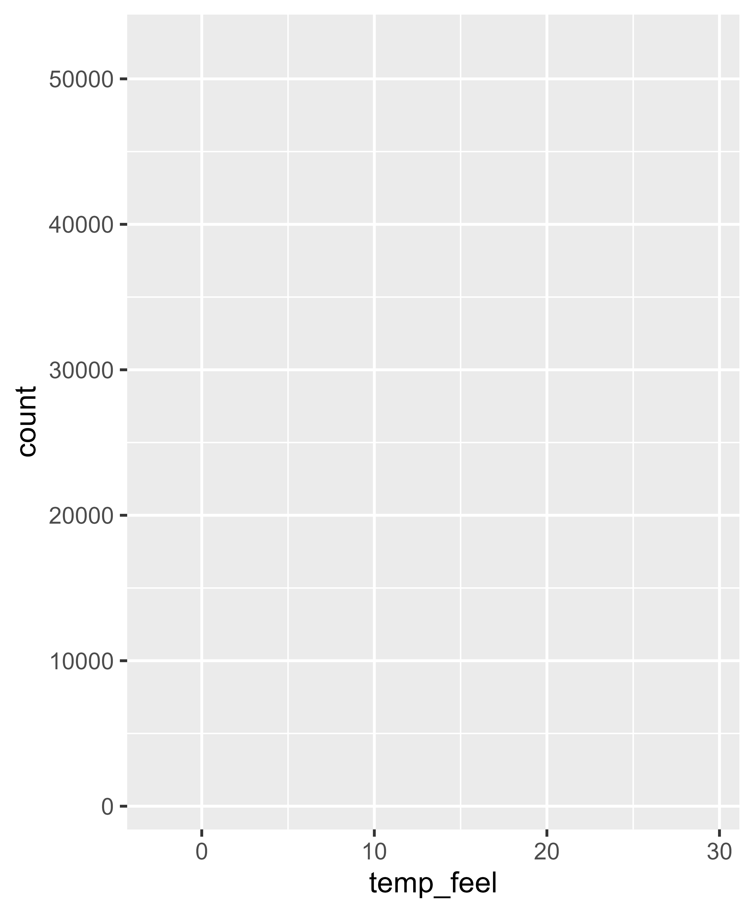{width=1500}
:::
:::


## <span style='color:#4758AB;'>aes</span>thetics

`aes()` outside as component


::: {.cell hash='02_concepts_pt1_cache/revealjs/ggplot-aesthetics-outside-comp_b5f4f8af2c0b315ea08362428fe536a1'}

```{.r .cell-code}
ggplot(data = bikes) +
  aes(x = temp_feel, y = count)
```
:::


<br>

::: fragment
`aes()` inside, explicit matching


::: {.cell hash='02_concepts_pt1_cache/revealjs/ggplot-aesthetics-inside_a3d9988efe1debf7309452a3ff181801'}

```{.r .cell-code}
ggplot(data = bikes, mapping = aes(x = temp_feel, y = count))
```
:::


<br>
:::

::: fragment
`aes()` inside, implicit matching


::: {.cell hash='02_concepts_pt1_cache/revealjs/ggplot-aesthetics-inside-implicit_918c7772a748171b473694944b42a467'}

```{.r .cell-code}
ggplot(bikes, aes(temp_feel, count))
```
:::


<br>
:::

::: fragment
`aes()` inside, mixed matching


::: {.cell hash='02_concepts_pt1_cache/revealjs/ggplot-aesthetics-inside-mix_3c390da4ff33aa34813be6fea2edcd01'}

```{.r .cell-code}
ggplot(bikes, aes(x = temp_feel, y = count))
```
:::

:::

# Geometrical Layers

## Geometries

<br>

<b class='simple-highlight-grn' style='font-size:2.6rem;'>= interpret aesthetics as graphical representations</b><br><br>

::: incremental
-   points
-   lines
-   polygons
-   text labels
-   ...
:::

## Geometries


::: {.cell output-location='column' hash='02_concepts_pt1_cache/revealjs/geom-point_72a76de6fd42ab92db3ebc83414daa30'}

```{.r .cell-code  code-line-numbers="1,2,3,4|5"}
ggplot(
    bikes,
    aes(x = temp_feel, y = count)
  ) +
  geom_point()
```

::: {.cell-output-display}
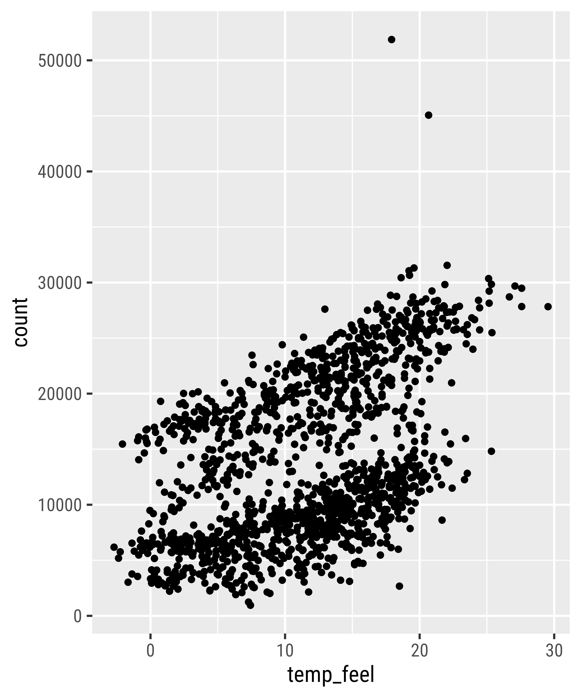{width=1500}
:::
:::


## Visual Properties of Layers


::: {.cell output-location='column' hash='02_concepts_pt1_cache/revealjs/geom-point-properties_bf81fb88c2ddf293fd0d5b008babceaa'}

```{.r .cell-code  code-line-numbers="5,6,7,8,9,10,11|6,7,8,9,10"}
ggplot(
    bikes,
    aes(x = temp_feel, y = count)
  ) +
  geom_point(
    color = "#28a87d",
    alpha = .5,
    shape = "X",
    stroke = 1,
    size = 4
  )
```

::: {.cell-output-display}
{width=1500}
:::
:::


## Setting vs Mapping of Visual Properties

::: {layout-ncol="2"}

::: {.cell hash='02_concepts_pt1_cache/revealjs/geom-point-properties-set_9dd2218ba09c922573c5aae89d75a88c'}

```{.r .cell-code  code-line-numbers="6"}
ggplot(
    bikes,
    aes(x = temp_feel, y = count)
  ) +
  geom_point(
    color = "#28a87d",
    alpha = .5
  )
```

::: {.cell-output-display}
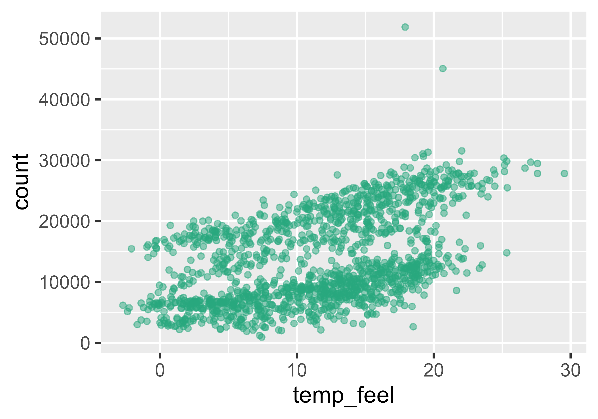{width=1500}
:::
:::


::: fragment

::: {.cell hash='02_concepts_pt1_cache/revealjs/geom-point-properties-map_b0274a7c003a5ed34d03c6468b5ef456'}

```{.r .cell-code  code-line-numbers="6"}
ggplot(
    bikes,
    aes(x = temp_feel, y = count)
  ) +
  geom_point(
    aes(color = season),
    alpha = .5
  )
```

::: {.cell-output-display}
{width=1500}
:::
:::

:::
:::

## Mapping Expressions


::: {.cell output-location='column' hash='02_concepts_pt1_cache/revealjs/geom-point-aes-expression_c1f5da34d23b10fb9916af7e24ce646c'}

```{.r .cell-code  code-line-numbers="6"}
ggplot(
    bikes,
    aes(x = temp_feel, y = count)
  ) +
  geom_point(
    aes(color = temp_feel > 20),
    alpha = .5
  )
```

::: {.cell-output-display}
{width=1500}
:::
:::


## Your Turn!

::: question
-   **Create a scatter plot of `temp_feel` vs `temp`.**
    -   Map the color of the points to clear weather.
    -   Map the size of the points to count.
    -   Turn the points into diamonds.
    -   [Bonus: What do you notice in the legend? How could you fix it?]{style="color:#5DB699;"}
:::


::: {.cell hash='02_concepts_pt1_cache/revealjs/countdown-exercise-aes_5659c74efae6248d7c6e5768054fee5f'}
::: {.cell-output-display}
```{=html}
<div class="countdown" id="timer_62f3ac52" style="right:0;bottom:0;font-size:.5em;" data-warnwhen="0">
<code class="countdown-time"><span class="countdown-digits minutes">05</span><span class="countdown-digits colon">:</span><span class="countdown-digits seconds">00</span></code>
</div>
```
:::
:::


## Mapping Expressions


::: {.cell output-location='column' hash='02_concepts_pt1_cache/revealjs/geom-point-aes-expression-exercise_03f89059e4f726b5e23ec539d220bcf3'}

```{.r .cell-code  code-line-numbers="3|6"}
ggplot(
    bikes,
    aes(x = temp, y = temp_feel)
  ) +
  geom_point(
    aes(color = weather_type == "clear"),
    alpha = .5,
    size = 2
  )
```

::: {.cell-output-display}
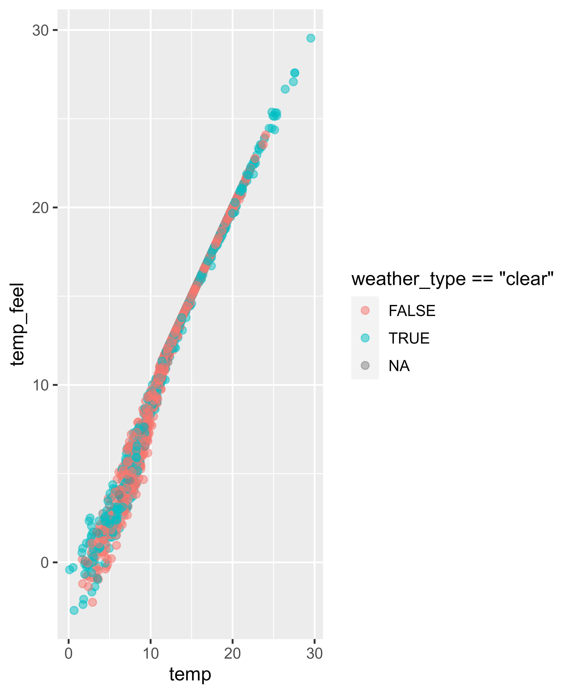{width=1500}
:::
:::


## Mapping to Size


::: {.cell output-location='column' hash='02_concepts_pt1_cache/revealjs/geom-point-aes-size-exercise_adcce289fda228ea0918f2d74867896c'}

```{.r .cell-code  code-line-numbers="7"}
ggplot(
    bikes,
    aes(x = temp, y = temp_feel)
  ) +
  geom_point(
    aes(color = weather_type == "clear",
        size = count),
    alpha = .5
  )
```

::: {.cell-output-display}
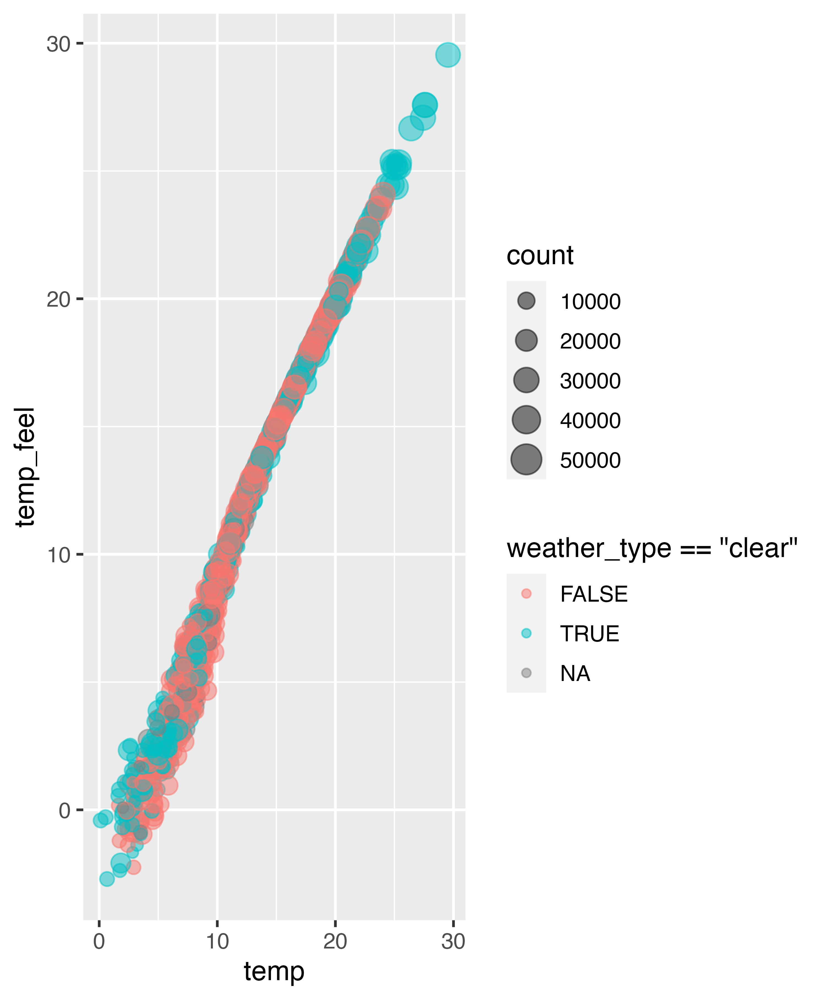{width=1500}
:::
:::


## Setting a Constant Property


::: {.cell output-location='column' hash='02_concepts_pt1_cache/revealjs/geom-point-aes-expression-exercise-shape_a23b967e1fd63477d8889e7073291b24'}

```{.r .cell-code  code-line-numbers="8"}
ggplot(
    bikes,
    aes(x = temp, y = temp_feel)
  ) +
  geom_point(
    aes(color = weather_type == "clear",
        size = count),
    shape = 18,
    alpha = .5
  )
```

::: {.cell-output-display}
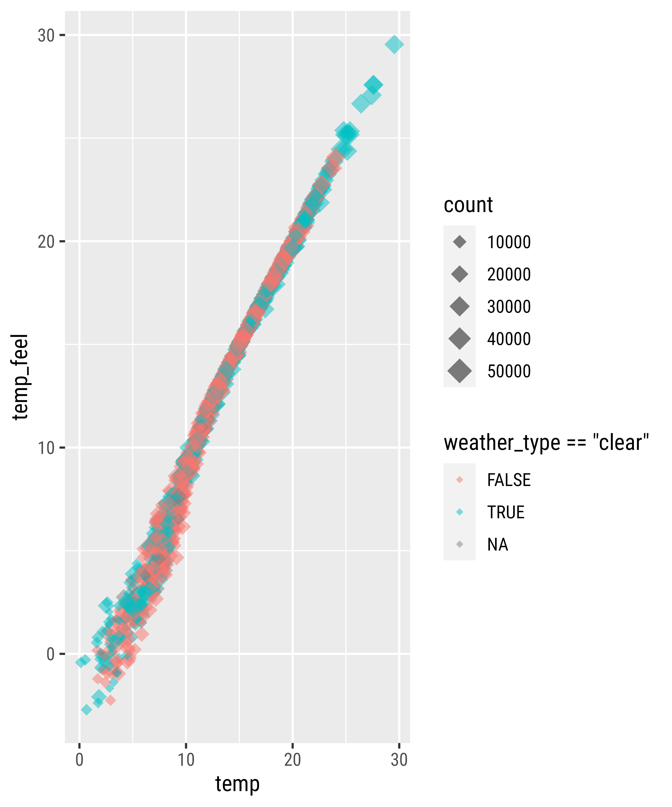{width=1500}
:::
:::


## Setting a Constant Property


::: {.cell output-location='column' hash='02_concepts_pt1_cache/revealjs/geom-point-aes-expression-exercise-shape-2_d3f96e279da49778e8add0e12eaf9e5a'}

```{.r .cell-code  code-line-numbers="8"}
ggplot(
    bikes,
    aes(x = temp, y = temp_feel)
  ) +
  geom_point(
    aes(color = weather_type == "clear",
        size = count),
    shape = 5,
    alpha = .5
  )
```

::: {.cell-output-display}
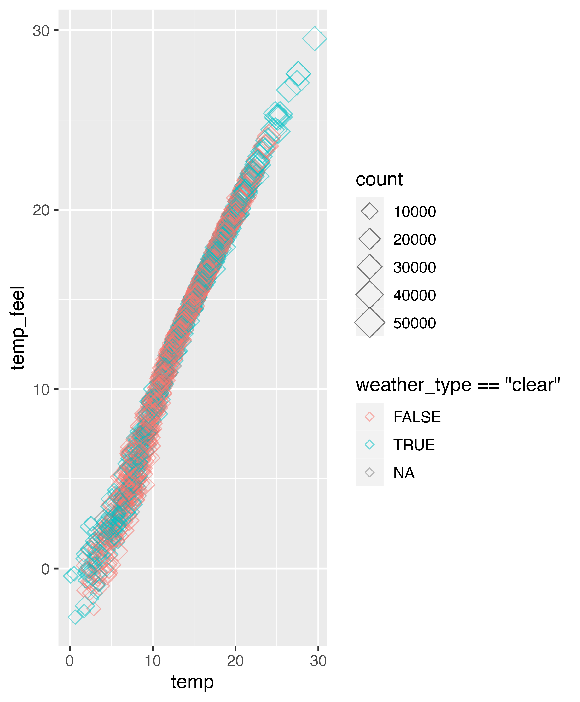{width=1500}
:::
:::


## Setting a Constant Property


::: {.cell output-location='column' hash='02_concepts_pt1_cache/revealjs/geom-point-aes-expression-exercise-shape-3_d18a8f9836571968e37088e6fe03b0c3'}

```{.r .cell-code  code-line-numbers="8"}
ggplot(
    bikes,
    aes(x = temp, y = temp_feel)
  ) +
  geom_point(
    aes(color = weather_type == "clear",
        size = count),
    shape = 9,
    alpha = .5
  )
```

::: {.cell-output-display}
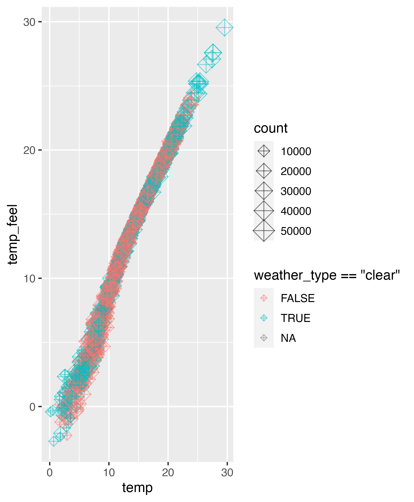{width=1500}
:::
:::


## Setting a Constant Property


::: {.cell output-location='column' hash='02_concepts_pt1_cache/revealjs/geom-point-aes-expression-exercise-shape-4_306b89c2a800fec31f962b1cbc14faf2'}

```{.r .cell-code  code-line-numbers="8"}
ggplot(
    bikes,
    aes(x = temp, y = temp_feel)
  ) +
  geom_point(
    aes(color = weather_type == "clear",
        size = count),
    shape = 23,
    alpha = .5
  )
```

::: {.cell-output-display}
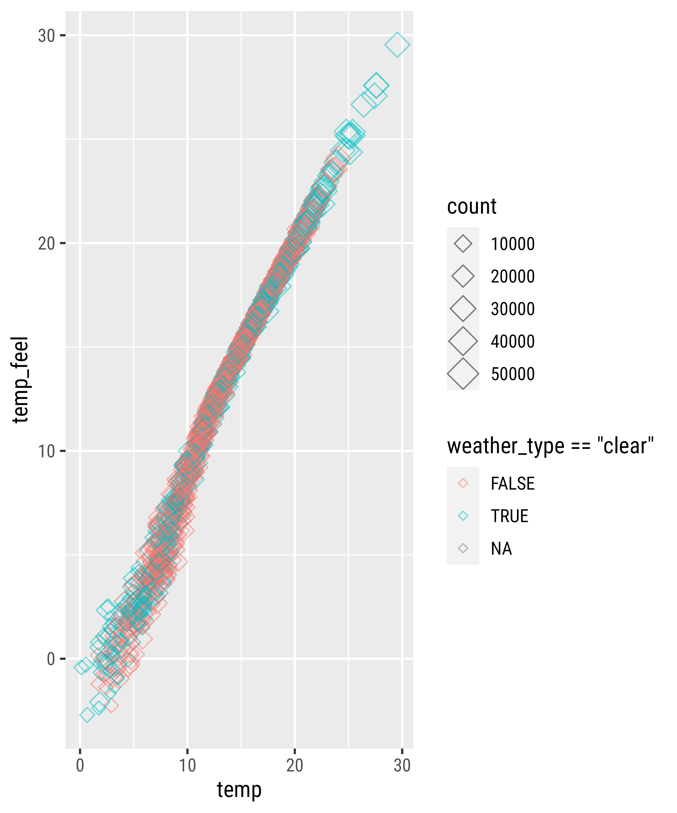{width=1500}
:::
:::


------------------------------------------------------------------------

](img/concepts/shapes-type.png){fig-alt="An overview of a set of available shapes, ordered by their type of shape (e.g. points, triangles etc)." fig-width="150%"}

## Setting a Constant Property


::: {.cell output-location='column' hash='02_concepts_pt1_cache/revealjs/geom-point-aes-expression-exercise-shape-4-fill_ffc9f7e41e08aba28330138a11d6707d'}

```{.r .cell-code  code-line-numbers="6,8,9"}
ggplot(
    bikes,
    aes(x = temp, y = temp_feel)
  ) +
  geom_point(
    aes(fill = weather_type == "clear",
        size = count),
    shape = 23,
    color = "black",
    alpha = .5
  )
```

::: {.cell-output-display}
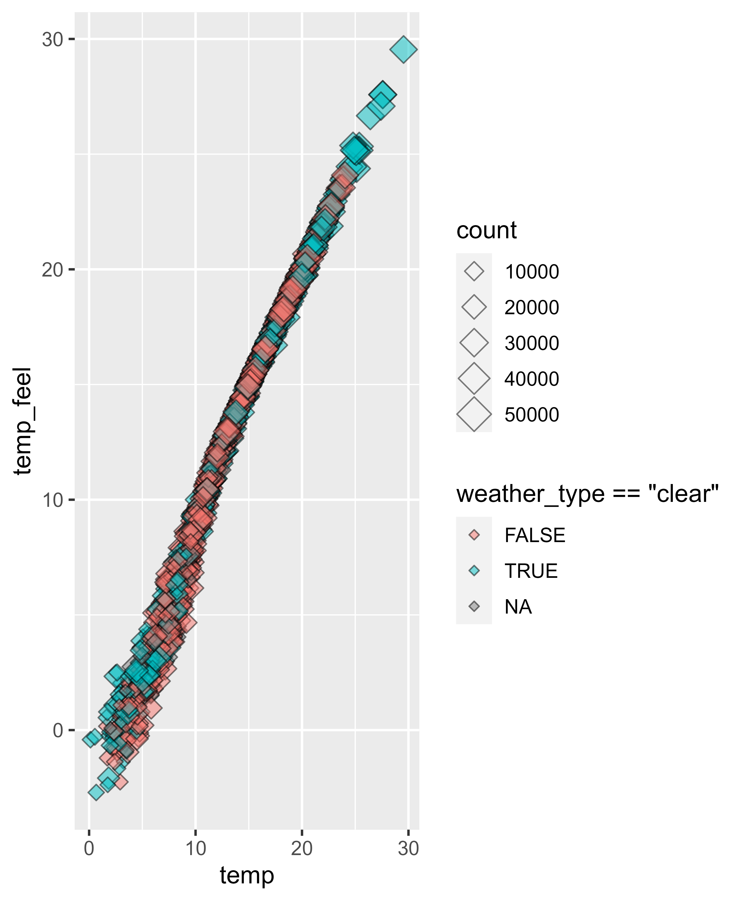{width=1500}
:::
:::


## Filter Data


::: {.cell output-location='column' hash='02_concepts_pt1_cache/revealjs/geom-point-aes-expression-exercise-na_f0f1c83fb3662a752acc624279ff5421'}

```{.r .cell-code  code-line-numbers="2"}
ggplot(
    filter(bikes, !is.na(weather_type)),
    aes(x = temp, y = temp_feel)
  ) +
  geom_point(
    aes(color = weather_type == "clear",
        size = count),
    shape = 18,
    alpha = .5
  )
```

::: {.cell-output-display}
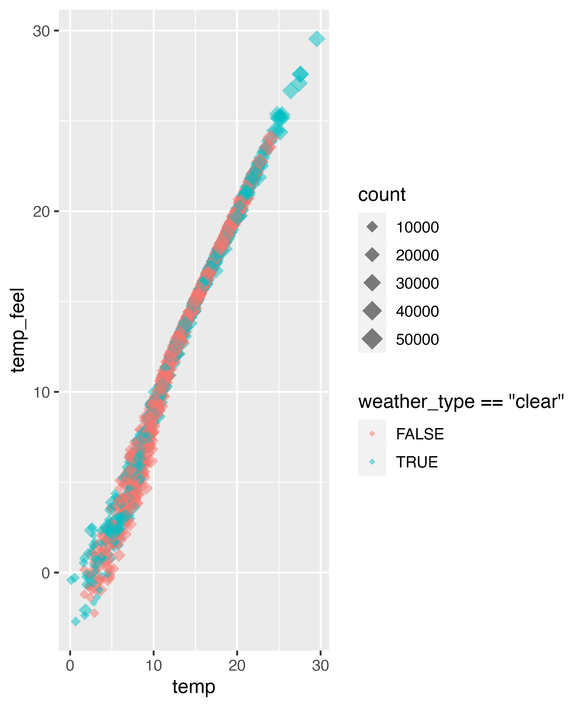{width=1500}
:::
:::


## Filter Data


::: {.cell output-location='column' hash='02_concepts_pt1_cache/revealjs/geom-point-aes-expression-exercise-na-pipe_21188348706af001250b5cf10e21d8c6'}

```{.r .cell-code  code-line-numbers="2"}
ggplot(
    bikes %>% filter(!is.na(weather_type)),
    aes(x = temp, y = temp_feel)
  ) +
  geom_point(
    aes(color = weather_type == "clear",
        size = count),
    shape = 18,
    alpha = .5
  )
```

::: {.cell-output-display}
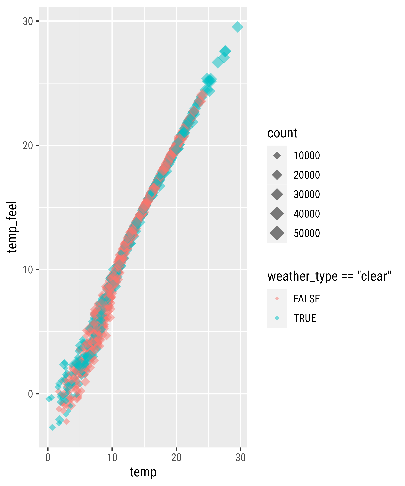{width=1500}
:::
:::


## Local vs. Global Encoding

::: {layout-ncol="2"}

::: {.cell hash='02_concepts_pt1_cache/revealjs/geom-point-aes-geom_31bb37d0288bd7c1beba2a67b166a0ac'}

```{.r .cell-code  code-line-numbers="3,6"}
ggplot(
    bikes,
    aes(x = temp_feel, y = count)
  ) +
  geom_point(
    aes(color = season),
    alpha = .5
  )
```

::: {.cell-output-display}
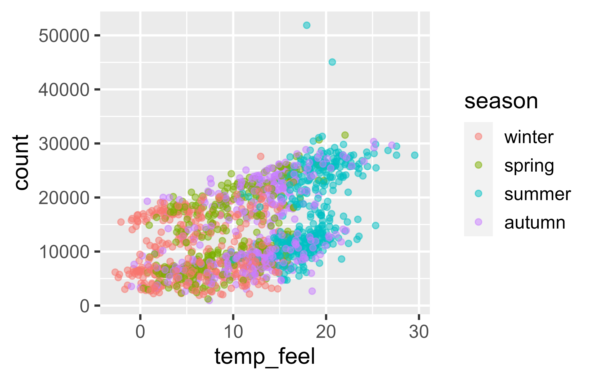{width=1500}
:::
:::


::: fragment

::: {.cell hash='02_concepts_pt1_cache/revealjs/geom-point-aes-global_0ecdbefffdf058b1af3cbe3f0ae1f938'}

```{.r .cell-code  code-line-numbers="3,4"}
ggplot(
    bikes,
    aes(x = temp_feel, y = count,
        color = season)
  ) +
  geom_point(
    alpha = .5
  )
```

::: {.cell-output-display}
{width=1500}
:::
:::

:::
:::

## Adding More Layers


::: {.cell output-location='column' hash='02_concepts_pt1_cache/revealjs/geom-smooth_cfdb2502a151ab6945c2e9f5cf2d9d0a'}

```{.r .cell-code  code-line-numbers="9,10,11"}
ggplot(
    bikes,
    aes(x = temp_feel, y = count,
        color = season)
  ) +
  geom_point(
    alpha = .5
  ) +
  geom_smooth(
    method = "lm"
  )
```

::: {.cell-output-display}
{width=1500}
:::
:::


## Global Color Encoding


::: {.cell output-location='column' hash='02_concepts_pt1_cache/revealjs/geom-smooth-aes-global_146d659433aecef80c3b3c215d799d06'}

```{.r .cell-code  code-line-numbers="3,4,9,10,11"}
ggplot(
    bikes,
    aes(x = temp_feel, y = count,
        color = season)
  ) +
  geom_point(
    alpha = .5
  ) +
  geom_smooth(
    method = "lm"
  )
```

::: {.cell-output-display}
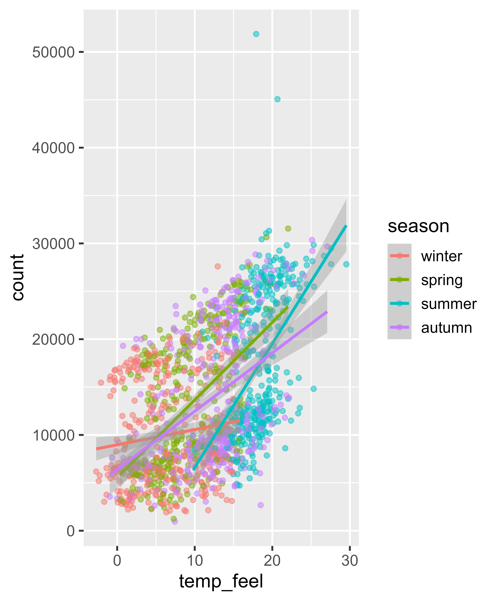{width=1500}
:::
:::


## Local Color Encoding


::: {.cell output-location='column' hash='02_concepts_pt1_cache/revealjs/geom-smooth-aes-fixed_b8adaa688ff62f1991da0609ecf14a2e'}

```{.r .cell-code  code-line-numbers="6,9,10,11"}
ggplot(
    bikes,
    aes(x = temp_feel, y = count)
  ) +
  geom_point(
    aes(color = season),
    alpha = .5
  ) +
  geom_smooth(
    method = "lm"
  )
```

::: {.cell-output-display}
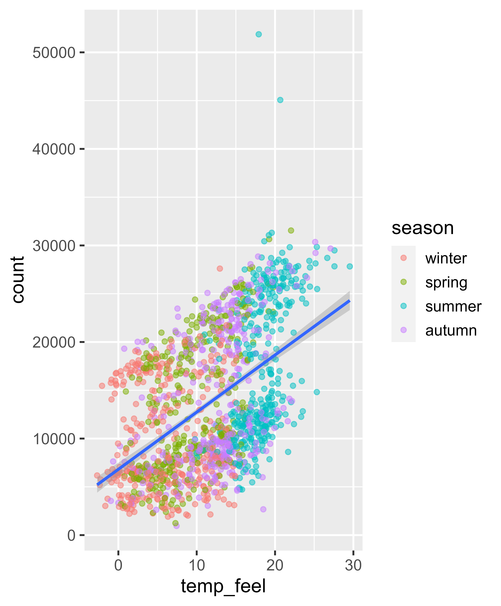{width=1500}
:::
:::


## The \`group\` Aesthetic


::: {.cell output-location='column' hash='02_concepts_pt1_cache/revealjs/geom-smooth-aes-grouped_b408d6ded4e3f6b1f5b79d9eef8002f5'}

```{.r .cell-code  code-line-numbers="10"}
ggplot(
    bikes,
    aes(x = temp_feel, y = count)
  ) +
  geom_point(
    aes(color = season),
    alpha = .5
  ) +
  geom_smooth(
    aes(group = day_night),
    method = "lm"
  )
```

::: {.cell-output-display}
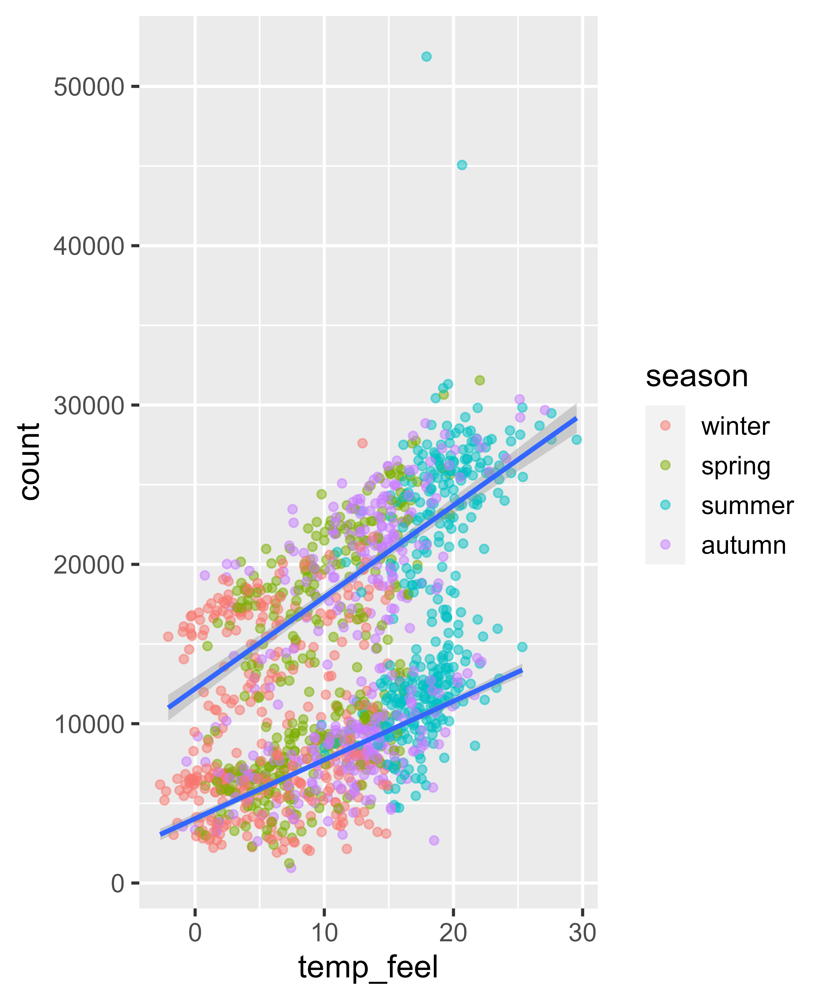{width=1500}
:::
:::


## Set Both as Global Aesthetics


::: {.cell output-location='column' hash='02_concepts_pt1_cache/revealjs/geom-smooth-aes-global-grouped_900a838ed3d312bcbdf2bed99189b738'}

```{.r .cell-code  code-line-numbers="4,5"}
ggplot(
    bikes,
    aes(x = temp_feel, y = count,
        color = season,
        group = day_night)
  ) +
  geom_point(
    alpha = .5
  ) +
  geom_smooth(
    method = "lm"
  )
```

::: {.cell-output-display}
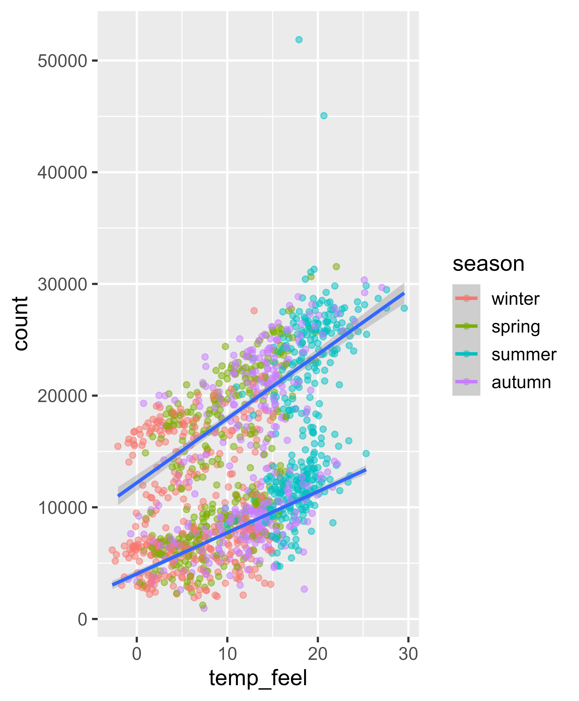{width=1500}
:::
:::


## Overwrite Global Aesthetics


::: {.cell output-location='column' hash='02_concepts_pt1_cache/revealjs/geom-smooth-aes-global-grouped-overwrite_9d909965d4d23848152353349d5d6d32'}

```{.r .cell-code  code-line-numbers="4,12"}
ggplot(
    bikes,
    aes(x = temp_feel, y = count,
        color = season,
        group = day_night)
  ) +
  geom_point(
    alpha = .5
  ) +
  geom_smooth(
    method = "lm",
    color = "black"
  )
```

::: {.cell-output-display}
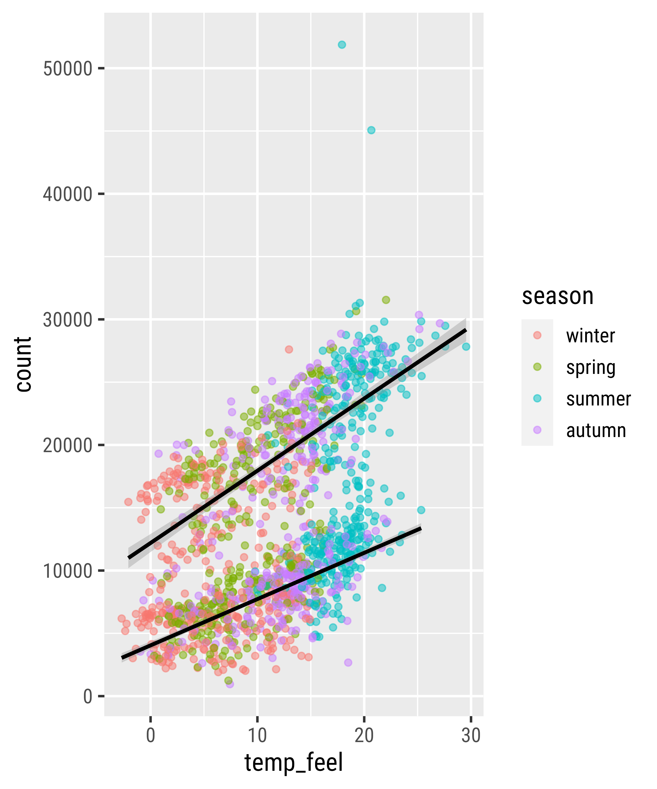{width=1500}
:::
:::


# Statistical Layers


## \`stat_\*()\` and \`geom_\*()\`

::: {layout-ncol="2"}

::: {.cell hash='02_concepts_pt1_cache/revealjs/stat-geom_73e9f7efe0bd8ee187d618e3a6f946f2'}

```{.r .cell-code  code-line-numbers="2"}
ggplot(bikes, aes(x = temp_feel, y = count)) +
  stat_smooth(geom = "smooth")
```

::: {.cell-output-display}
{width=1500}
:::
:::

::: {.cell hash='02_concepts_pt1_cache/revealjs/geom-stat_90de7dc4190d5497ddb9a8852582f819'}

```{.r .cell-code  code-line-numbers="2"}
ggplot(bikes, aes(x = temp_feel, y = count)) +
  geom_smooth(stat = "smooth")
```

::: {.cell-output-display}
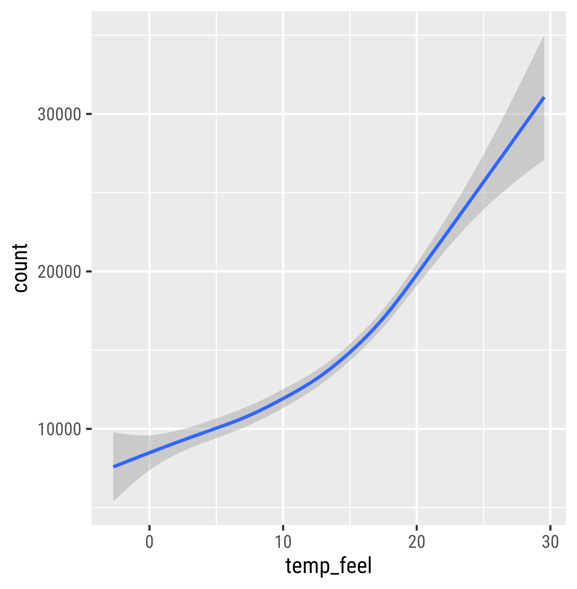{width=1500}
:::
:::

:::


## \`stat_\*()\` and \`geom_\*()\`

::: {layout-ncol="2"}

::: {.cell hash='02_concepts_pt1_cache/revealjs/stat-geom-2_817eb6560590196d38978d8477a8183b'}

```{.r .cell-code  code-line-numbers="2"}
ggplot(bikes, aes(x = season)) +
  stat_count(geom = "bar")
```

::: {.cell-output-display}
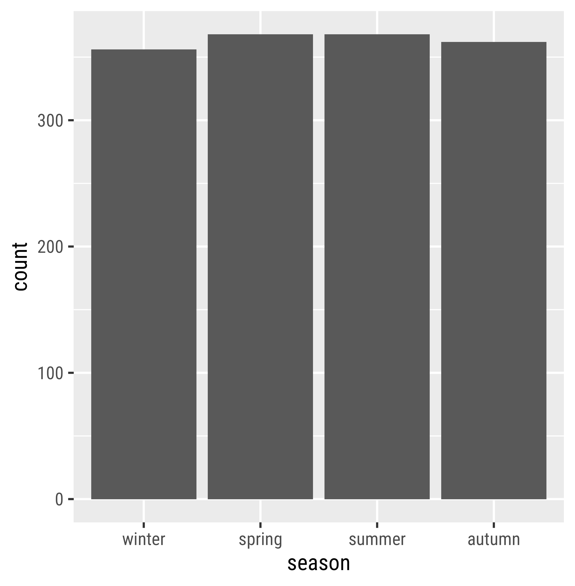{width=1500}
:::
:::

::: {.cell hash='02_concepts_pt1_cache/revealjs/geom-stat-2_3fb5421702e3972d451025b5317874fd'}

```{.r .cell-code  code-line-numbers="2"}
ggplot(bikes, aes(x = season)) +
  geom_bar(stat = "count")
```

::: {.cell-output-display}
{width=1500}
:::
:::

:::


## \`stat_\*()\` and \`geom_\*()\`

::: {layout-ncol="2"}

::: {.cell hash='02_concepts_pt1_cache/revealjs/stat-geom-3_597c9718cd490e2cf71ead418cfb2b9e'}

```{.r .cell-code  code-line-numbers="2"}
ggplot(bikes, aes(x = date, y = temp_feel)) +
  stat_identity(geom = "point")
```

::: {.cell-output-display}
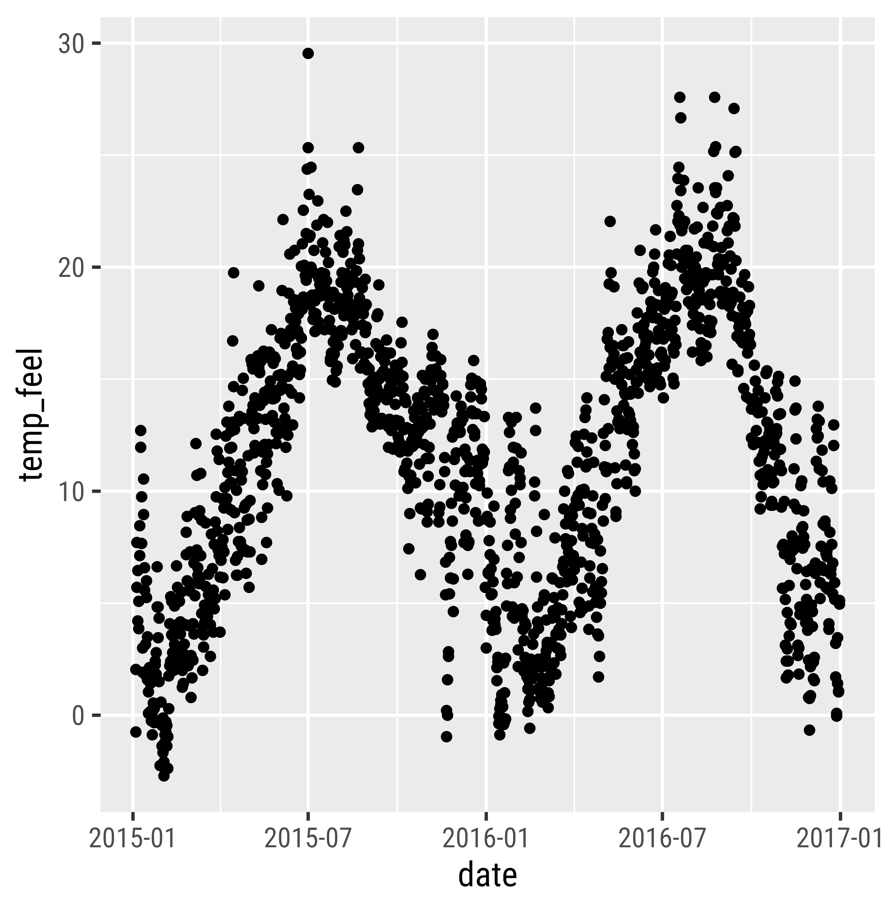{width=1500}
:::
:::

::: {.cell hash='02_concepts_pt1_cache/revealjs/geom-stat-3_32ba84bc67092e73ecb87a81d7a5e7a1'}

```{.r .cell-code  code-line-numbers="2"}
ggplot(bikes, aes(x = date, y = temp_feel)) +
  geom_point(stat = "identity")
```

::: {.cell-output-display}
{width=1500}
:::
:::

:::

## Statistical Summaries


::: {.cell output-location='column' hash='02_concepts_pt1_cache/revealjs/stat-summary_cd69e212370e6e50cfe98b7712284fce'}

```{.r .cell-code  code-line-numbers="5|3"}
ggplot(
    bikes, 
    aes(x = season, y = temp_feel)
  ) +
  stat_summary() 
```

::: {.cell-output-display}
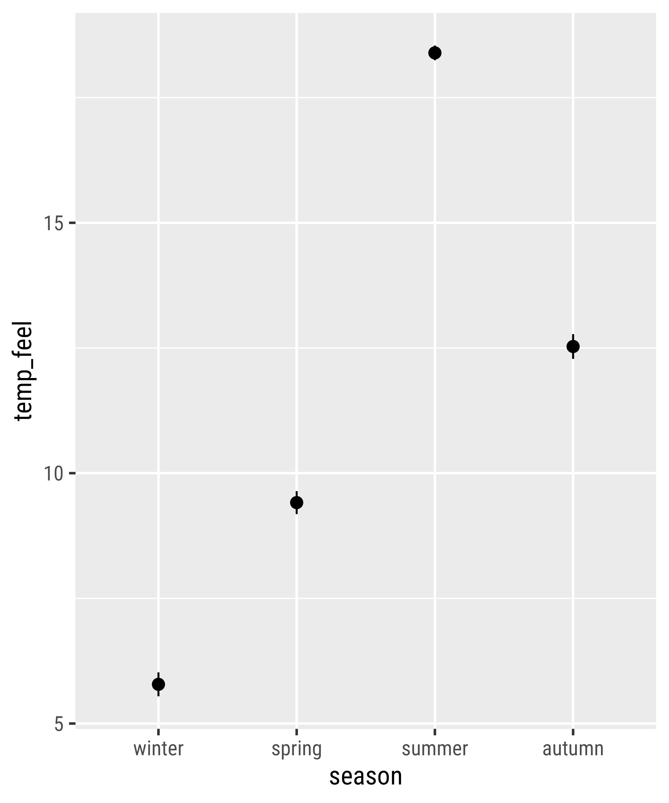{width=1500}
:::
:::


## Statistical Summaries


::: {.cell output-location='column' hash='02_concepts_pt1_cache/revealjs/stat-summary-defaults_5e752c462c68fd42cdea9b66f5659d96'}

```{.r .cell-code  code-line-numbers="6,7"}
ggplot(
    bikes, 
    aes(x = season, y = temp_feel)
  ) +
  stat_summary(
    fun = mean_se, ## the default
    geom = "pointrange"  ## the default
  ) 
```

::: {.cell-output-display}
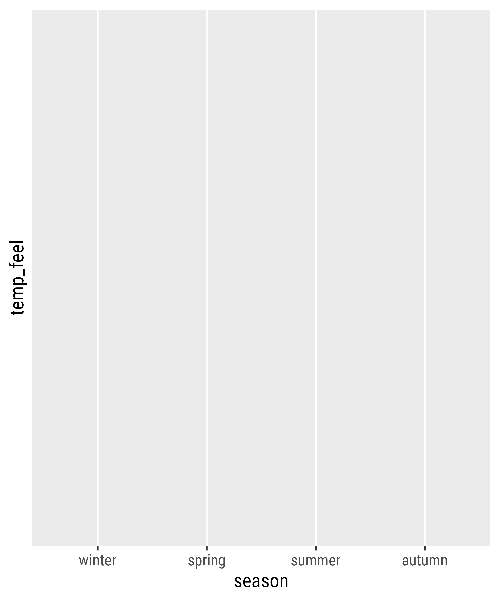{width=1500}
:::
:::


## Statistical Summaries


::: {.cell output-location='column' hash='02_concepts_pt1_cache/revealjs/stat-summary-median_0a4a3205d870105d0c1d01d0afb8a9a9'}

```{.r .cell-code  code-line-numbers="5|5,6,11|6,7,8,9,10,11|7,8"}
ggplot(
    bikes, 
    aes(x = season, y = temp_feel)
  ) +
  geom_boxplot() +
  stat_summary(
    fun = mean,
    geom = "point",
    color = "#28a87d",
    size = 3
  ) 
```

::: {.cell-output-display}
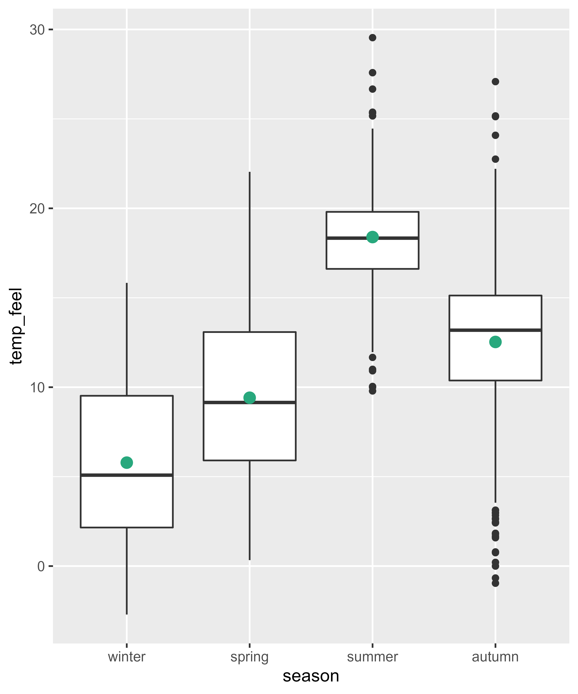{width=1500}
:::
:::


## Statistical Summaries


::: {.cell output-location='column' hash='02_concepts_pt1_cache/revealjs/stat-summary-custom_7e23305d45aa73883fb5433e8f1c75ef'}

```{.r .cell-code  code-line-numbers="5,6,7,8,9|7,8"}
ggplot(
    bikes, 
    aes(x = season, y = temp_feel)
  ) +
  stat_summary(
    fun = mean, 
    fun.max = function(y) mean(y) + sd(y), 
    fun.min = function(y) mean(y) - sd(y) 
  ) 
```

::: {.cell-output-display}
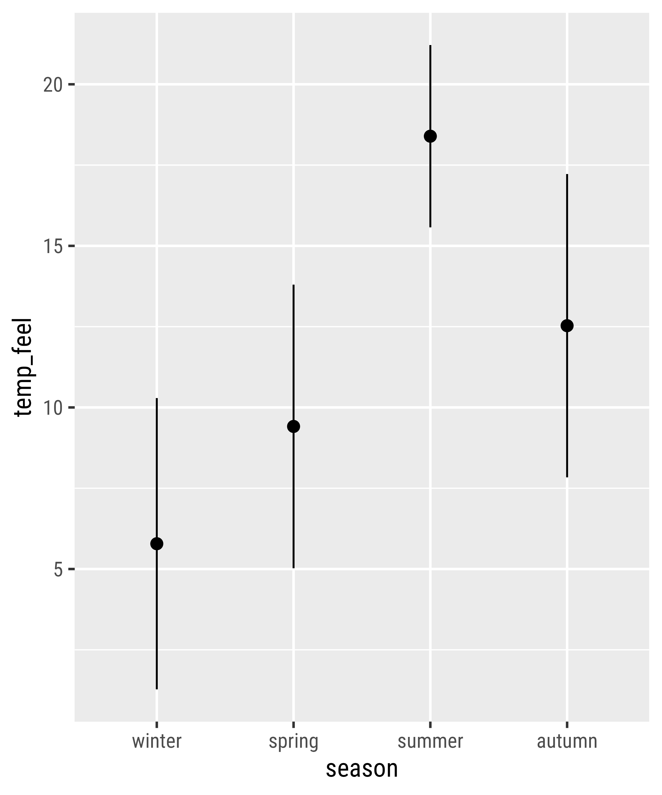{width=1500}
:::
:::


# Extending a ggplot

## Store a ggplot as Object


::: {.cell hash='02_concepts_pt1_cache/revealjs/ggplot-object_64584976e5e7de04828ed9067c84991f'}

```{.r .cell-code  code-line-numbers="1,16"}
g <-
  ggplot(
    bikes,
    aes(x = temp_feel, y = count,
        color = season,
        group = day_night)
  ) +
  geom_point(
    alpha = .5
  ) +
  geom_smooth(
    method = "lm",
    color = "black"
  )

class(g)
```

::: {.cell-output .cell-output-stdout}
```
[1] "gg"     "ggplot"
```
:::
:::


## Inspect a ggplot Object


::: {.cell hash='02_concepts_pt1_cache/revealjs/ggplot-object-data_d59f14cdb4f90b5cf9e7ead0fb5a2c01'}

```{.r .cell-code}
g$data
```

::: {.cell-output .cell-output-stdout}
```
# A tibble: 1,454 x 14
   date       day_night year  month season count is_workday is_weekend
   <date>     <chr>     <fct> <fct> <fct>  <int> <lgl>      <lgl>     
 1 2015-01-04 day       2015  1     winter  6830 FALSE      TRUE      
 2 2015-01-04 night     2015  1     winter  2404 FALSE      TRUE      
 3 2015-01-05 day       2015  1     winter 14763 TRUE       FALSE     
 4 2015-01-05 night     2015  1     winter  5609 TRUE       FALSE     
 5 2015-01-06 day       2015  1     winter 14501 TRUE       FALSE     
 6 2015-01-06 night     2015  1     winter  6112 TRUE       FALSE     
 7 2015-01-07 day       2015  1     winter 16358 TRUE       FALSE     
 8 2015-01-07 night     2015  1     winter  4706 TRUE       FALSE     
 9 2015-01-08 day       2015  1     winter  9971 TRUE       FALSE     
10 2015-01-08 night     2015  1     winter  5630 TRUE       FALSE     
# ... with 1,444 more rows, and 6 more variables: is_holiday <lgl>, temp <dbl>,
#   temp_feel <dbl>, humidity <dbl>, wind_speed <dbl>, weather_type <chr>
```
:::
:::


## Inspect a ggplot Object


::: {.cell hash='02_concepts_pt1_cache/revealjs/ggplot-object-mapping_af7debd7d8c9f2fc1bd52481622937af'}

```{.r .cell-code}
g$mapping
```

::: {.cell-output .cell-output-stdout}
```
Aesthetic mapping: 
* `x`      -> `temp_feel`
* `y`      -> `count`
* `colour` -> `season`
* `group`  -> `day_night`
```
:::
:::


## Extend a ggplot Object: Add Layers


::: {.cell output-location='column' hash='02_concepts_pt1_cache/revealjs/ggplot-object-extend-geom_3794fe3203743cc7508dea942675dc75'}

```{.r .cell-code}
g +
  geom_rug(
    alpha = .2
  )
```

::: {.cell-output-display}
{width=1500}
:::
:::


## Remove a Layer from the Legend


::: {.cell output-location='column' hash='02_concepts_pt1_cache/revealjs/geom-guide-none_02f4192502fb110d429b518ed6e44777'}

```{.r .cell-code  code-line-numbers="4"}
g +
  geom_rug(
    alpha = .2,
    show.legend = FALSE
  )
```

::: {.cell-output-display}
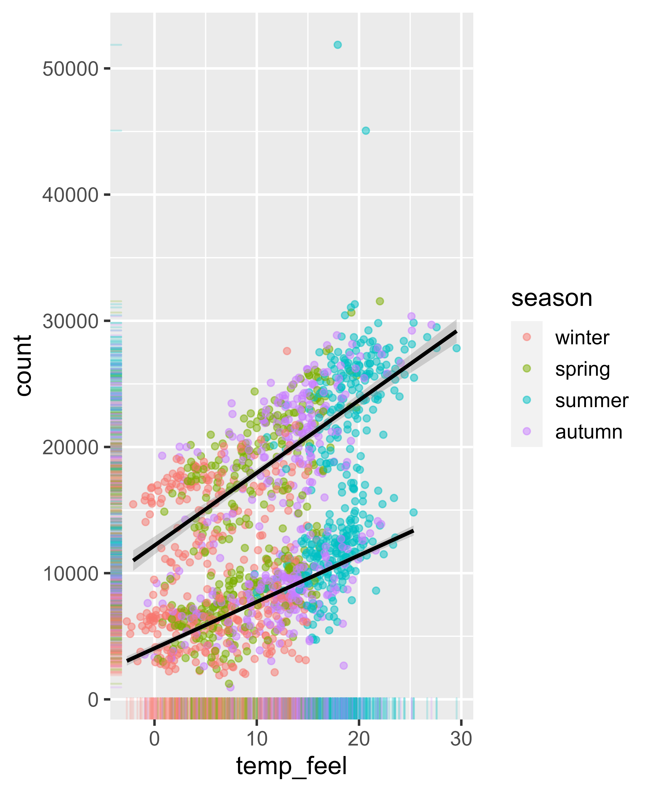{width=1500}
:::
:::


## Extend a ggplot Object: Add Labels


::: {.cell output-location='column' hash='02_concepts_pt1_cache/revealjs/ggplot-labs-individual_9ecf583a6bbaa5887dcde64ad81c997d'}

```{.r .cell-code  code-line-numbers="2,3,4"}
g +
  xlab("Feels-like temperature (°F)") +
  ylab("Reported bike shares") +
  ggtitle("TfL bike sharing trends")
```

::: {.cell-output-display}
{width=1500}
:::
:::


## Extend a ggplot Object: Add Labels


::: {.cell output-location='column' hash='02_concepts_pt1_cache/revealjs/ggplot-labs-bundled_ed6a66d8d6aa14f29ac5eaf6a3e22b3f'}

```{.r .cell-code  code-line-numbers="2,3,4,5,6"}
g +
  labs(
    x = "Feels-like temperature (°F)",
    y = "Reported bike shares",
    title = "TfL bike sharing trends"
  )
```

::: {.cell-output-display}
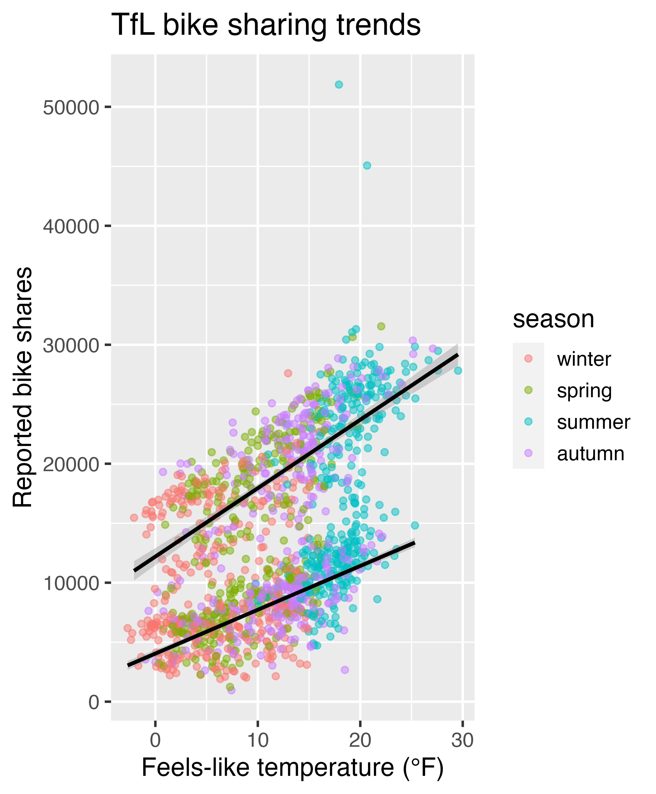{width=1500}
:::
:::


## Extend a ggplot Object: Add Labels


::: {.cell output-location='column' hash='02_concepts_pt1_cache/revealjs/ggplot-labs-bundled-color_12944cdd8e5e2885e284ea06abc2a5e6'}

```{.r .cell-code  code-line-numbers="6"}
g <- g +
  labs(
    x = "Feels-like temperature (°F)",
    y = "Reported bike shares",
    title = "TfL bike sharing trends",
    color = "Season:"
  )

g
```

::: {.cell-output-display}
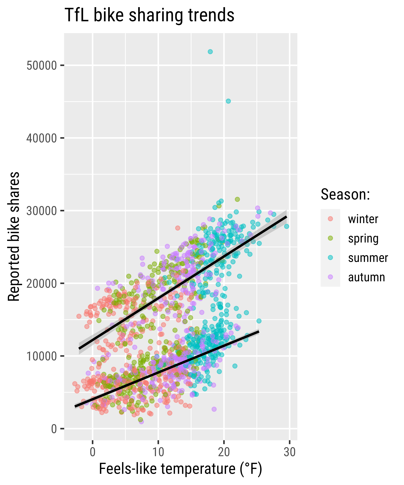{width=1500}
:::
:::


## Extend a ggplot Object: Add Labels


::: {.cell output-location='column' hash='02_concepts_pt1_cache/revealjs/ggplot-labs-bundled-extended_a6976119b4f7c835fc7c9abf623cad7c'}

```{.r .cell-code  code-line-numbers="6,7,9"}
g +
  labs(
    x = "Feels-like temperature (°F)",
    y = "Reported bike shares",
    title = "TfL bike sharing trends",
    subtitle = "Reported bike rents versus feels-like temperature in London",
    caption = "Data: TfL",
    color = "Season:",
    tag = "Fig. 1"
  )
```

::: {.cell-output-display}
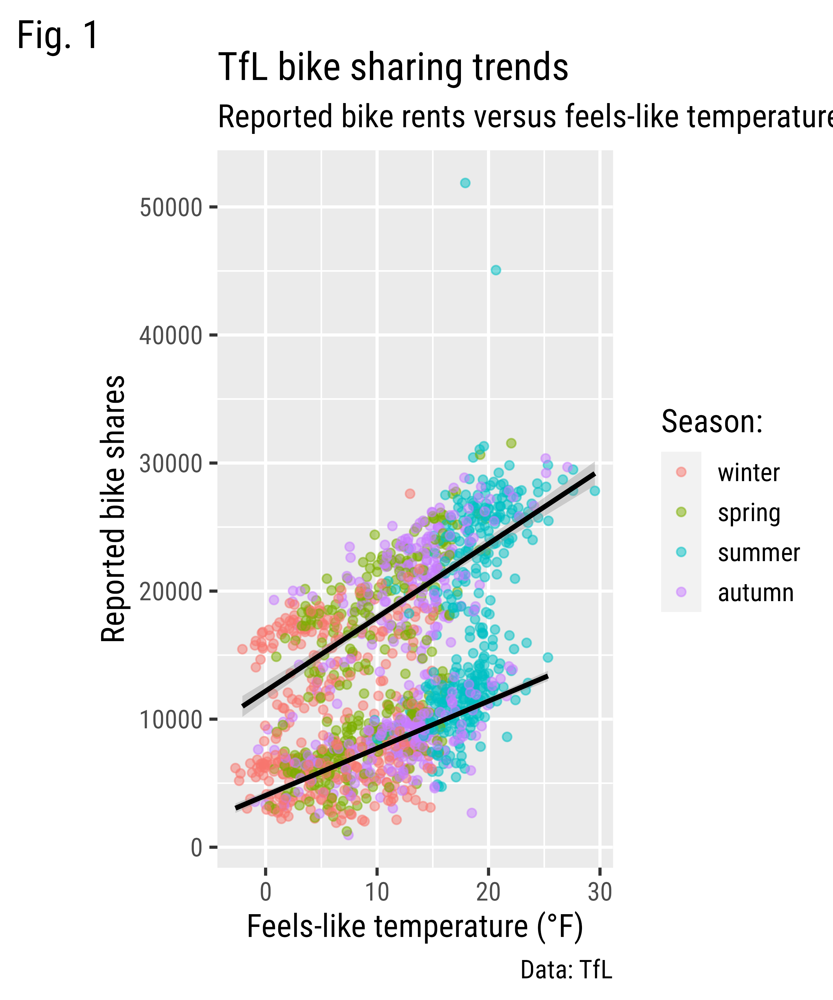{width=1500}
:::
:::


## Extend a ggplot Object: Add Labels

::: {layout-ncol="2"}

::: {.cell hash='02_concepts_pt1_cache/revealjs/ggplot-labs-empty-vs-null-A_a9d4d9b61e4fa1fddfebc6057921e402'}

```{.r .cell-code  code-line-numbers="3"}
g +
  labs(
    x = "",
    caption = "Data: TfL"
  )
```

::: {.cell-output-display}
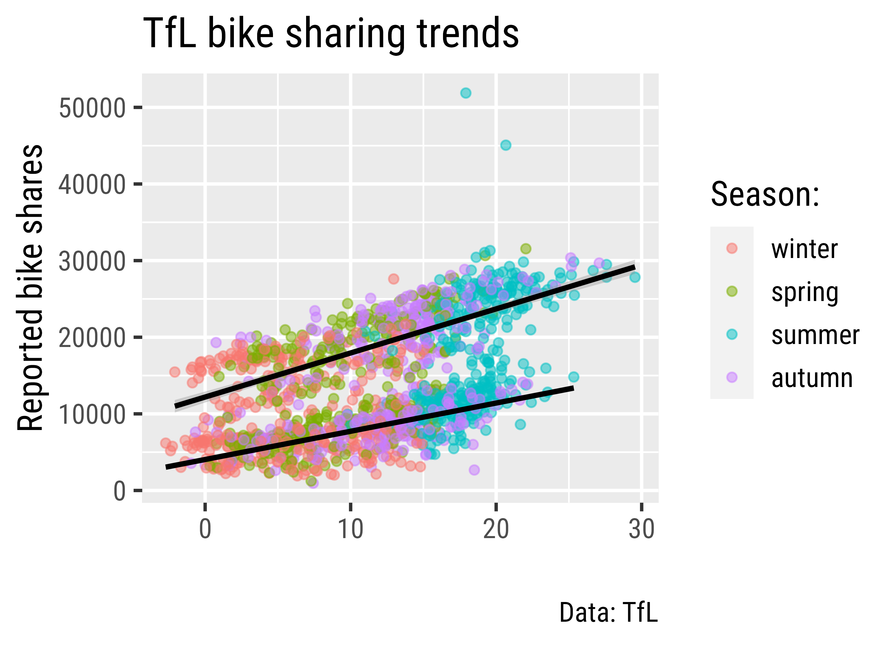{width=1500}
:::
:::

::: {.cell hash='02_concepts_pt1_cache/revealjs/ggplot-labs-empty-vs-null-B_3569c89fc70e339422d477b526ee529b'}

```{.r .cell-code  code-line-numbers="3"}
g +
  labs(
    x = NULL,
    caption = "Data: TfL"
  )
```

::: {.cell-output-display}
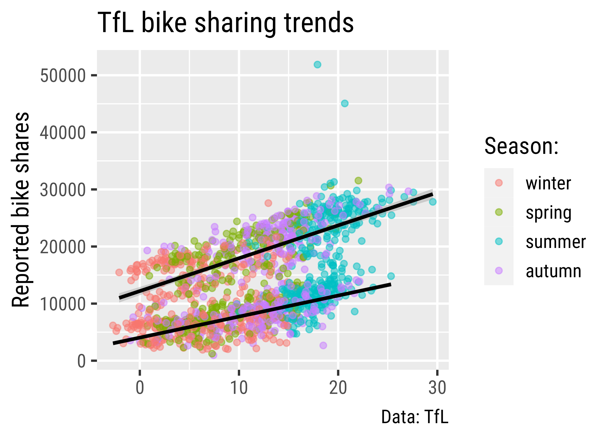{width=1500}
:::
:::

:::

# A Polished ggplot Example

## Extend a ggplot Object: Themes

::: {layout-ncol="2"}

::: {.cell hash='02_concepts_pt1_cache/revealjs/ggplot-object-extend-theme-light_8332d57526d153d2bdb80477becdf57d'}

```{.r .cell-code}
g + theme_light()
```

::: {.cell-output-display}
{width=1500}
:::
:::


::: fragment

::: {.cell hash='02_concepts_pt1_cache/revealjs/ggplot-object-extend-theme-minimal_392453f1c41666b02e4aa66474380351'}

```{.r .cell-code}
g + theme_minimal()
```

::: {.cell-output-display}
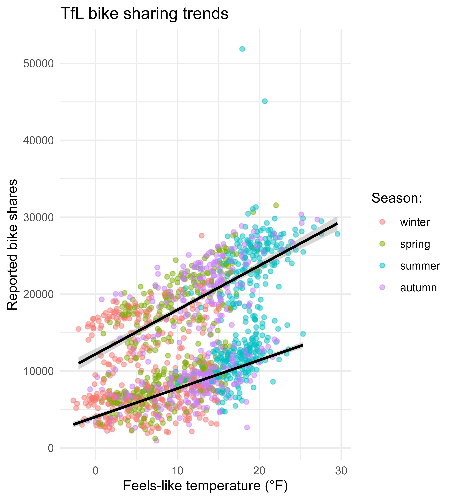{width=1500}
:::
:::

:::
:::

## Change the Theme Base Settings


::: {.cell output-location='column' hash='02_concepts_pt1_cache/revealjs/ggplot-theme-extend-theme-base_80922b7de2cc35376a02f02954dc5492'}

```{.r .cell-code  code-line-numbers="2,3|1,2,3,4"}
g + theme_light(
  base_size = 14,
  base_family = "Roboto Condensed"
)
```

::: {.cell-output-display}
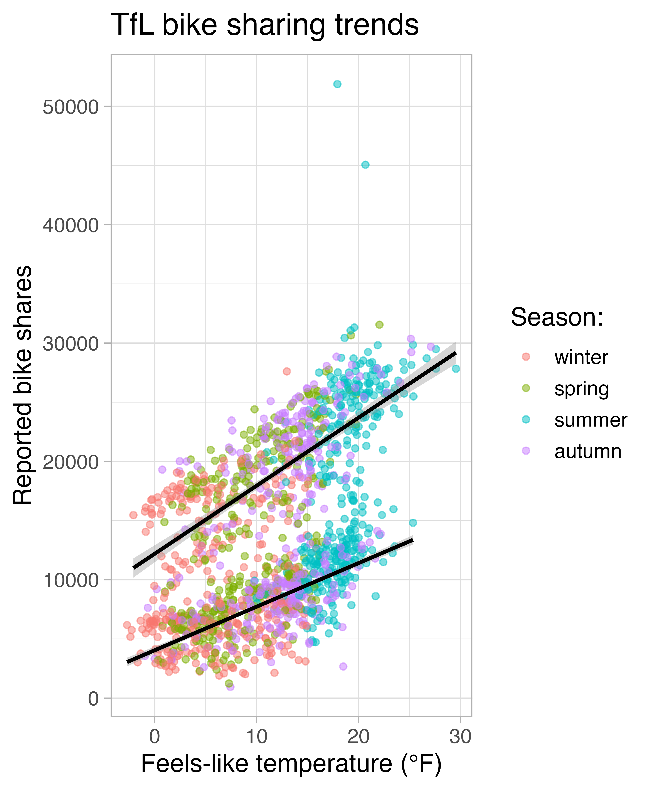{width=1500}
:::
:::


## Set a Theme Globally


::: {.cell output-location='column' hash='02_concepts_pt1_cache/revealjs/ggplot-theme-global_ccf0cc184587a47e9e2d2396c6587b1c'}

```{.r .cell-code}
theme_set(theme_light())

g
```

::: {.cell-output-display}
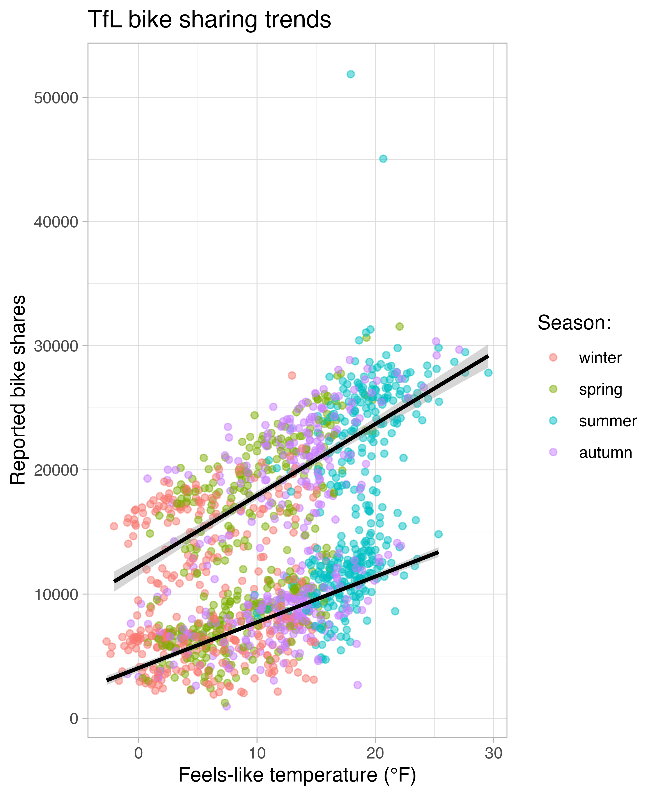{width=1500}
:::
:::


## Change the Theme Base Settings


::: {.cell output-location='column' hash='02_concepts_pt1_cache/revealjs/ggplot-theme-global-base_064a3d6720da7c238ca44c84fc791b2f'}

```{.r .cell-code  code-line-numbers="2,3|1,2,3,4"}
theme_set(theme_light(
  base_size = 14,
  base_family = "Roboto Condensed"
))

g
```

::: {.cell-output-display}
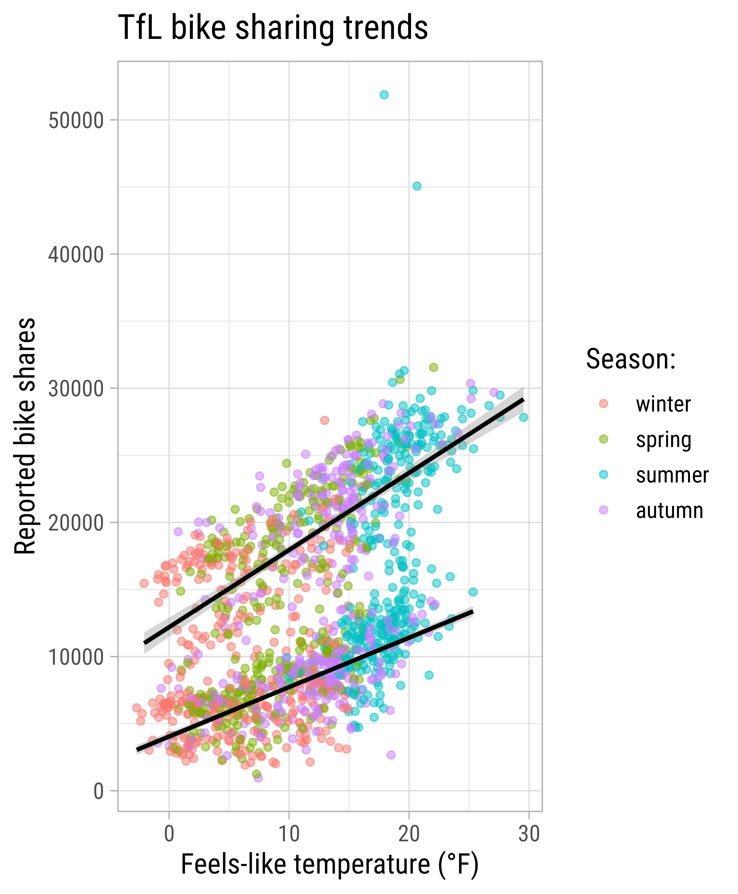{width=1500}
:::
:::


## {systemfonts}


::: {.cell hash='02_concepts_pt1_cache/revealjs/systemfonts_a95df5730aba5f6032618b71685f1b80'}

```{.r .cell-code  code-line-numbers="3,5,6,7,8|5,6,7,8"}
# install.packages("systemfonts")

library(systemfonts)

system_fonts() %>%
  filter(str_detect(family, "Cabinet")) %>%
  pull(name) %>%
  sort()
```

::: {.cell-output .cell-output-stdout}
```
 [1] "CabinetGrotesk-Black"      "CabinetGrotesk-Black"     
 [3] "CabinetGrotesk-Bold"       "CabinetGrotesk-Bold"      
 [5] "CabinetGrotesk-Extrabold"  "CabinetGrotesk-Extrabold" 
 [7] "CabinetGrotesk-Extralight" "CabinetGrotesk-Extralight"
 [9] "CabinetGrotesk-Light"      "CabinetGrotesk-Light"     
[11] "CabinetGrotesk-Medium"     "CabinetGrotesk-Medium"    
[13] "CabinetGrotesk-Regular"    "CabinetGrotesk-Regular"   
[15] "CabinetGrotesk-Thin"       "CabinetGrotesk-Thin"      
```
:::
:::


## {systemfonts}


::: {.cell hash='02_concepts_pt1_cache/revealjs/systemfonts-register_120b1ef2c7faf95d61681a9353ece1ee'}

```{.r .cell-code  code-line-numbers="1,2,34,5,6|1,2,3|4"}
register_variant(
  name = "Cabinet Grotesk Black",
  family = "Cabinet Grotesk",
  weight = "heavy",
  features = font_feature(letters = "stylistic")
)
```
:::


## {systemfonts} + {ggplot2}


::: {.cell output-location='column' hash='02_concepts_pt1_cache/revealjs/systemfonts-register-plot_e8c2aafc98225d9f2eaaddd9dcbf67f8'}

```{.r .cell-code  code-line-numbers="4"}
g +
  theme_light(
    base_size = 18,
    base_family = "Cabinet Grotesk Black"
  )
```

::: {.cell-output-display}
{width=1500}
:::
:::


## Overwrite Specific Theme Settings


::: {.cell output-location='column' hash='02_concepts_pt1_cache/revealjs/ggplot-theme-settings-individual-1_99756756fd59ec1aed6444cb54e7bb6a'}

```{.r .cell-code  code-line-numbers="2|3"}
g +
  theme(
    panel.grid.minor = element_blank()
  )
```

::: {.cell-output-display}
{width=1500}
:::
:::


## Overwrite Specific Theme Settings


::: {.cell output-location='column' hash='02_concepts_pt1_cache/revealjs/ggplot-theme-settings-individual-2_a6cd815f0f8bcb29d72c1cde21db77ab'}

```{.r .cell-code  code-line-numbers="4"}
g +
  theme(
    panel.grid.minor = element_blank(),
    plot.title = element_text(face = "bold")
  )
```

::: {.cell-output-display}
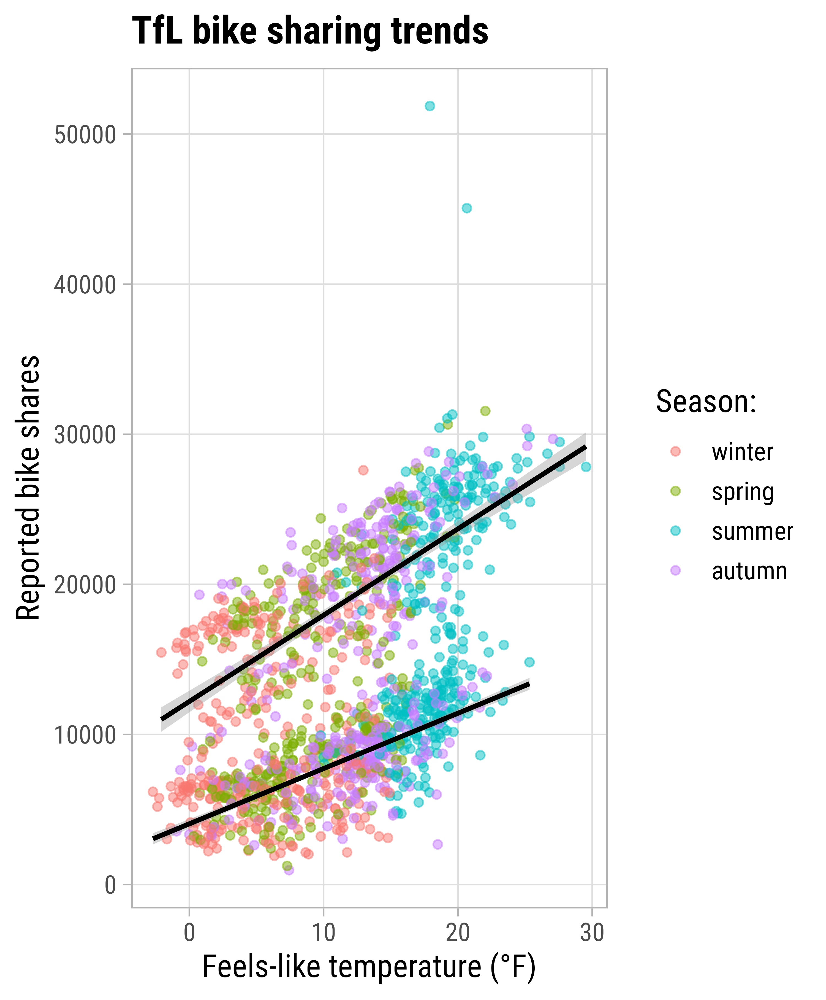{width=1500}
:::
:::


## Overwrite Specific Theme Settings


::: {.cell output-location='column' hash='02_concepts_pt1_cache/revealjs/ggplot-theme-settings-individual-3_685f0cefc603e31c700d62f329fac9c0'}

```{.r .cell-code  code-line-numbers="5"}
g +
  theme(
    panel.grid.minor = element_blank(),
    plot.title = element_text(face = "bold"),
    legend.position = "top"
  )
```

::: {.cell-output-display}
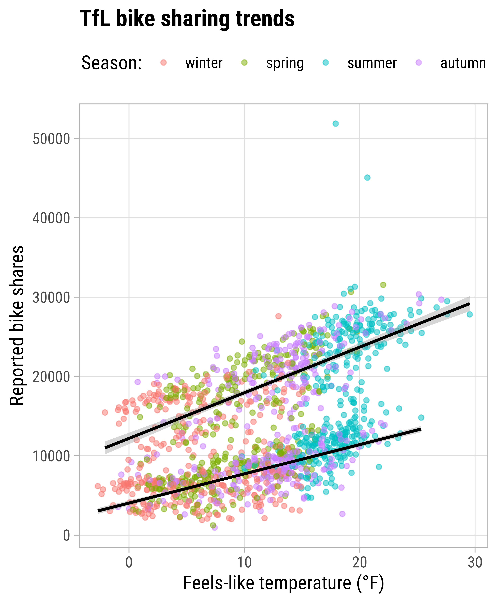{width=1500}
:::
:::


## Overwrite Specific Theme Settings


::: {.cell output-location='column' hash='02_concepts_pt1_cache/revealjs/ggplot-theme-settings-individual-legend-none_5dd33d82d8a6ff242bd7ac13d3ab25a4'}

```{.r .cell-code  code-line-numbers="5"}
g +
  theme(
    panel.grid.minor = element_blank(),
    plot.title = element_text(face = "bold"),
    legend.position = "none"
  )
```

::: {.cell-output-display}
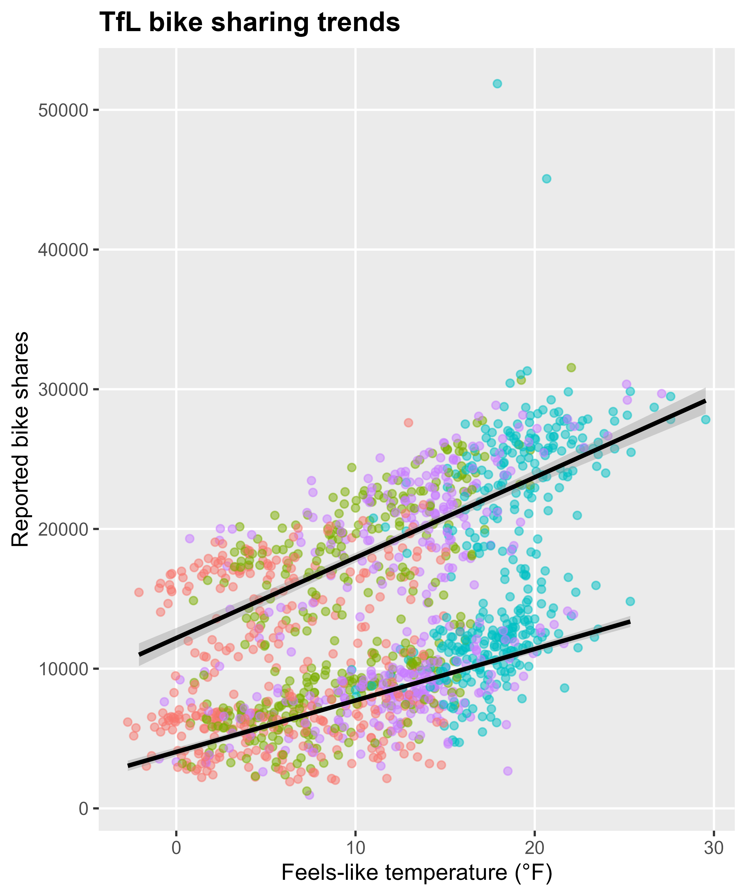{width=1500}
:::
:::


## Overwrite Specific Theme Settings


::: {.cell output-location='column' hash='02_concepts_pt1_cache/revealjs/ggplot-theme-settings-individual-4_52ed0f323475726c3a8324a86f564f1c'}

```{.r .cell-code  code-line-numbers="6|2,3,4,6,7"}
g +
  theme(
    panel.grid.minor = element_blank(),
    plot.title = element_text(face = "bold"),
    legend.position = "top",
    plot.title.position = "plot"
  )
```

::: {.cell-output-display}
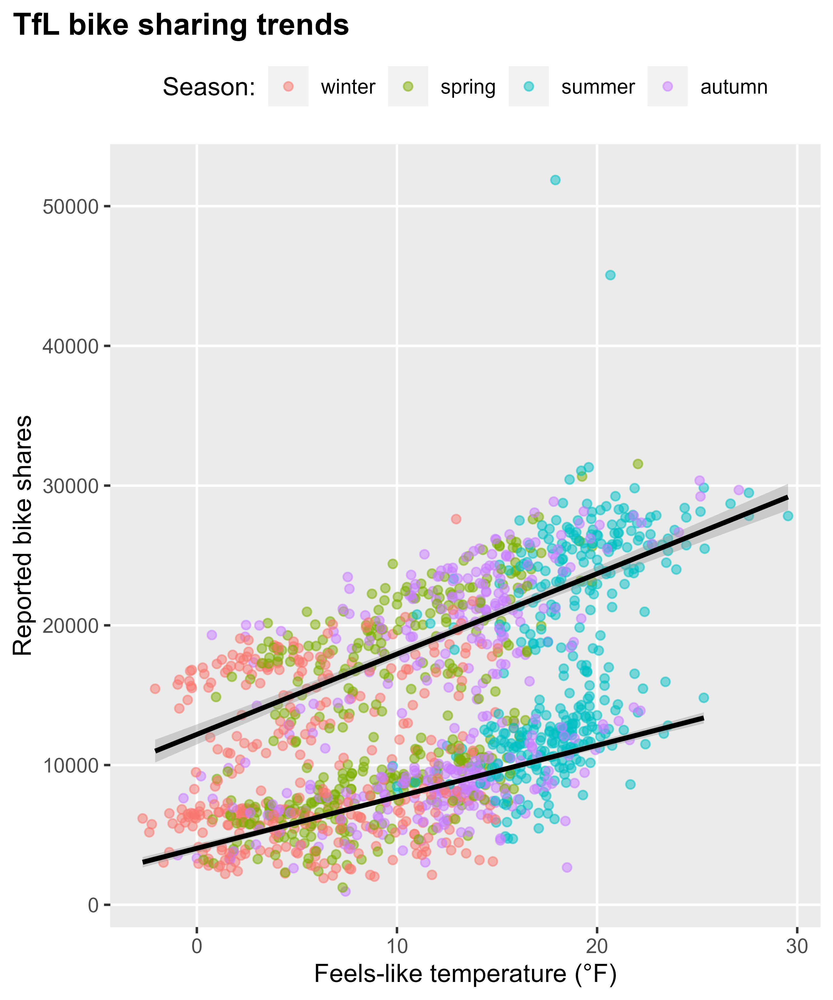{width=1500}
:::
:::


## Overwrite Theme Settings Globally


::: {.cell output-location='column' hash='02_concepts_pt1_cache/revealjs/ggplot-theme-settings-global_840216dfced452d852e575b23f118531'}

```{.r .cell-code  code-line-numbers="1|2,3,4,5|1,2,3,4,5,6"}
theme_update(
  panel.grid.minor = element_blank(),
  plot.title = element_text(face = "bold"),
  legend.position = "top",
  plot.title.position = "plot"
)

g
```

::: {.cell-output-display}
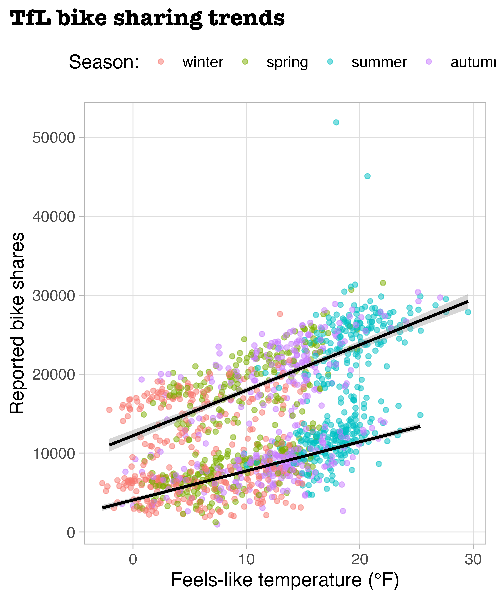{width=1500}
:::
:::


## Save the Graphic


::: {.cell hash='02_concepts_pt1_cache/revealjs/ggplot-save_39d04f9826b4aa1526d0acbe672fb3ef'}

```{.r .cell-code}
ggsave(g, filename = "my_plot.png")
```
:::


::: fragment

::: {.cell hash='02_concepts_pt1_cache/revealjs/ggplot-save-implicit_c9387d06a8d4ef157e4e304b3646cfe4'}

```{.r .cell-code}
ggsave("my_plot.png")
```
:::

:::

::: fragment

::: {.cell hash='02_concepts_pt1_cache/revealjs/ggplot-save-aspect_9a28d3acef743ed3bf88814b01fdb51f'}

```{.r .cell-code}
ggsave("my_plot.png", width = 8, height = 5, dpi = 600)
```
:::

:::

::: fragment

::: {.cell hash='02_concepts_pt1_cache/revealjs/ggplot-save-vector_404f98689e351a38197e90e568db86f5'}

```{.r .cell-code}
ggsave("my_plot.pdf", width = 20, height = 12, unit = "cm", device = cairo_pdf)
```
:::

:::

::: fragment

::: {.cell hash='02_concepts_pt1_cache/revealjs/ggplot-save-cairo_pdf_023836a19a6a4418d3f6154954c2e25c'}

```{.r .cell-code}
grDevices::cairo_pdf("my_plot.pdf", width = 10, height = 7)
g
dev.off()
```
:::

:::

------------------------------------------------------------------------

<br>

{fig-alt="A comparison of vector and raster graphics." fig-width="150%"}

## How to Work with Aspect Ratios

::: incremental
-   don't rely on the Rstudio viewer pane!
-   once you have a "it's getting close" prototype, settle on a plot size<br><br>
-   **Approach 1:** save the file to disk and inspect it; go back to your IDE
    -   tedious and time-consuming...<br><br>
-   **Approach 2:** use a qmd or rmd with inline output and chunk settings
    -   set `fig.width` and `fig.height` per chunk or globally<br><br>
-   **Approach 3:** use our [{camcorder} package](https://github.com/thebioengineer/camcorder)
    -   saves output from all `ggplot()` calls and displays it in the viewer pane
:::

## Setting Plot Sizes in Rmd's

{fig-alt="A screenshot of an exemplary Rmd file with two chunks with different settings of fig.width and fig.height." fig-width="60%"}

## Setting Plot Sizes via {camcorder}

<br>

{fig-alt="A screenshot of an exemplary R script with a plot automatically saved and isplayed in correct aspect ratio thanks to the camcorder package." fig-width="120%"}

## <b style='color:#663399;'>Recap</b>

::: recap
::: incremental
-   `{ggplot2}` is a powerful library for reproducible graphic design
-   the components follow a consistent syntax
-   each ggplot needs at least **data**, some **aesthetics**, and a **layer**
-   we **set** constant propeties outside `aes()`
-   ... and **map** data-related properties inside `aes()`
-   local settings and mappings override global properties
-   grouping allows applying layers for subsets
-   we can store a ggplot object and extend it afterwards
-   we can change the appearance for all plots with `theme_set()`<br>and `theme_update()`
:::
:::

# Exercises

## Exercise 1

::: question
-   Open the script `exercises/02_concepts_pt1_ex1.qmd`.
-   Explore the TfL bike share data visually:<br>**create a timeseries of reported bike shares on weekend days**
    -   Highlight day and night encoded by colors and shapes.
    -   Connect the points of each period with lines.
        -   What is the difference between `geom_line()` and `geom_path()`?
    -   Apply your favorite theme to the plot.
    -   Add meaningful labels.
-   Save the plot as a vector graphic with a decent plot size.
:::


::: {.cell hash='02_concepts_pt1_cache/revealjs/countdown-ex1_32a186491cd09e2cce9588d41421b714'}
::: {.cell-output-display}
```{=html}
<div class="countdown" id="timer_62f3aa06" style="right:0;bottom:0;font-size:.5em;" data-warnwhen="0">
<code class="countdown-time"><span class="countdown-digits minutes">15</span><span class="countdown-digits colon">:</span><span class="countdown-digits seconds">00</span></code>
</div>
```
:::
:::


##  {background-image="img/exercises/exercise-what-now.png" background-position="center" background-size="65%"}

## Exercise 2

::: question
-   Open the script `exercises/02_concepts_pt1_ex2.qmd`.
-   Explore the TfL bike sharing data visually:<br>**create a boxplot of counts per weather type**
    -   Turn the plot into a jitter strips plot (random noise across the x axis)
    -   Combine both chart types (jittered points on top of the boxplots)
    -   [Bonus: Sort the boxplot-jitter hybrid by median counts]{style="color:#5DB699;"}
    -   Apply your favorite theme to the plot.
    -   Add meaningful labels.
    -   [Bonus: Explore other chart types to visualize the distributions.]{style="color:#5DB699;"}
-   Save the plot as a vector graphic with a decent plot size.
:::


::: {.cell hash='02_concepts_pt1_cache/revealjs/countdown-ex2_103e23ee89a6472e0704dac442431bb7'}
::: {.cell-output-display}
```{=html}
<div class="countdown" id="timer_62f3aa2e" style="right:0;bottom:0;font-size:.5em;" data-warnwhen="0">
<code class="countdown-time"><span class="countdown-digits minutes">25</span><span class="countdown-digits colon">:</span><span class="countdown-digits seconds">00</span></code>
</div>
```
:::
:::


##  {background-image="img/exercises/exercise-what-now.png" background-position="center" background-size="65%"}
