## Setup


::: {.cell hash='05_annotations_cache/revealjs/prep_2c08d6dfa92dd4350f43192d229f4cdf'}

```{.r .cell-code}
library(tidyverse)

bikes <- readr::read_csv(
  here::here("data", "london-bikes-custom.csv"),
  col_types = "Dcfffilllddddc"
)

#bikes$season <- factor(bikes$season, levels = c("spring", "summer", "autumn", "winter"))
bikes$season <- forcats::fct_inorder(bikes$season)

theme_set(theme_light(base_size = 14, base_family = "Roboto Condensed"))

theme_update(
  panel.grid.minor = element_blank(),
  legend.position = "top"
)
```
:::


# Labels + `theme()`

## Working with Labels


::: {.cell output-location='column' hash='05_annotations_cache/revealjs/ggplot-labs-bundled-extended_d67507eb9488144da89569ab7123d50f'}

```{.r .cell-code  code-line-numbers="9,10,11,12,13,14,15,16,17"}
g <- ggplot(
    bikes,
    aes(x = temp_feel, y = count,
        color = season)
  ) +
  geom_point(
    alpha = .5
  ) +
  labs(
    x = "Feels Like temperature (°F)",
    y = "Reported bike shares",
    title = "TfL bike sharing trends",
    subtitle = "Reported bike rents versus Feels Like temperature in London",
    caption = "Data: TfL",
    color = "Season:",
    tag = "1."
  )

g
```

::: {.cell-output-display}
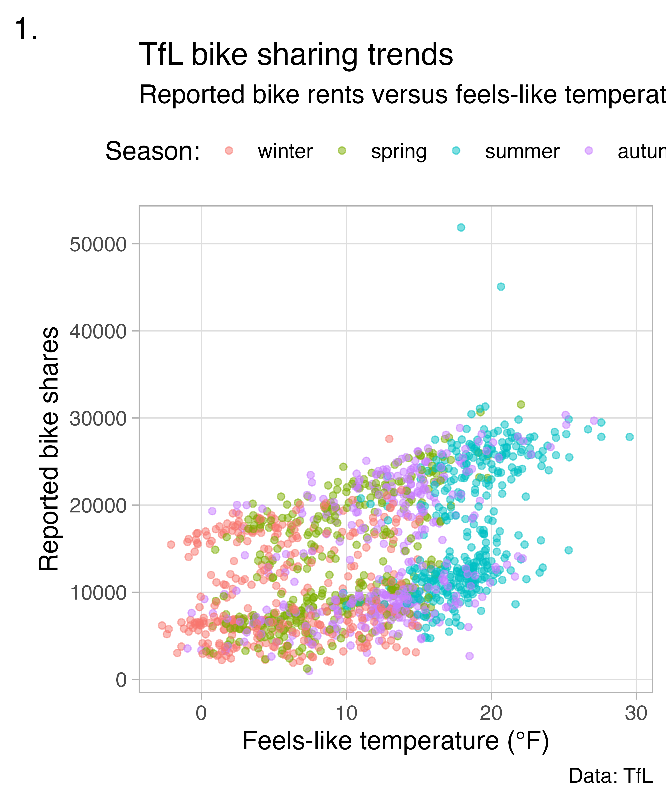{width=1500}
:::
:::


## Customize Labels via \`theme()\`


::: {.cell output-location='column' hash='05_annotations_cache/revealjs/ggplot-theme-title_5f674d2abb2da1d508f6ac9105b20560'}

```{.r .cell-code}
g + theme(
  plot.title = element_text(face = "bold"),
  plot.title.position = "plot"
)
```

::: {.cell-output-display}
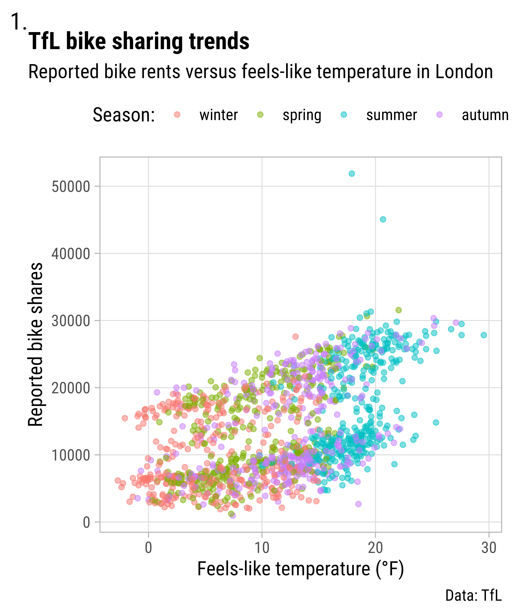{width=1500}
:::
:::


## Customize Labels via \`theme()\`


::: {.cell output-location='column' hash='05_annotations_cache/revealjs/ggplot-labs-theme-element-text_2bebdfefd4838fc9ae2246488d9ace8c'}

```{.r .cell-code  code-line-numbers="4,5,6"}
g + theme(
  plot.title = element_text(face = "bold"),
  plot.title.position = "plot",
  axis.text = element_text(
    color = "#28a87d"
  )
)
```

::: {.cell-output-display}
{width=1500}
:::
:::


## Customize Labels via \`theme()\`


::: {.cell output-location='column' hash='05_annotations_cache/revealjs/ggplot-labs-theme-element-text-more_6b12ed25ccc8e052a36ffbd3fe1d3f99'}

```{.r .cell-code  code-line-numbers="6|7|8|9|10|11|12"}
g + theme(
  plot.title = element_text(face = "bold"),
  plot.title.position = "plot",
  axis.text = element_text(
    color = "#28a87d",
    family = "Tabular",
    face = "italic",
    hjust = 1,
    vjust = 0,
    angle = 45,
    lineheight = 1.3, ## no effect here
    margin = margin(10, 0, 20, 0)
  )
)
```

::: {.cell-output-display}
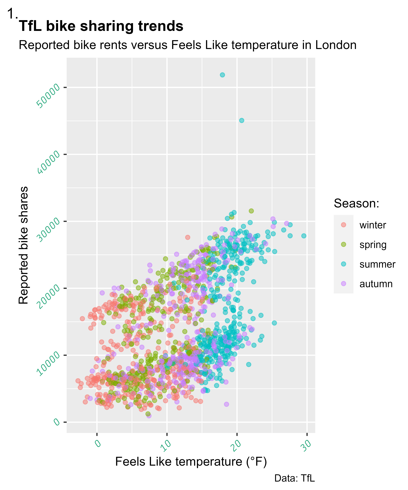{width=1500}
:::
:::


## Customize Labels via \`theme()\`


::: {.cell output-location='column' hash='05_annotations_cache/revealjs/ggplot-labs-theme-element-text-x_c88cccb59d94cd5bc155f21675d3192f'}

```{.r .cell-code  code-line-numbers="16,17,18"}
g + theme(
  plot.title = element_text(face = "bold"),
  plot.title.position = "plot",
  axis.text = element_text(
    color = "#28a87d",
    family = "Tabular",
    face = "italic",
    colour = NULL,
    size = NULL,
    hjust = 1,
    vjust = 0,
    angle = 45,
    lineheight = 1.3, ## no effect here
    margin = margin(10, 0, 20, 0) ## no effect here
  ),
  axis.text.x = element_text(
    margin = margin(10, 0, 20, 0) ## trbl
  )
)
```

::: {.cell-output-display}
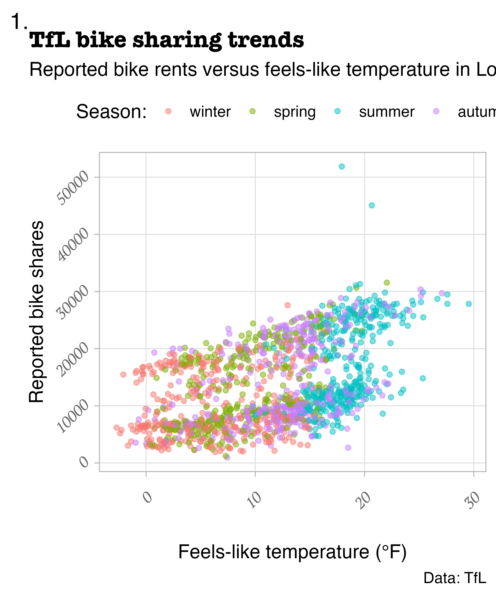{width=1500}
:::
:::


## Customize Labels via \`theme()\`


::: {.cell output-location='column' hash='05_annotations_cache/revealjs/ggplot-labs-theme-element-text-tag_eb4fd85a753089e50351a593b4f810ed'}

```{.r .cell-code  code-line-numbers="16,17,18"}
g + theme(
  plot.title = element_text(face = "bold"),
  plot.title.position = "plot",
  axis.text = element_text(
    color = "#28a87d",
    family = "Tabular",
    face = "italic",
    colour = NULL,
    size = NULL,
    hjust = 1,
    vjust = 0,
    angle = 45,
    lineheight = 1.3, ## no effect here
    margin = margin(10, 0, 20, 0) ## no effect here
  ),
  plot.tag = element_text(
    margin = margin(0, 12, -8, 0) ## trbl
  )
)
```

::: {.cell-output-display}
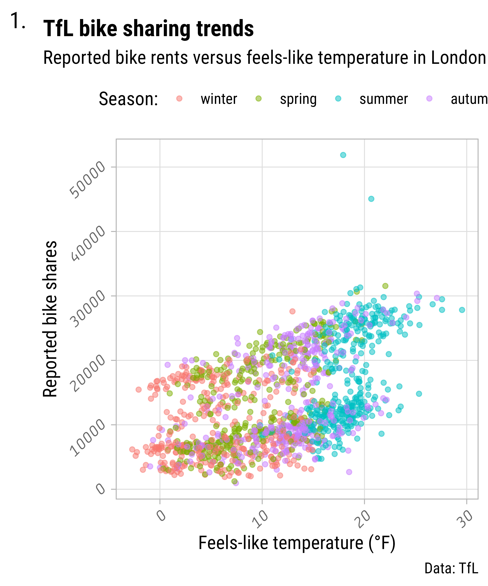{width=1500}
:::
:::


## Customize Labels via \`theme()\`


::: {.cell output-location='column' hash='05_annotations_cache/revealjs/ggplot-labs-theme-element-text-debug_07f22b2a39c8563c01385c89cf2e6663'}

```{.r .cell-code  code-line-numbers="15,19"}
g + theme(
  plot.title = element_text(face = "bold"),
  plot.title.position = "plot",
  axis.text = element_text(
    color = "#28a87d",
    family = "Tabular",
    face = "italic",
    colour = NULL,
    size = NULL,
    hjust = 1,
    vjust = 0,
    angle = 45,
    lineheight = 1.3, ## no effect here
    margin = margin(10, 0, 20, 0), ## no effect here
    debug = TRUE
  ),
  plot.tag = element_text(
    margin = margin(0, 12, -8, 0), ## trbl
    debug = TRUE
  )
)
```

::: {.cell-output-display}
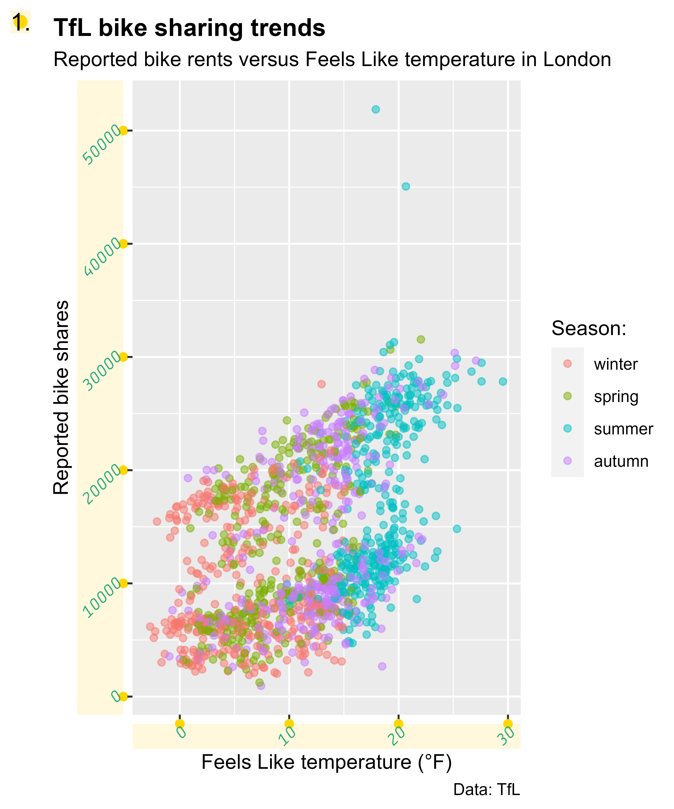{width=1500}
:::
:::


# Labels + `scale_*()`

## Format Labels via \`scale\_\*\`


::: {.cell output-location='column' hash='05_annotations_cache/revealjs/scales-xy-continuous-labels-scales-prep_e3b00eec020e0a3dc8627152ebd95108'}

```{.r .cell-code  code-line-numbers="1,2|4,5,6,7"}
g <- g + labs(tag = NULL, title = NULL, 
              subtitle = NULL)

g +
  scale_y_continuous(
    breaks = 0:4*15000
  )
```

::: {.cell-output-display}
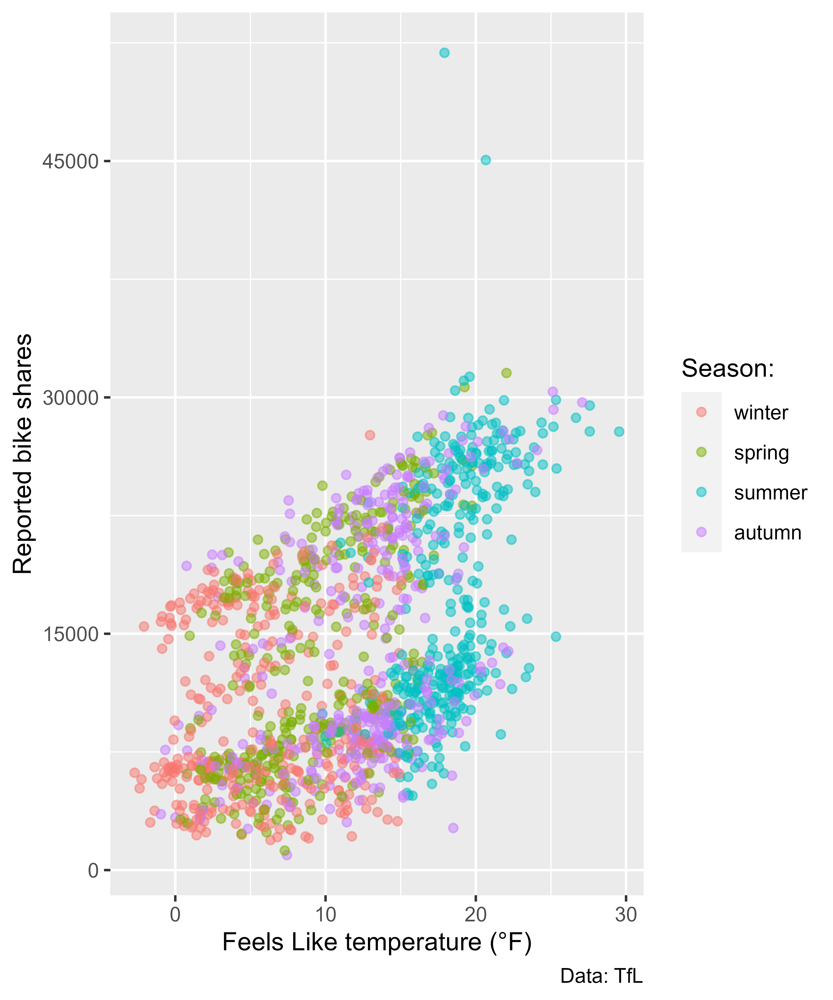{width=1500}
:::
:::


## Format Labels via \`scale\_\*\`


::: {.cell output-location='column' hash='05_annotations_cache/revealjs/scales-xy-continuous-labels-scales-1_52b8da74744b4166a0048a59cd59ebab'}

```{.r .cell-code  code-line-numbers="4"}
g +
  scale_y_continuous(
    breaks = 0:4*15000,
    labels = scales::comma_format()
  )
```

::: {.cell-output-display}
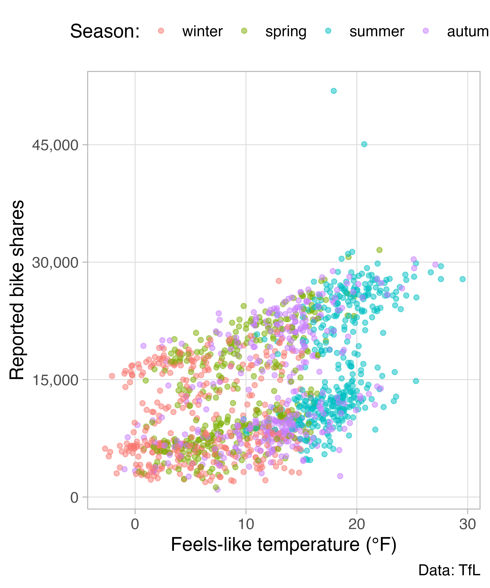{width=1500}
:::
:::


## Format Labels via \`scale\_\*\`


::: {.cell output-location='column' hash='05_annotations_cache/revealjs/scales-xy-continuous-labels-scales-2_26b6b18829cf4dfe0d0be1d660e87557'}

```{.r .cell-code  code-line-numbers="4,5,6|5|7"}
g +
  scale_y_continuous(
    breaks = 0:4*15000,
    labels = scales::comma_format(
      suffix = " bikes"
    ),
    name = NULL
  )
```

::: {.cell-output-display}
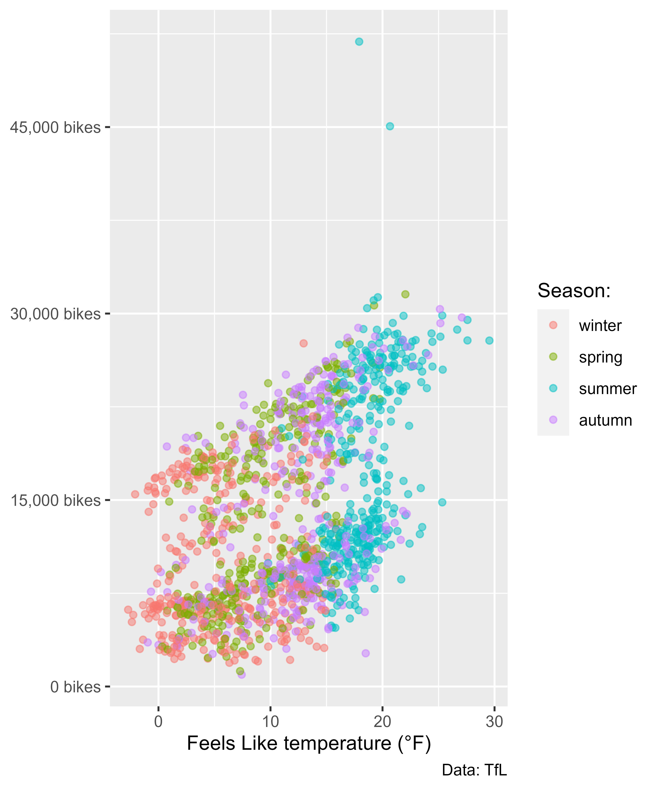{width=1500}
:::
:::


## Format Labels via \`scale\_\*\`


::: {.cell output-location='column' hash='05_annotations_cache/revealjs/scales-xy-continuous-labels-scales-3_6479157cf11b351a9bcdd60f7d7f053e'}

```{.r .cell-code  code-line-numbers="5|9,10,11,12,13"}
g +
  scale_y_continuous(
    breaks = 0:4*15000,
    labels = scales::comma_format(
      suffix = "\nbikes shared"
    ),
    name = NULL
  ) +
  theme(
    axis.text.y = element_text(
      hjust = .5
    )
  )
```

::: {.cell-output-display}
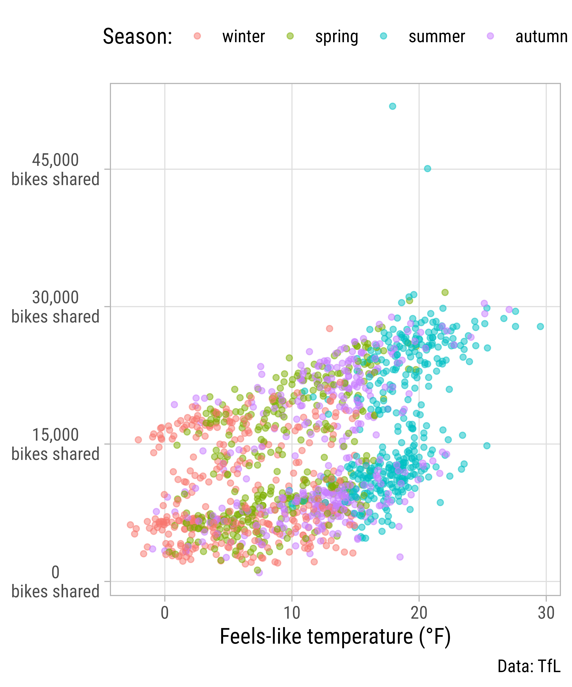{width=1500}
:::
:::


## Format Labels via \`scale\_\*\`


::: {.cell output-location='column' hash='05_annotations_cache/revealjs/scales-xy-continuous-labels-scales-4_b540d2e07ce8baf5d382aef21b0d7a91'}

```{.r .cell-code  code-line-numbers="5|5,7"}
g +
  scale_y_continuous(
    breaks = 0:4*15000,
    labels = scales::comma_format(
      scale = .001
    ),
    name = "Reported bike shares in thousands"
  )
```

::: {.cell-output-display}
{width=1500}
:::
:::


## Format Labels via \`scale\_\*\`


::: {.cell output-location='column' hash='05_annotations_cache/revealjs/scales-xy-continuous-labels-function_44a46c340bb3af7934985435a2e63fc9'}

```{.r .cell-code  code-line-numbers="4"}
g +
  scale_y_continuous(
    breaks = 0:4*15000,
    labels = function(y) y / 1000,
    name = "Reported bike shares in thousands",
  )
```

::: {.cell-output-display}
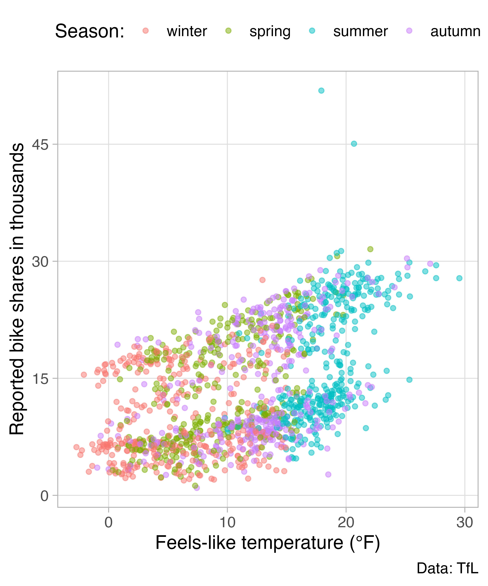{width=1500}
:::
:::


## Format Labels via \`scale\_\*\`


::: {.cell output-location='column' hash='05_annotations_cache/revealjs/scales-xy-continuous-labels-function-paste_a1c9d3114eafece7824e2c732869b5da'}

```{.r .cell-code  code-line-numbers="2,5|3|4"}
g +
  scale_x_continuous(
    labels = function(y) paste0(y, "°F"),
    name = "Feels Like Temperature"
  )
```

::: {.cell-output-display}
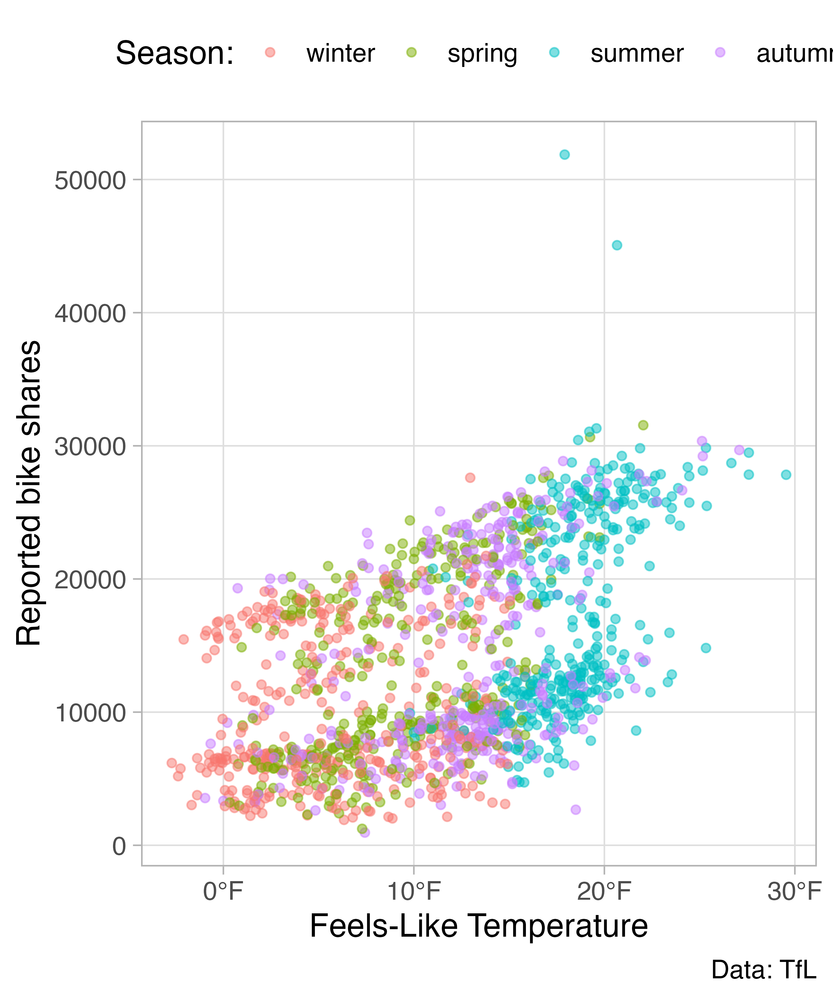{width=1500}
:::
:::


## Format Labels via \`scale\_\*\`


::: {.cell output-location='column' hash='05_annotations_cache/revealjs/scales-xy-discrete-labels_19ded73416493b70499ceaf1feb3a78b'}

```{.r .cell-code}
ggplot(
    bikes,
    aes(x = season, y = count)
  ) +
  geom_boxplot() +
  scale_x_discrete()
```

::: {.cell-output-display}
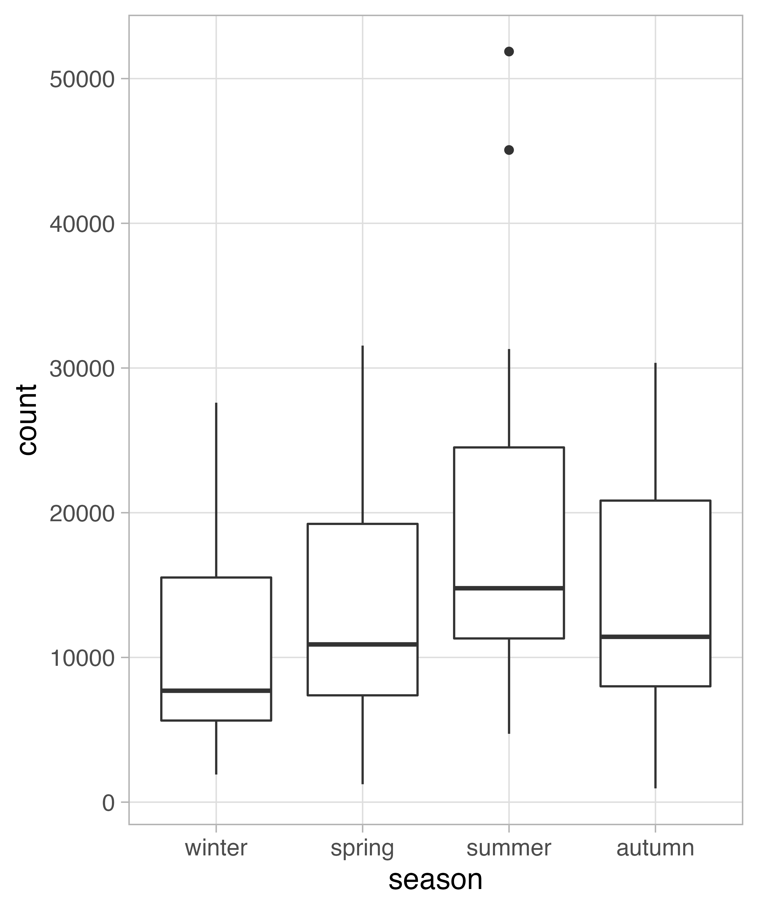{width=1500}
:::
:::


## Format Labels via \`scale\_\*\`


::: {.cell output-location='column' hash='05_annotations_cache/revealjs/scales-xy-discrete-labels-function_8c26204a7c3671559a184e633799dba8'}

```{.r .cell-code  code-line-numbers="8|7,8"}
ggplot(
    bikes,
    aes(x = season, y = count)
  ) +
  geom_boxplot() +
  scale_x_discrete(
    name = NULL,
    labels = stringr::str_to_title
  )
```

::: {.cell-output-display}
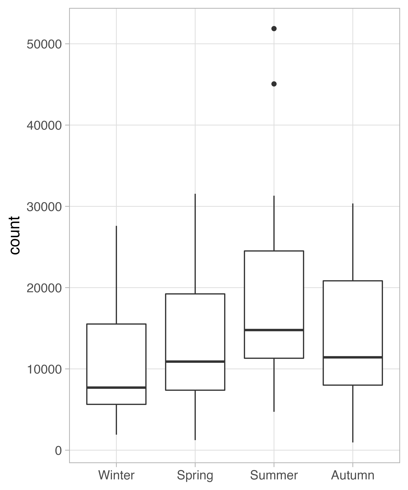{width=1500}
:::
:::


## Format Labels via \`scale\_\*\`


::: {.cell output-location='column' hash='05_annotations_cache/revealjs/scales-color-discrete-name-labels_aca54c4a88eebd9db63e8f3a1e42a655'}

```{.r .cell-code  code-line-numbers="2,4"}
g +
  scale_color_discrete(
    name = NULL,
    labels = stringr::str_to_title
  )
```

::: {.cell-output-display}
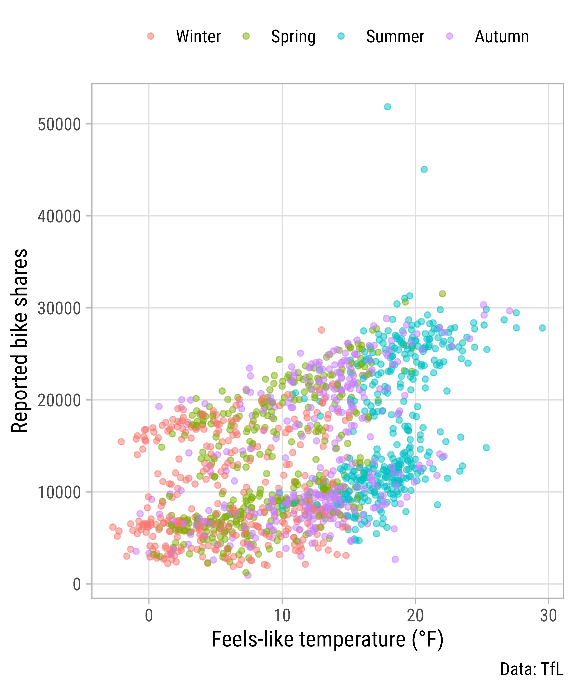{width=1500}
:::
:::


# Labels +<br>`element_markdown`

## Styling Labels with {ggtext}


::: {.cell output-location='column' hash='05_annotations_cache/revealjs/ggtext-prep-markdown_3bd3f9812bf8131ac3b17572f70b71b4'}

```{.r .cell-code  code-line-numbers="4"}
# install.packages("ggtext")

g +
  ggtitle("**TfL bike sharing trends by _season_**")
```

::: {.cell-output-display}
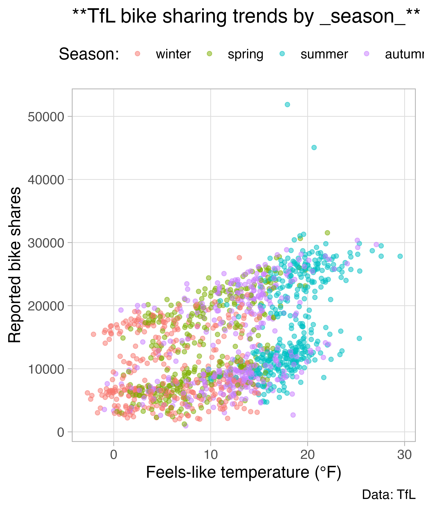{width=1500}
:::
:::


## Styling Labels with {ggtext}


::: {.cell output-location='column' hash='05_annotations_cache/revealjs/ggtext-element-markdown_1ded3358c954f0ff27f2ae17328cf065'}

```{.r .cell-code  code-line-numbers="4,5,6,7|4|6"}
# install.packages("ggtext")

g +
  ggtitle("**TfL bike sharing trends by _season_**") +
  theme(
    plot.title = ggtext::element_markdown()
  )
```

::: {.cell-output-display}
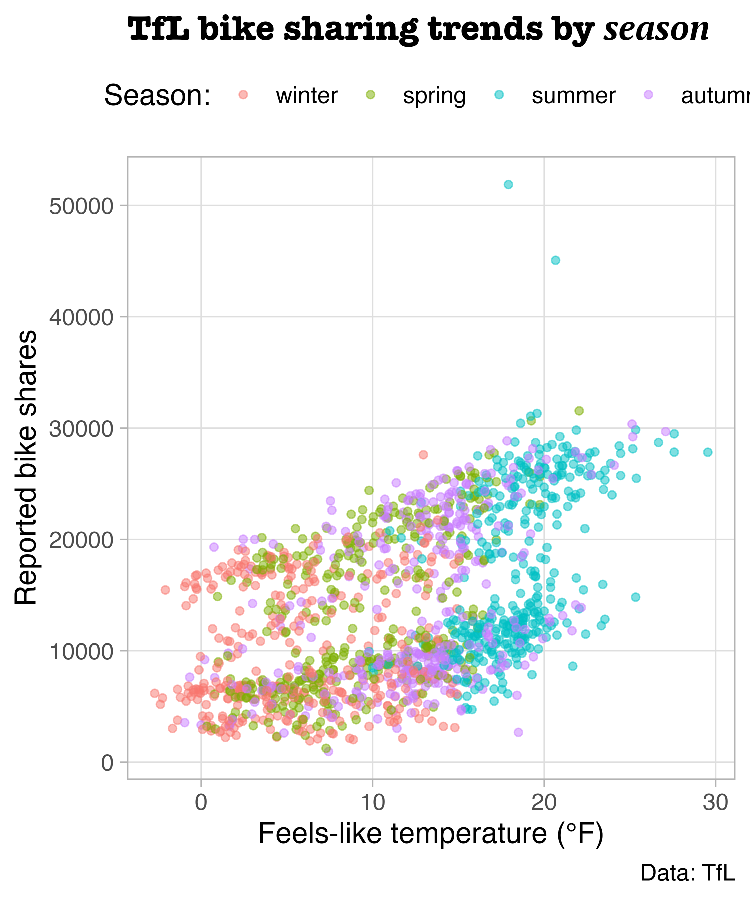{width=1500}
:::
:::


## Styling Labels with {ggtext}


::: {.cell output-location='column' hash='05_annotations_cache/revealjs/ggtext-element-markdown-html_fd0bf1b800e141f8590e6489d373fc27'}

```{.r .cell-code  code-line-numbers="4|4,6"}
# install.packages("ggtext")

g +
  ggtitle("<b style='font-family:tabular;font-size:25pt'>TfL</b> bike sharing trends by <i style='color:#28a87d;'>season</i>") +
  theme(
    plot.title = ggtext::element_markdown()
  )
```

::: {.cell-output-display}
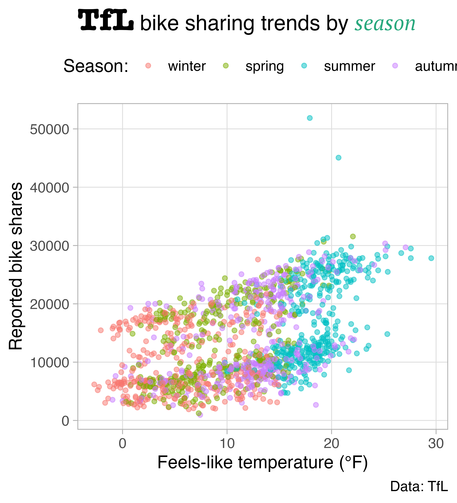{width=1500}
:::
:::


<p style="font-size:12pt;">

`<b style='font-family:tabular;font-size:15pt;'>TfL</b> bike sharing trends by <i style='color:#28a87d;'>season</i>`

</p>

# Labels + `facet_*()`

## Facet Labellers


::: {.cell output-location='column' hash='05_annotations_cache/revealjs/facet-wrap-labels-1_e47414108e3c707af9e243e7615c61ce'}

```{.r .cell-code  code-line-numbers="4"}
g +
  facet_wrap(
    ~ day_night,
    labeller = label_both
  )
```

::: {.cell-output-display}
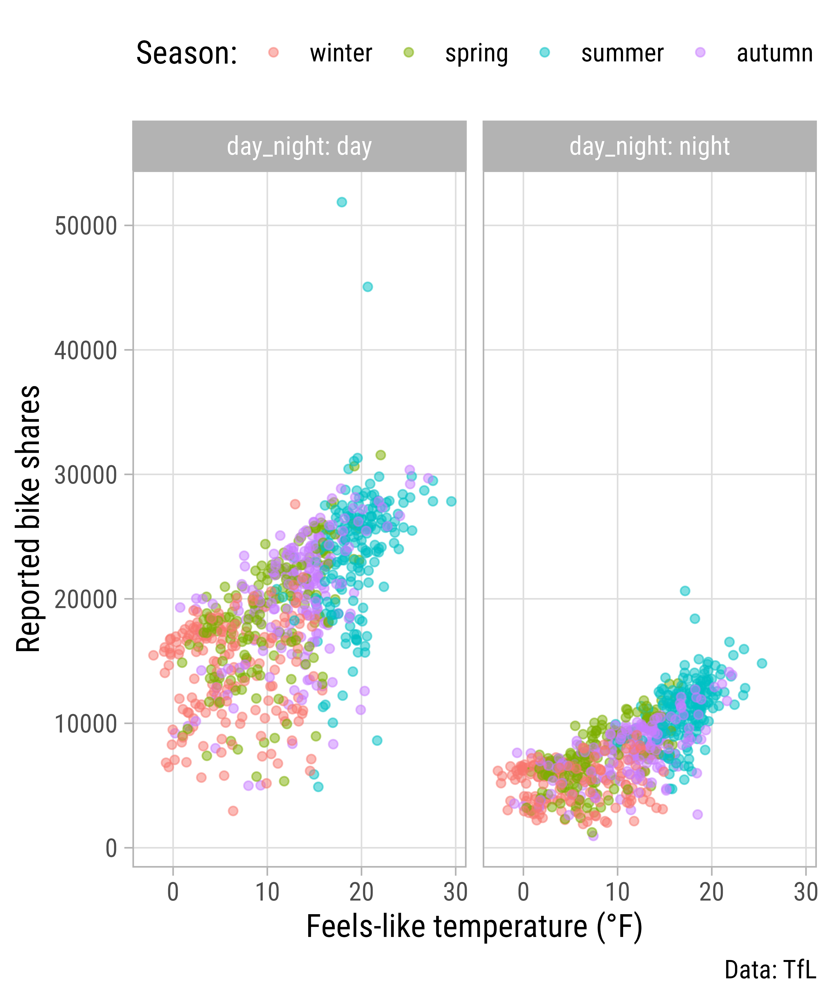{width=1500}
:::
:::


## Facet Labellers


::: {.cell output-location='column' hash='05_annotations_cache/revealjs/facet-wrap-labels-2_dbd3e4246e5ad1cf198d03e98f31c98f'}

```{.r .cell-code  code-line-numbers="3,4"}
g +
  facet_wrap(
    ~ is_workday + day_night,
    labeller = label_both
  )
```

::: {.cell-output-display}
{width=1500}
:::
:::


## Facet Labellers


::: {.cell output-location='column' hash='05_annotations_cache/revealjs/facet-wrap-labels-3_8efcd075bbed8049cb88a3869234b38c'}

```{.r .cell-code  code-line-numbers="4,6|4,5,6"}
g +
  facet_wrap(
    ~ is_workday + day_night,
    labeller = labeller(
      day_night = stringr::str_to_title
    )
  )
```

::: {.cell-output-display}
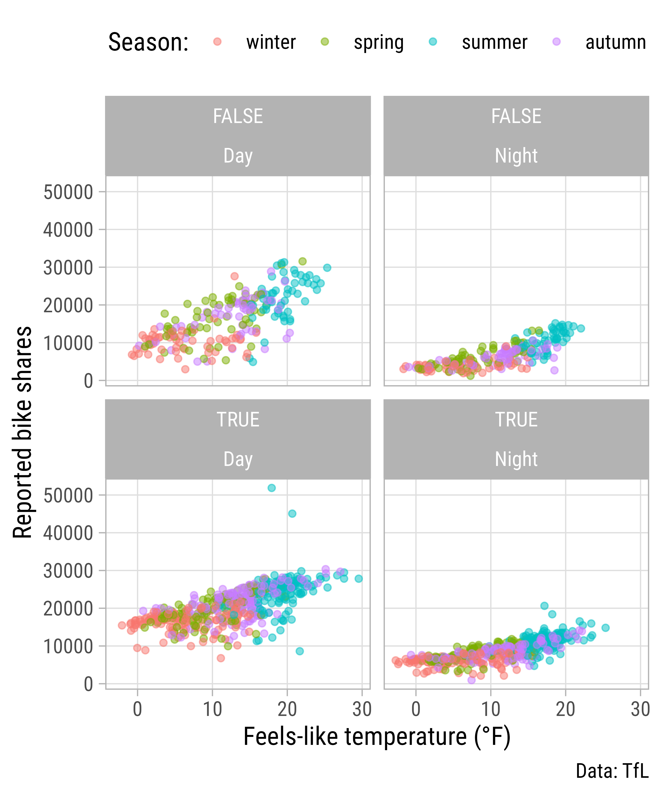{width=1500}
:::
:::


## Facet Labellers


::: {.cell output-location='column' hash='05_annotations_cache/revealjs/facet-wrap-labels-4_c66981a232b1a8fcd1f999354987ffcd'}

```{.r .cell-code  code-line-numbers="1,2,3,4|10,11"}
codes <- c(
  `TRUE` = "Workday",
  `FALSE` = "Weekend or Holiday"
)

g +
  facet_wrap(
    ~ is_workday + day_night,
    labeller = labeller(
      day_night = stringr::str_to_title,
      is_workday = codes
    )
  )
```

::: {.cell-output-display}
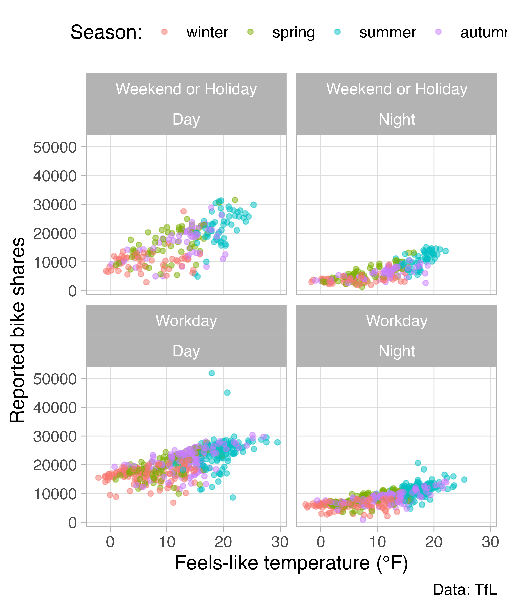{width=1500}
:::
:::


## Facet Labellers


::: {.cell output-location='column' hash='05_annotations_cache/revealjs/facet-wrap-labels-5_b37040c9467087ee93d643bb8968c48a'}

```{.r .cell-code  code-line-numbers="10"}
codes <- c(
  `TRUE` = "Workday",
  `FALSE` = "Weekend or Holiday"
)

g +
  facet_wrap(
    ~ is_workday + day_night,
    labeller = labeller(
      .default = stringr::str_to_title,
      is_workday = codes
    )
  )
```

::: {.cell-output-display}
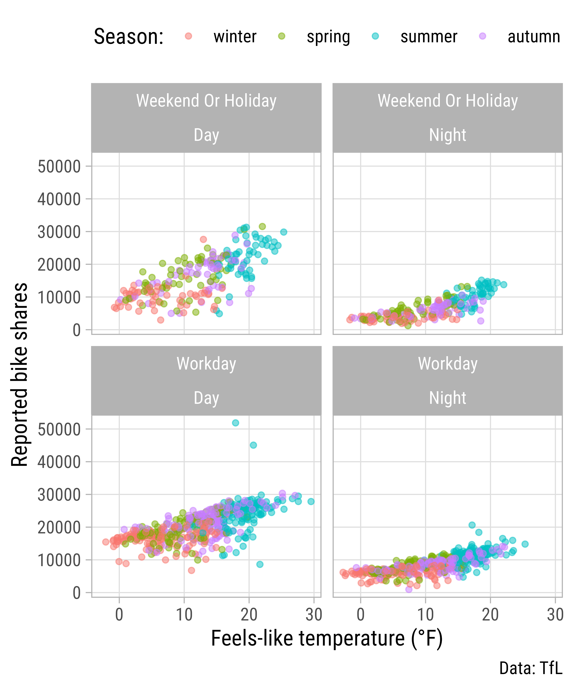{width=1500}
:::
:::


## Facet Labeller


::: {.cell output-location='column' hash='05_annotations_cache/revealjs/facet-grid-labeller_eb416e7c2bc08cd69a8ce0a45fe81a25'}

```{.r .cell-code  code-line-numbers="6,7,8,9"}
g +
  facet_grid(
    day_night ~ is_workday,
    scales = "free",
    space = "free",
    labeller = labeller(
      day_night = stringr::str_to_title,
      is_workday = codes
    )
  )
```

::: {.cell-output-display}
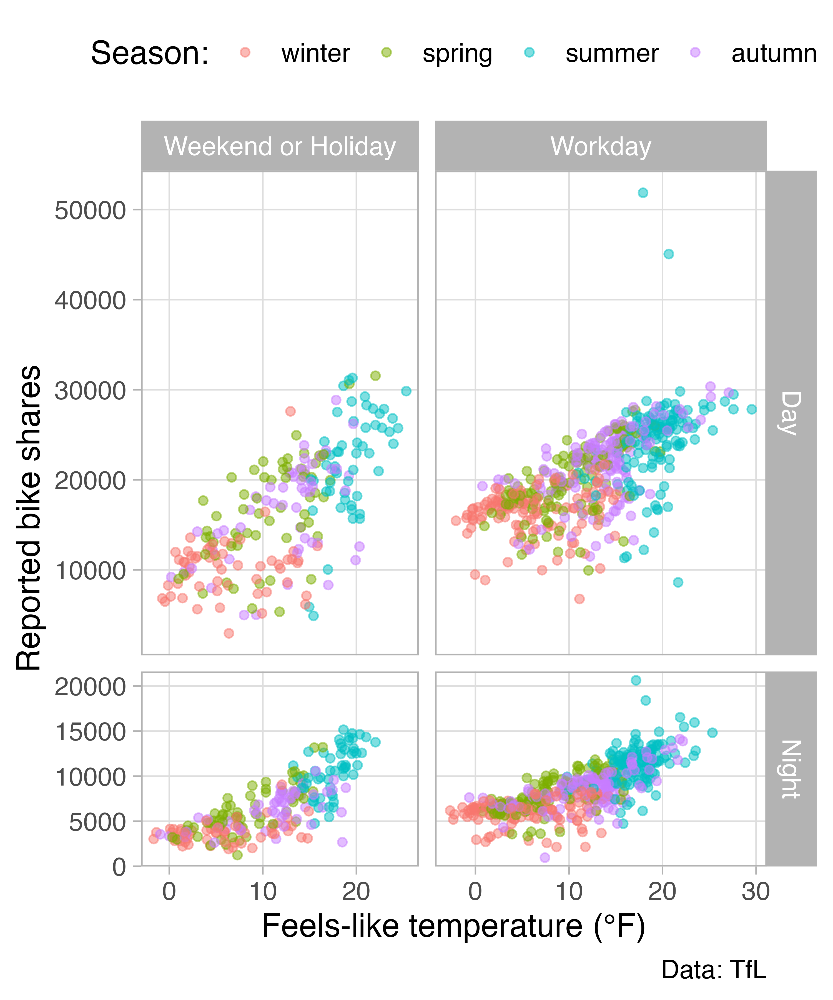{width=1500}
:::
:::


# Handling Long Labels


## Handling Long Labels with {stringr}


::: {.cell output-location='column' hash='05_annotations_cache/revealjs/stringr-default-labs_60a7d6861d528c67f41ac5c67b5070ea'}

```{.r .cell-code}
ggplot(
    bikes,
    aes(x = weather_type,
        y = count)
  ) +
  geom_boxplot()
```

::: {.cell-output-display}
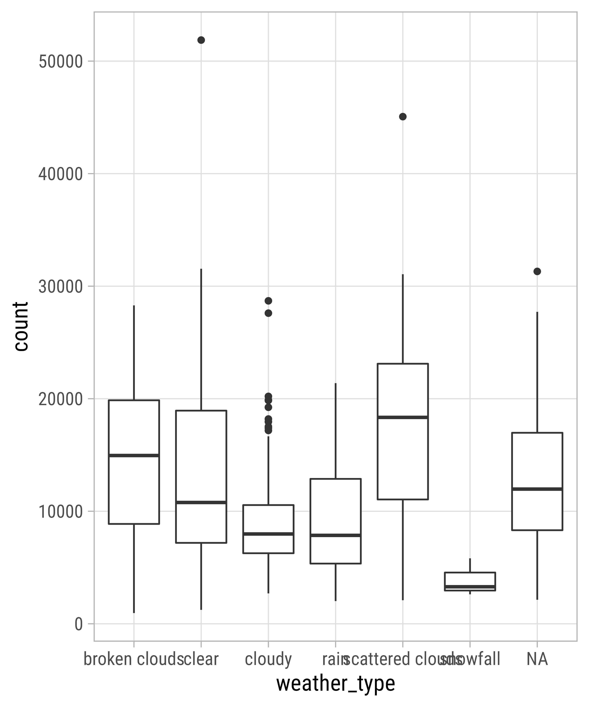{width=1500}
:::
:::


## Handling Long Labels with {stringr}


::: {.cell output-location='column' hash='05_annotations_cache/revealjs/stringr-wrap-labs_a7aa365a4d7314ec9d9be096f904fd7b'}

```{.r .cell-code  code-line-numbers="3"}
ggplot(
    bikes,
    aes(x = stringr::str_wrap(weather_type, 6),
        y = count)
  ) +
  geom_boxplot()
```

::: {.cell-output-display}
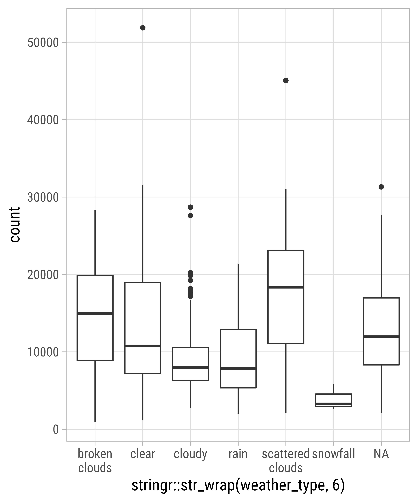{width=1500}
:::
:::


## Handling Long Labels with {ggtext}


::: {.cell output-location='column' hash='05_annotations_cache/revealjs/ggtext-text-default_ffeaa4ec7380f543c7f368b91a48e08b'}

```{.r .cell-code  code-line-numbers="2|3,4,5,6|4"}
g +
  ggtitle("TfL bike sharing trends in 2015 and 2016 by season for day and night periods") +
  theme(
    plot.title = element_text(size = 20),
    plot.title.position = "plot"
  )
```

::: {.cell-output-display}
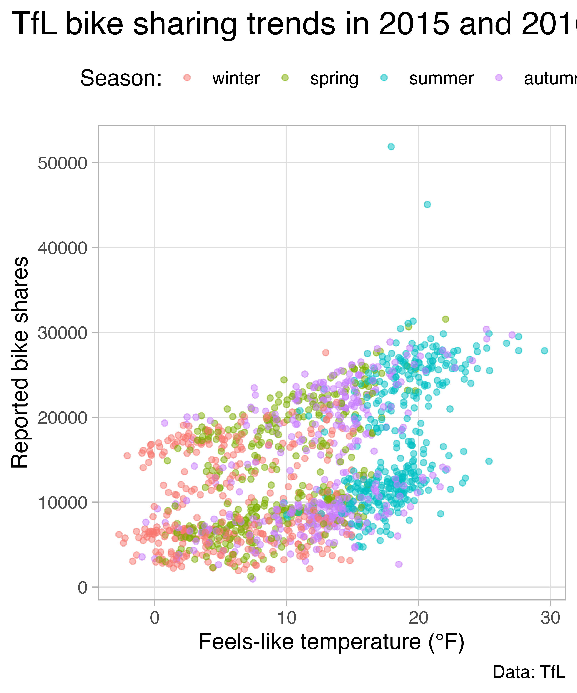{width=1500}
:::
:::


## Handling Long Labels


::: {.cell output-location='column' hash='05_annotations_cache/revealjs/ggtext-textbox-default_79b026b906d2022fb8359aaea84513bd'}

```{.r .cell-code  code-line-numbers="5,6"}
g +
  ggtitle("TfL bike sharing trends in 2015 and 2016 by season for day and night periods") +
  theme(
    plot.title =
      ggtext::element_textbox_simple(size = 20),
    plot.title.position = "plot"
  )
```

::: {.cell-output-display}
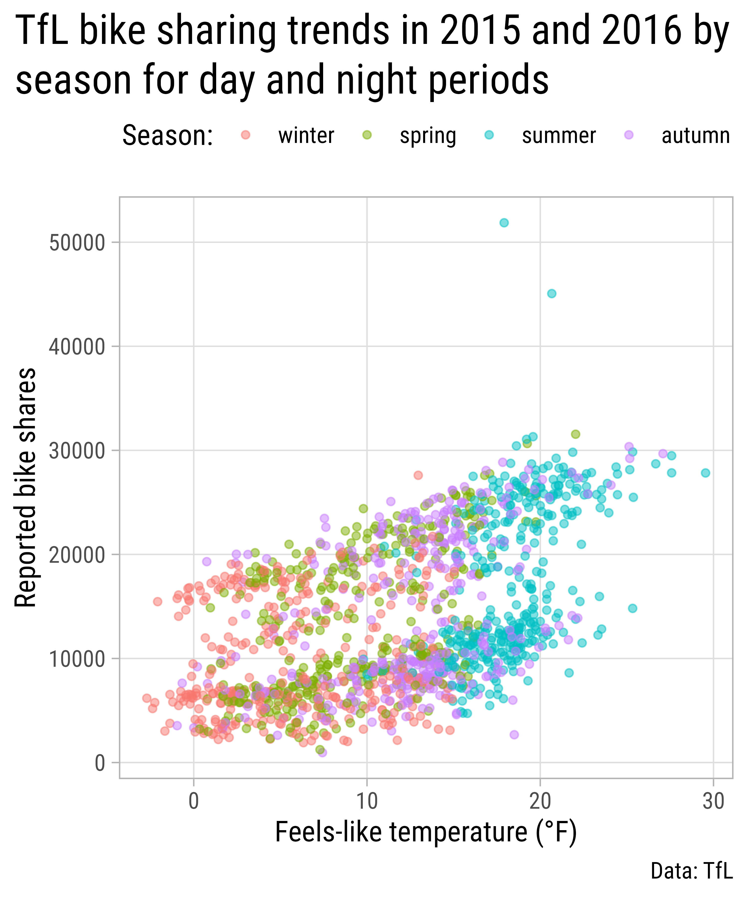{width=1500}
:::
:::


## Handling Long Labels


::: {.cell output-location='column' hash='05_annotations_cache/revealjs/ggtext-textbox-margin_660896f6af8caae49ce2529cc3528c80'}

```{.r .cell-code  code-line-numbers="5,6"}
g +
  ggtitle("TfL bike sharing trends in 2015 and 2016 by season for day and night periods") +
  theme(
    plot.title = ggtext::element_textbox_simple(
      margin = margin(t = 12, b = 12),
      lineheight = .9
    ),
    plot.title.position = "plot"
  )
```

::: {.cell-output-display}
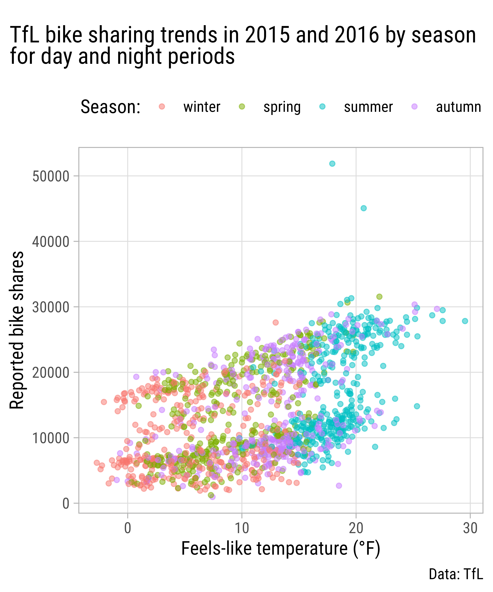{width=1500}
:::
:::


## Handling Long Labels


::: {.cell output-location='column' hash='05_annotations_cache/revealjs/ggtext-textbox-box_4ad026bc473c9d83a66e1db14f27d8bc'}

```{.r .cell-code  code-line-numbers="6"}
g +
  ggtitle("TfL bike sharing trends in 2015 and 2016 by season for day and night periods") +
  theme(
    plot.title = ggtext::element_textbox_simple(
      margin = margin(t = 12, b = 12),
      fill = "grey90",
      lineheight = .9
    ),
    plot.title.position = "plot"
  )
```

::: {.cell-output-display}
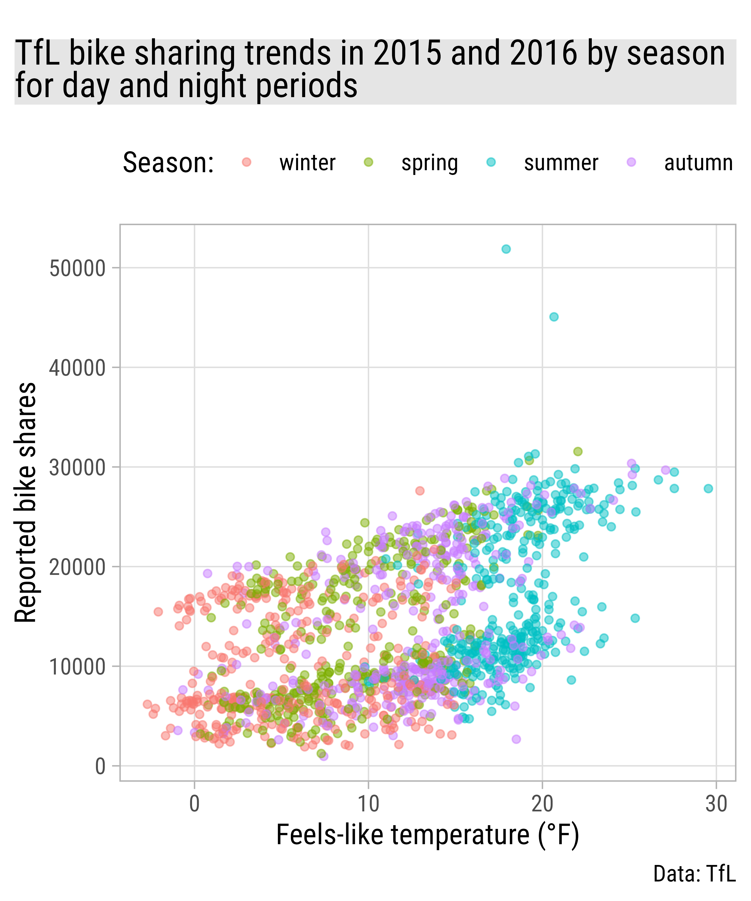{width=1500}
:::
:::


## Handling Long Labels


::: {.cell output-location='column' hash='05_annotations_cache/revealjs/ggtext-textbox-box-styled_153b5cda3f9016f1a96ed62aa76ad8bf'}

```{.r .cell-code  code-line-numbers="6|8|9|10|11"}
g +
  ggtitle("TfL bike sharing trends in 2015 and 2016 by season for day and night periods") +
  theme(
    plot.title = ggtext::element_textbox_simple(
      margin = margin(t = 12, b = 12),
      padding = margin(rep(12, 4)),
      fill = "grey90",
      box.color = "grey40",
      r = unit(9, "pt"),
      halign = .5,
      face = "bold",
      lineheight = .9
    ),
    plot.title.position = "plot"
  )
```

::: {.cell-output-display}
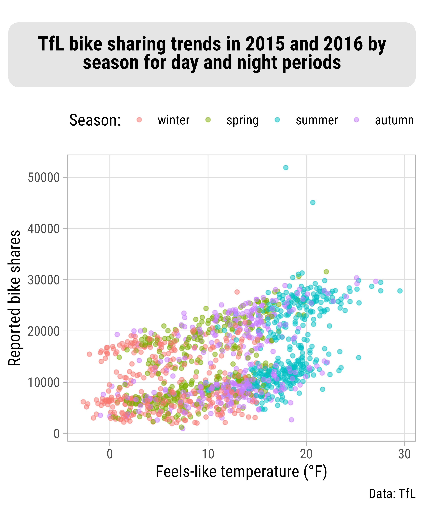{width=1500}
:::
:::


# Annotations with `annotate()`

## Add Single Text Annotations


::: {.cell output-location='column' hash='05_annotations_cache/revealjs/annotate-text_ab39a6b7895fa700e110ce85ff830cc8'}

```{.r .cell-code  code-line-numbers="3,4,5,6,7,8|4|5,6|7"}
ggplot(bikes, aes(humidity, temp)) +
  geom_point(size = 2, color = "grey") +
  annotate(
    geom = "text",
    x = 90,
    y = 27.5,
    label = "Some\nadditional\ntext"
  )
```

::: {.cell-output-display}
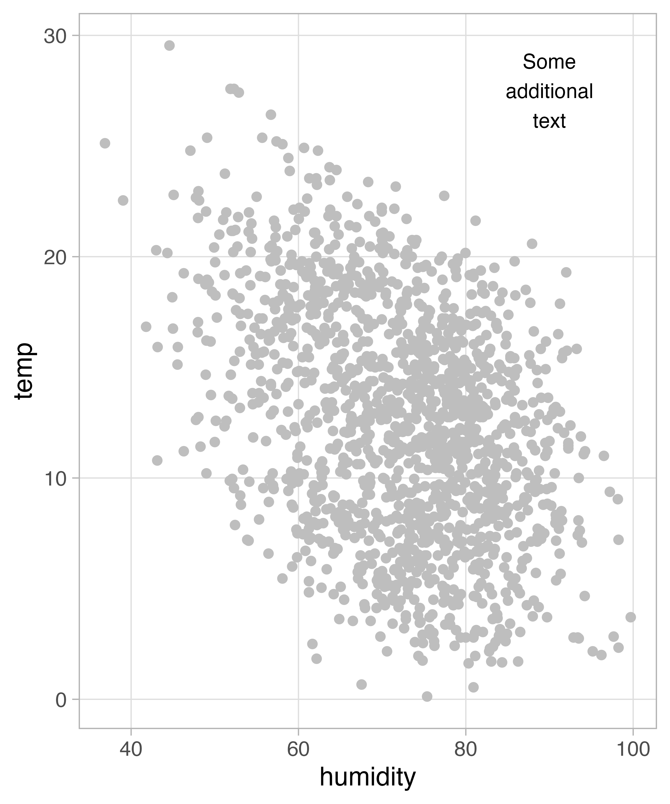{width=1500}
:::
:::


## Style Text Annotations


::: {.cell output-location='column' hash='05_annotations_cache/revealjs/annotate-text-adj_aebb80c0dc22f4f2809b81d9ed342327'}

```{.r .cell-code  code-line-numbers="8,9,10,11"}
ggplot(bikes, aes(humidity, temp)) +
  geom_point(size = 2, color = "grey") +
  annotate(
    geom = "text",
    x = 90,
    y = 27.5,
    label = "Some\nadditional\ntext",
    size = 6,
    color = "firebrick",
    fontface = "bold",
    lineheight = .9
  )
```

::: {.cell-output-display}
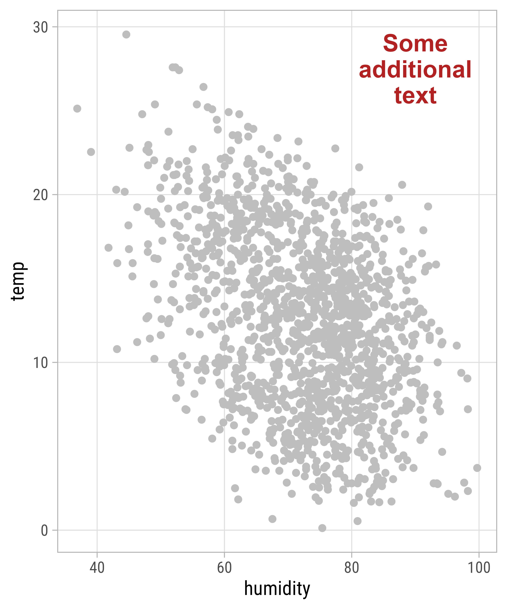{width=1500}
:::
:::


## Add Multiple Text Annotations


::: {.cell output-location='column' hash='05_annotations_cache/revealjs/annotate-text-multiple_afa14ef0c65c0a954bc543d09a2bf159'}

```{.r .cell-code  code-line-numbers="6,7,8,9,10,11|6,7,8|9,10,11"}
ggplot(bikes, aes(humidity, temp)) +
  geom_point(size = 2, color = "grey") +
  annotate(
    geom = "text",
    x = c(90, 50),
    y = c(27.5, 3.5),
    label = c("Text A", "Text B"),
    color = c("black", "firebrick"),
    size = c(5, 10),
    fontface = c("plain", "bold")
  )
```

::: {.cell-output-display}
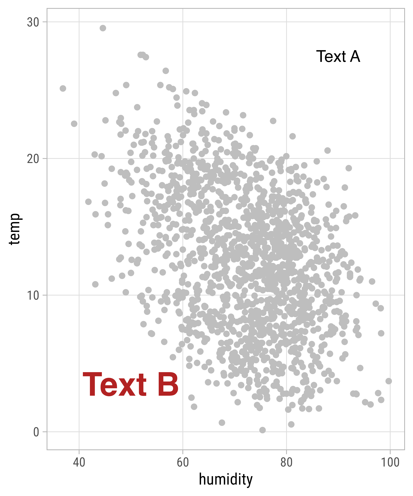{width=1500}
:::
:::


## Add Boxes (Rectangles)


::: {.cell output-location='column' hash='05_annotations_cache/revealjs/annotate-box_df82aea091c33c34281ab178769d1700'}

```{.r .cell-code  code-line-numbers="4,5,6,7,8,9|4|5,6,7,8|5,8"}
ggplot(bikes, aes(humidity, temp)) +
  geom_point(size = 2, color = "grey") +
  annotate(
    geom = "rect",
    xmin = -Inf,
    xmax = 60,
    ymin = 20,
    ymax = Inf,
    fill = "#663399"
  )
```

::: {.cell-output-display}
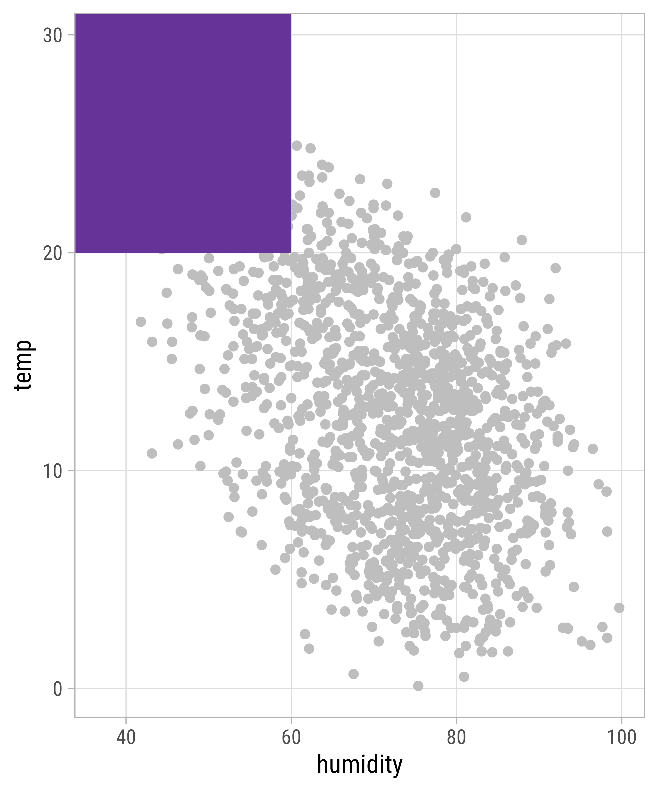{width=1500}
:::
:::


## Add Boxes (Rectangles)


::: {.cell output-location='column' hash='05_annotations_cache/revealjs/annotate-box-hierarchy_95aa6ecce69497f1fc00cab91aae25e5'}

```{.r .cell-code  code-line-numbers="1,2,9,10"}
ggplot(bikes, aes(humidity, temp)) +
  annotate(
    geom = "rect",
    xmin = -Inf,
    xmax = 60,
    ymin = 20,
    ymax = Inf,
    fill = "#663399"
  ) +
  geom_point(size = 2, color = "grey")
```

::: {.cell-output-display}
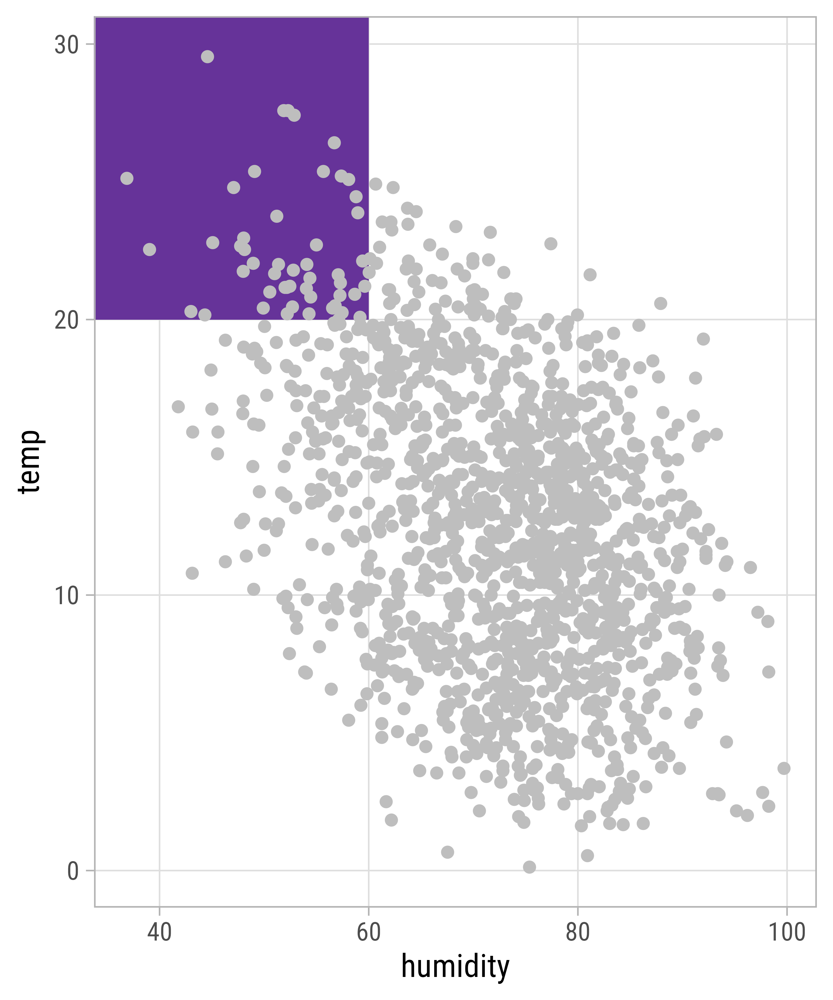{width=1500}
:::
:::


## Add Lines (Segments)


::: {.cell output-location='column' hash='05_annotations_cache/revealjs/annotate-text-line_5636b342a43cf1181c21701ee8f98629'}

```{.r .cell-code  code-line-numbers="11,12,13,14|12|13|14"}
ggplot(bikes, aes(humidity, temp)) +
  geom_point(size = 2, color = "grey") +
  annotate(
    geom = "text",
    x = 90,
    y = 27.5,
    label = "Some\nadditional\ntext",
    size = 6,
    lineheight = .9
  ) +
  annotate(
    geom = "segment",
    x = 90, xend = 82,
    y = 25, yend = 18.5
  )
```

::: {.cell-output-display}
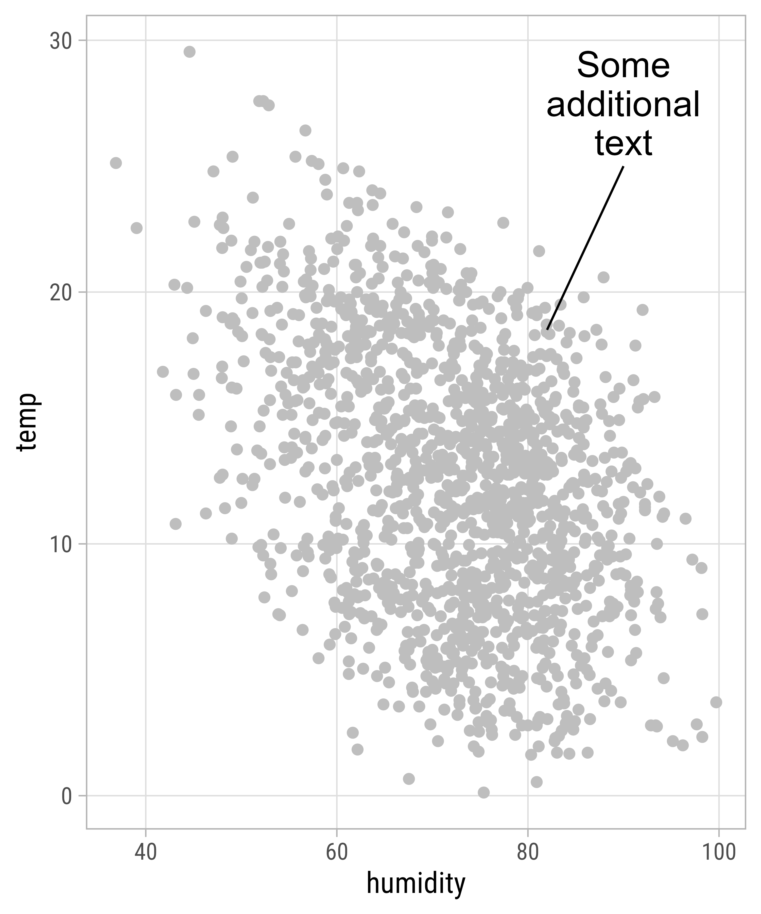{width=1500}
:::
:::


## Add Curves


::: {.cell output-location='column' hash='05_annotations_cache/revealjs/annotate-text-curve_60d5ea89fc184e6b32110739d564b4d7'}

```{.r .cell-code  code-line-numbers="12"}
ggplot(bikes, aes(humidity, temp)) +
  geom_point(size = 2, color = "grey") +
  annotate(
    geom = "text",
    x = 90,
    y = 27.5,
    label = "Some\nadditional\ntext",
    size = 6,
    lineheight = .9
  ) +
  annotate(
    geom = "curve",
    x = 90, xend = 82,
    y = 25, yend = 18.5
  )
```

::: {.cell-output-display}
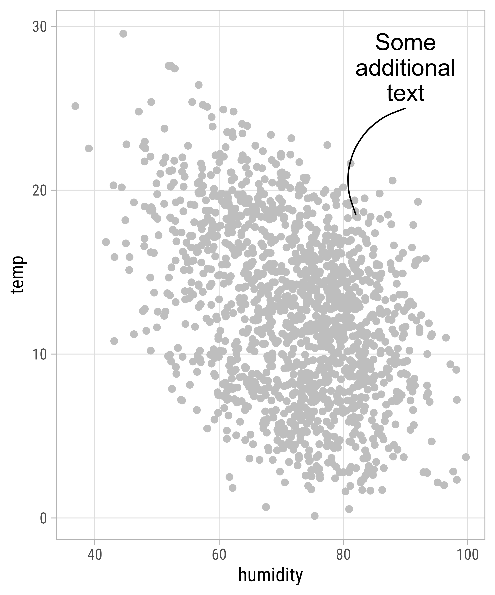{width=1500}
:::
:::


## Add Arrows


::: {.cell output-location='column' hash='05_annotations_cache/revealjs/annotate-text-arrow_52cba76c4c49902f864e29151df43e77'}

```{.r .cell-code  code-line-numbers="15,16"}
ggplot(bikes, aes(humidity, temp)) +
  geom_point(size = 2, color = "grey") +
  annotate(
    geom = "text",
    x = 90,
    y = 27.5,
    label = "Some\nadditional\ntext",
    size = 6,
    lineheight = .9
  ) +
  annotate(
    geom = "curve",
    x = 90, xend = 82,
    y = 25, yend = 18.5,
    curvature = -.3,
    arrow = arrow()
  )
```

::: {.cell-output-display}
{width=1500}
:::
:::


## Add Arrows


::: {.cell output-location='column' hash='05_annotations_cache/revealjs/annotate-text-arrow-type2_3f4db153fbfc17b41df303e714b2a944'}

```{.r .cell-code  code-line-numbers="16,17,18,19,20|17,18,19"}
ggplot(bikes, aes(humidity, temp)) +
  geom_point(size = 2, color = "grey") +
  annotate(
    geom = "text",
    x = 90,
    y = 27.5,
    label = "Some\nadditional\ntext",
    size = 6,
    lineheight = .9
  ) +
  annotate(
    geom = "curve",
    x = 90, xend = 82,
    y = 25, yend = 18.5,
    curvature = -.3,
    arrow = arrow(
      length = unit(10, "pt"),
      type = "closed",
      ends = "both"
    )
  )
```

::: {.cell-output-display}
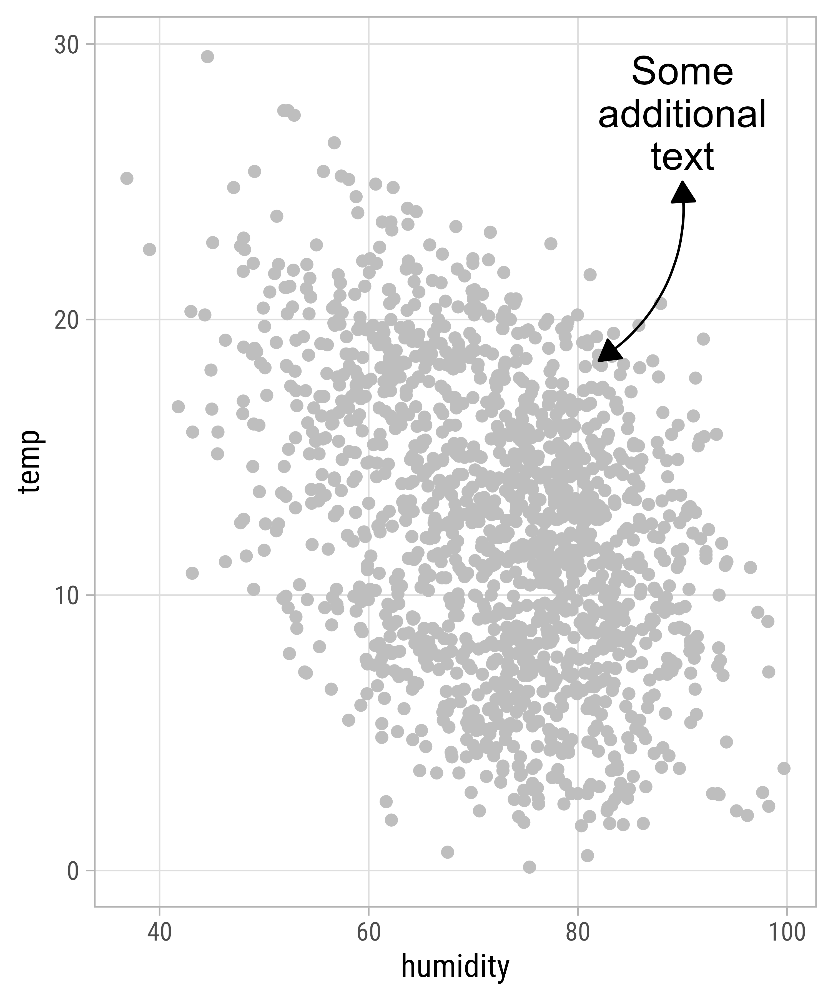{width=1500}
:::
:::


## Add Arrows


::: {.cell output-location='column' hash='05_annotations_cache/revealjs/annotate-text-arrow-skewed_d820da17ee3c7080ede000294a3317ce'}

```{.r .cell-code  code-line-numbers="16|13,14,15"}
ggplot(bikes, aes(humidity, temp)) +
  geom_point(size = 2, color = "grey") +
  annotate(
    geom = "text",
    x = 90,
    y = 27.5,
    label = "Some\nadditional\ntext",
    size = 6,
    lineheight = .9
  ) +
  annotate(
    geom = "curve",
    x = 94, xend = 82,
    y = 26, yend = 18.5,
    curvature = -.8,
    angle = 140,
    arrow = arrow(
      length = unit(10, "pt"),
      type = "closed"
    )
  )
```

::: {.cell-output-display}
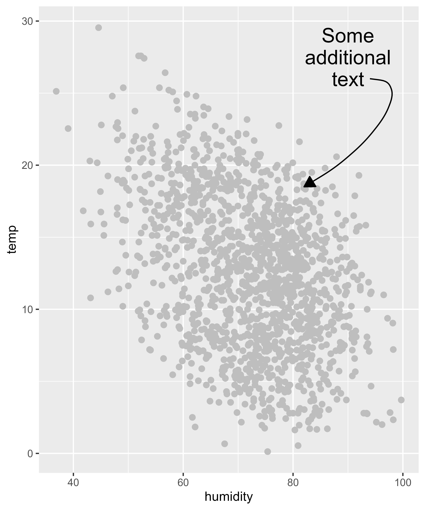{width=1500}
:::
:::


# Annotations with `geom_*()`

## Highlight Hot Periods


::: {.cell output-location='column' hash='05_annotations_cache/revealjs/highlight-hot-periods_eee613c189e9d12ea1e026709af73d48'}

```{.r .cell-code  code-line-numbers="1,2,3,4,5,6,7,8,9|2|2,9|5,6,7,8|6"}
ggplot(
    filter(bikes, temp >= 27),
    aes(x = humidity, y = temp)
  ) +
  geom_point(
    data = bikes,
    color = "grey65", alpha = .3
  ) +
  geom_point(size = 2.5)
```

::: {.cell-output-display}
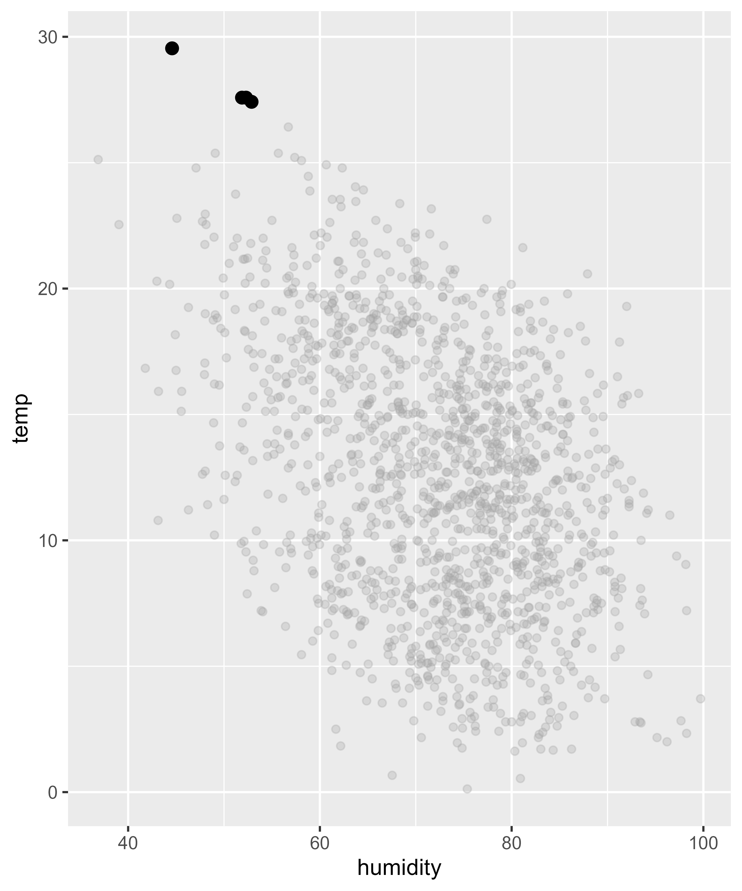{width=1500}
:::
:::


## Annotations with \`geom_text()\`


::: {.cell output-location='column' hash='05_annotations_cache/revealjs/highlight-geom-text_3e2b8874aba2a24f6582e39b8ccdf9d4'}

```{.r .cell-code  code-line-numbers="10,11,12,13,14"}
ggplot(
    filter(bikes, temp >= 27),
    aes(x = humidity, y = temp)
  ) +
  geom_point(
    data = bikes,
    color = "grey65", alpha = .3
  ) +
  geom_point(size = 2.5) +
  geom_text(
    aes(label = season),
    nudge_x = .3,
    hjust = 0
  )
```

::: {.cell-output-display}
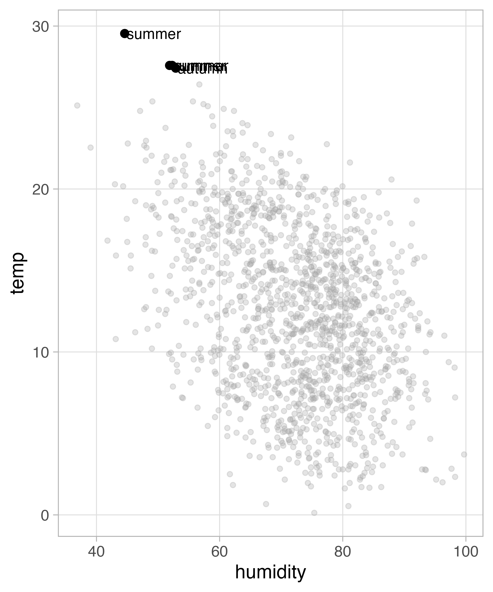{width=1500}
:::
:::


## Annotations with \`geom_label()\`


::: {.cell output-location='column' hash='05_annotations_cache/revealjs/highlight-geom-label_2513eb53db8be6c8b1b8120b4af53e2c'}

```{.r .cell-code  code-line-numbers="10"}
ggplot(
    filter(bikes, temp >= 27),
    aes(x = humidity, y = temp)
  ) +
  geom_point(
    data = bikes,
    color = "grey65", alpha = .3
  ) +
  geom_point(size = 2.5) +
  geom_label(
    aes(label = season),
    nudge_x = .3,
    hjust = 0
  )
```

::: {.cell-output-display}
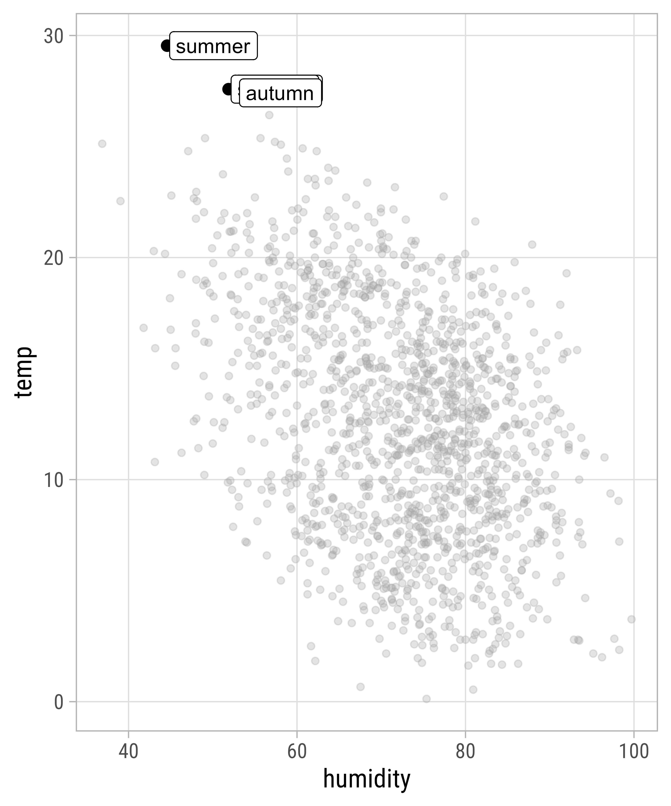{width=1500}
:::
:::


## Annotations with {ggrepel}


::: {.cell output-location='column' hash='05_annotations_cache/revealjs/highlight-geom-text-repel_a73f213b812860d93c410256cf34ae2a'}

```{.r .cell-code  code-line-numbers="10,11,12"}
ggplot(
    filter(bikes, temp >= 27),
    aes(x = humidity, y = temp)
  ) +
  geom_point(
    data = bikes,
    color = "grey65", alpha = .3
  ) +
  geom_point(size = 2.5) +
  ggrepel::geom_text_repel(
    aes(label = season)
  )
```

::: {.cell-output-display}
{width=1500}
:::
:::


## Annotations with {ggrepel}


::: {.cell output-location='column' hash='05_annotations_cache/revealjs/highlight-geom-text-repel-color_1ef9a4092c1f9531fc90740d2388906e'}

```{.r .cell-code  code-line-numbers="4,14,15,16,17"}
ggplot(
    filter(bikes, temp >= 27),
    aes(x = humidity, y = temp,
        color = season == "summer")
  ) +
  geom_point(
    data = bikes,
    color = "grey65", alpha = .3
  ) +
  geom_point(size = 2.5) +
  ggrepel::geom_text_repel(
    aes(label = str_to_title(season))
  ) +
  scale_color_manual(
    values = c("firebrick", "black"),
    guide = "none"
  )
```

::: {.cell-output-display}
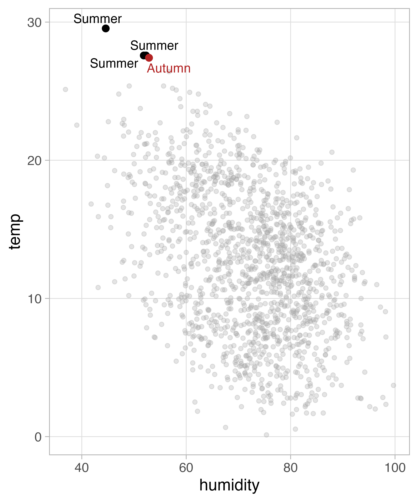{width=1500}
:::
:::


## Annotations with {ggrepel}


::: {.cell output-location='column' hash='05_annotations_cache/revealjs/highlight-geom-text-repel-dist_2c67f10ff58c10407d31c2915a9f2598'}

```{.r .cell-code  code-line-numbers="13,14,15,16"}
ggplot(
    filter(bikes, temp >= 27),
    aes(x = humidity, y = temp,
        color = season == "summer")
  ) +
  geom_point(
    data = bikes,
    color = "grey65", alpha = .3
  ) +
  geom_point(size = 2.5) +
  ggrepel::geom_text_repel(
    aes(label = str_to_title(season)),
    ## space between points + labels
    box.padding = .4,
    ## always draw segments
    min.segment.length = 0
  ) +
  scale_color_manual(
    values = c("firebrick", "black"),
    guide = "none"
  )
```

::: {.cell-output-display}
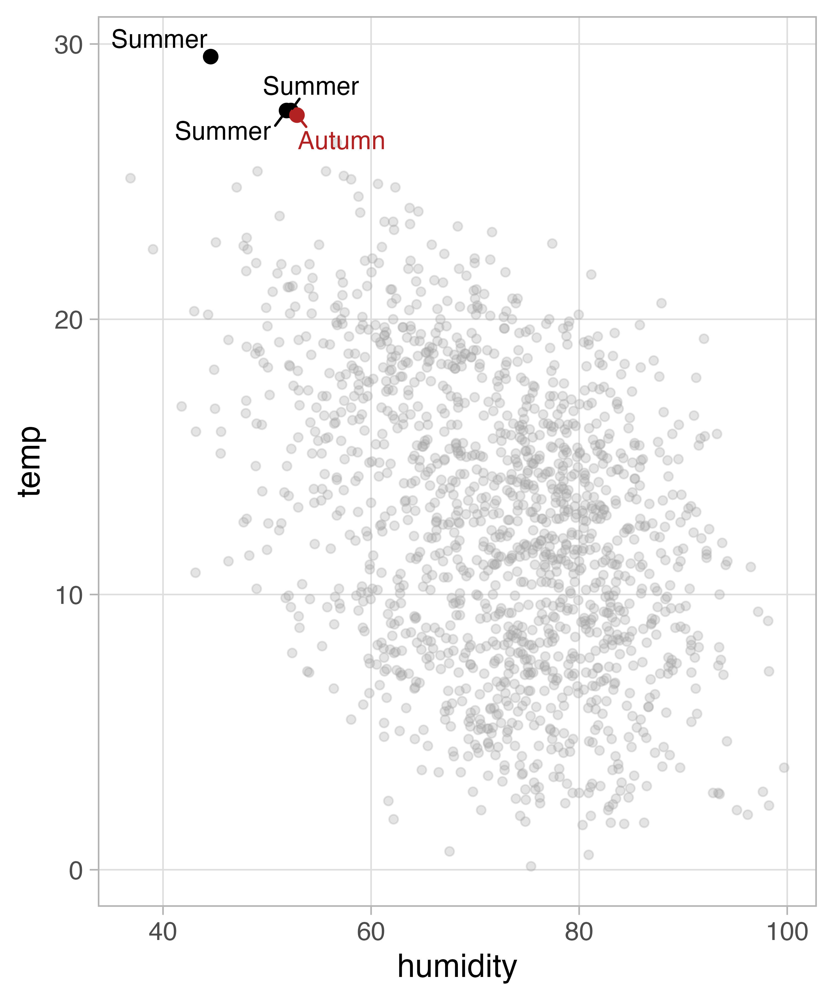{width=1500}
:::
:::


## Annotations with {ggrepel}


::: {.cell output-location='column' hash='05_annotations_cache/revealjs/highlight-geom-text-repel-lim_063c41450b095141a86c1c7169a62f15'}

```{.r .cell-code  code-line-numbers="13,14,20"}
ggplot(
    filter(bikes, temp >= 27),
    aes(x = humidity, y = temp,
        color = season == "summer")
  ) +
  geom_point(
    data = bikes,
    color = "grey65", alpha = .3
  ) +
  geom_point(size = 2.5) +
  ggrepel::geom_text_repel(
    aes(label = str_to_title(season)),
    ## force to the right
    xlim = c(NA, 35), hjust = 1
  ) +
  scale_color_manual(
    values = c("firebrick", "black"),
    guide = "none"
  ) +
  xlim(25, NA)
```

::: {.cell-output-display}
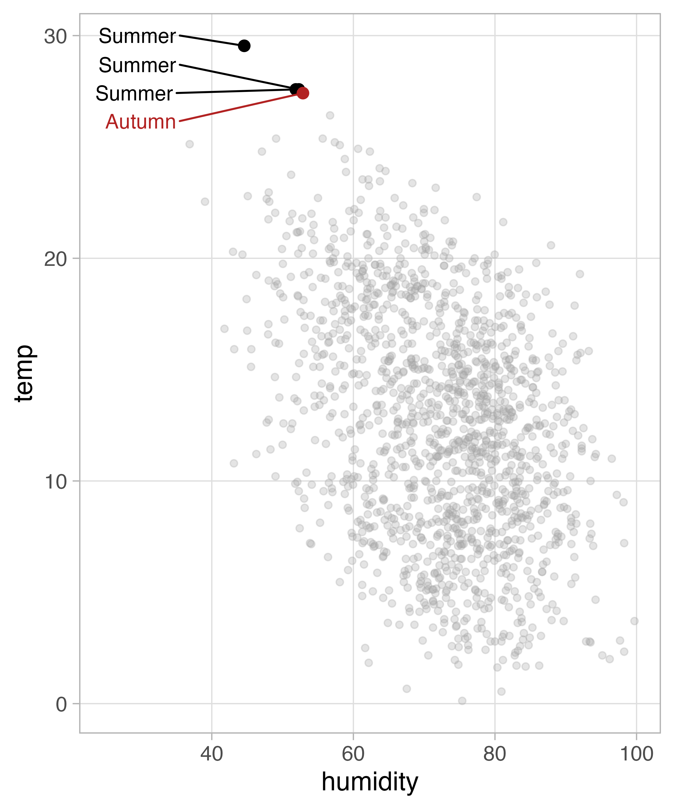{width=1500}
:::
:::


## Annotations with {ggrepel}


::: {.cell output-location='column' hash='05_annotations_cache/revealjs/highlight-geom-text-repel-arrow_840db937a95ef6e7e057fbe415478014'}

```{.r .cell-code  code-line-numbers="15,16,17"}
ggplot(
    filter(bikes, temp >= 27),
    aes(x = humidity, y = temp,
        color = season == "summer")
  ) +
  geom_point(
    data = bikes,
    color = "grey65", alpha = .3
  ) +
  geom_point(size = 2.5) +
  ggrepel::geom_text_repel(
    aes(label = str_to_title(season)),
    ## force to the right
    xlim = c(NA, 35),
    ## style segment
    segment.curvature = .01,
    arrow = arrow(length = unit(.02, "npc"), type = "closed")
  ) +
  scale_color_manual(
    values = c("firebrick", "black"),
    guide = "none"
  ) +
  xlim(25, NA)
```

::: {.cell-output-display}
{width=1500}
:::
:::


## Annotations with {ggrepel}


::: {.cell output-location='column' hash='05_annotations_cache/revealjs/highlight-geom-text-repel-inflect_b6315f93f2f65cdc19c0b28a1a7d39fb'}

```{.r .cell-code  code-line-numbers="15,16,17"}
ggplot(
    filter(bikes, temp >= 27),
    aes(x = humidity, y = temp,
        color = season == "summer")
  ) +
  geom_point(
    data = bikes,
    color = "grey65", alpha = .3
  ) +
  geom_point(size = 2.5) +
  ggrepel::geom_text_repel(
    aes(label = str_to_title(season)),
    ## force to the right
    xlim = c(NA, 35),
    ## style segment
    segment.curvature = .001,
    segment.inflect = TRUE
  ) +
  scale_color_manual(
    values = c("firebrick", "black"),
    guide = "none"
  ) +
  xlim(25, NA)
```

::: {.cell-output-display}
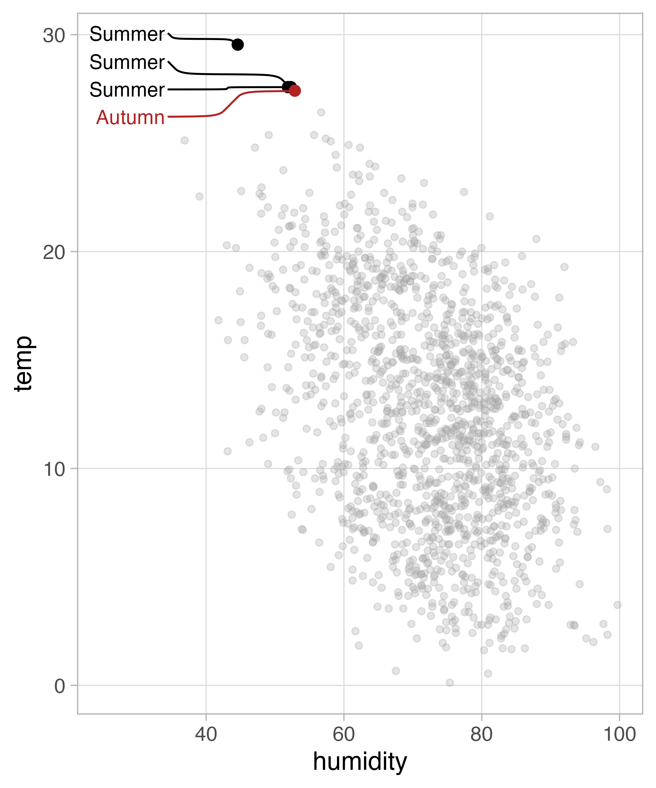{width=1500}
:::
:::


## Annotations with {ggforce}


::: {.cell output-location='column' hash='05_annotations_cache/revealjs/highlight-geom-mark-prep_e5ed51642cf4503075f5143c1723258c'}

```{.r .cell-code  code-line-numbers="1,2,3,4,5,6,7,8,9,10,11,12,13,14|2|4,11,12,13,14"}
ggplot(
    filter(bikes, temp > 20 & season != "summer"),
    aes(x = humidity, y = temp,
        color = season)
  ) +
  geom_point(
    data = bikes,
    color = "grey65", alpha = .3
  ) +
  geom_point() +
  scale_color_brewer(
    palette = "Dark2",
    guide = "none"
  )
```

::: {.cell-output-display}
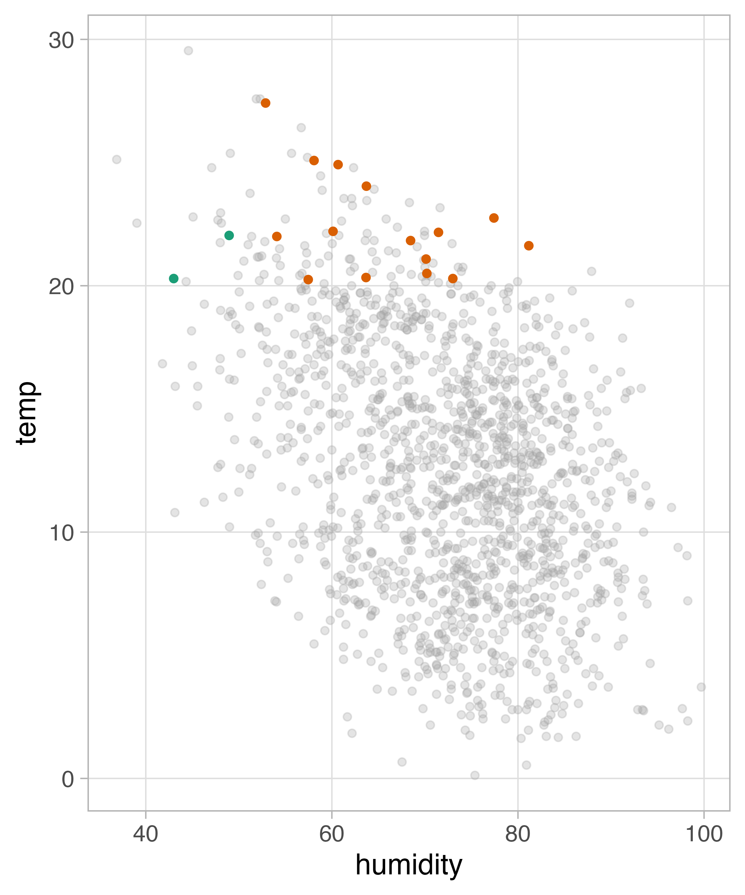{width=1500}
:::
:::


## Annotations with {ggforce}


::: {.cell output-location='column' hash='05_annotations_cache/revealjs/highlight-geom-mark-rect_702706758185f35454513c2b85e50d3c'}

```{.r .cell-code  code-line-numbers="11,12,13"}
ggplot(
    filter(bikes, temp > 20 & season != "summer"),
    aes(x = humidity, y = temp,
        color = season)
  ) +
  geom_point(
    data = bikes,
    color = "grey65", alpha = .3
  ) +
  geom_point() +
  ggforce::geom_mark_rect(
    aes(label = str_to_title(season))
  ) +
  scale_color_brewer(
    palette = "Dark2",
    guide = "none"
  )
```

::: {.cell-output-display}
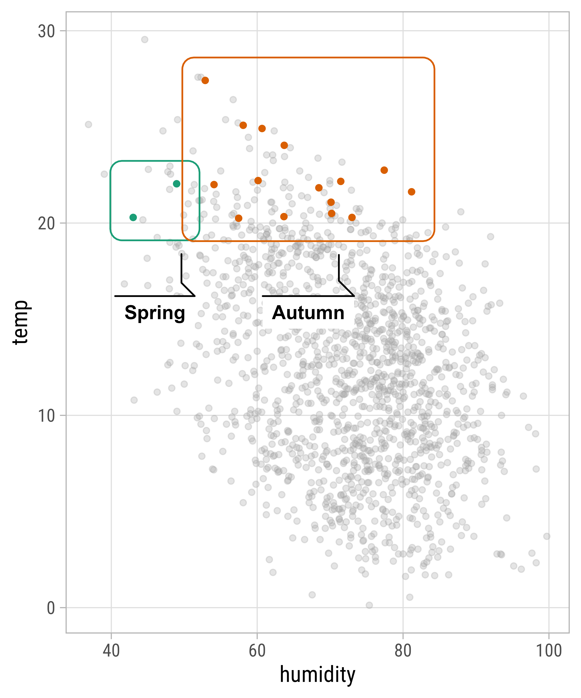{width=1500}
:::
:::


## Annotations with {ggforce}


::: {.cell output-location='column' hash='05_annotations_cache/revealjs/highlight-geom-mark-limit_34dd4017413602fb2e6c98180e509ef3'}

```{.r .cell-code  code-line-numbers="18"}
ggplot(
    filter(bikes, temp > 20 & season != "summer"),
    aes(x = humidity, y = temp,
        color = season)
  ) +
  geom_point(
    data = bikes,
    color = "grey65", alpha = .3
  ) +
  geom_point() +
  ggforce::geom_mark_rect(
    aes(label = str_to_title(season))
  ) +
  scale_color_brewer(
    palette = "Dark2",
    guide = "none"
  ) +
  ylim(NA, 35)
```

::: {.cell-output-display}
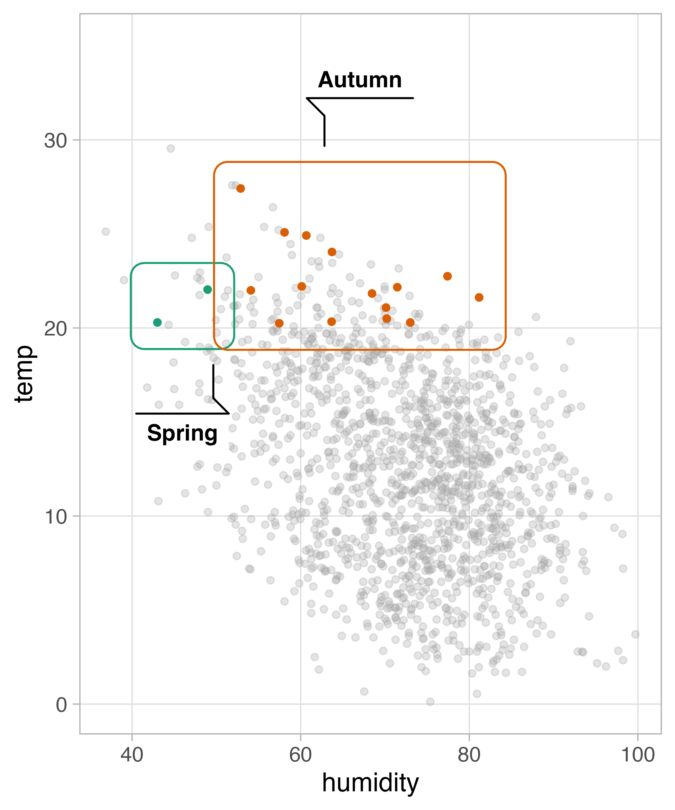{width=1500}
:::
:::


## Annotations with {ggforce}


::: {.cell output-location='column' hash='05_annotations_cache/revealjs/highlight-geom-mark-customize_ec8b3f34aa629c96c5355fede731d7fc'}

```{.r .cell-code  code-line-numbers="13,14,15,16,17,18|13,14|15,16,17|18"}
ggplot(
    filter(bikes, temp > 20 & season != "summer"),
    aes(x = humidity, y = temp,
        color = season)
  ) +
  geom_point(
    data = bikes,
    color = "grey65", alpha = .3
  ) +
  geom_point() +
  ggforce::geom_mark_rect(
    aes(label = str_to_title(season)),
    expand = unit(5, "pt"),
    radius = unit(0, "pt"),
    con.cap = unit(0, "pt"),
    label.buffer = unit(15, "pt"),
    con.type = "straight",
    label.fill = "transparent"
  ) +
  scale_color_brewer(
    palette = "Dark2",
    guide = "none"
  ) +
  ylim(NA, 35)
```

::: {.cell-output-display}
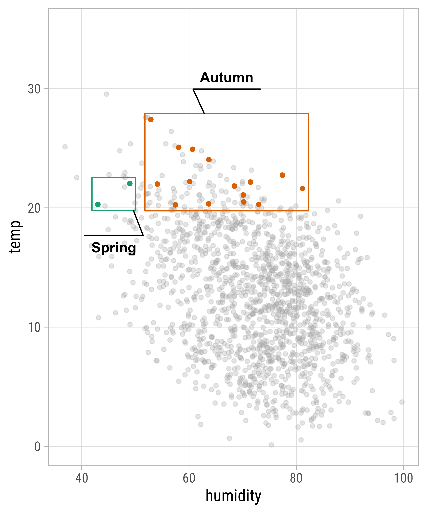{width=1500}
:::
:::


## Annotations with {ggforce}


::: {.cell output-location='column' hash='05_annotations_cache/revealjs/highlight-geom-mark-filter_51ff35a0a85572e0b318416d7febeaca'}

```{.r .cell-code  code-line-numbers="1,2,3,4,5,6,7,8,9,10,11,12,13,14,15,16|1,2,3,4,5|4,13,14,15,16|7|8,9|10"}
ggplot(
    bikes,
    aes(x = humidity, y = temp,
        color = season == "summer")
  ) +
  geom_point(alpha = .4) +
  ggforce::geom_mark_hull(
    aes(label = str_to_title(season),
        filter = season == "summer",
        description = "June to August"),
    expand = unit(10, "pt")
  ) +
  scale_color_manual(
    values = c("grey65", "firebrick"),
    guide = "none"
  )
```

::: {.cell-output-display}
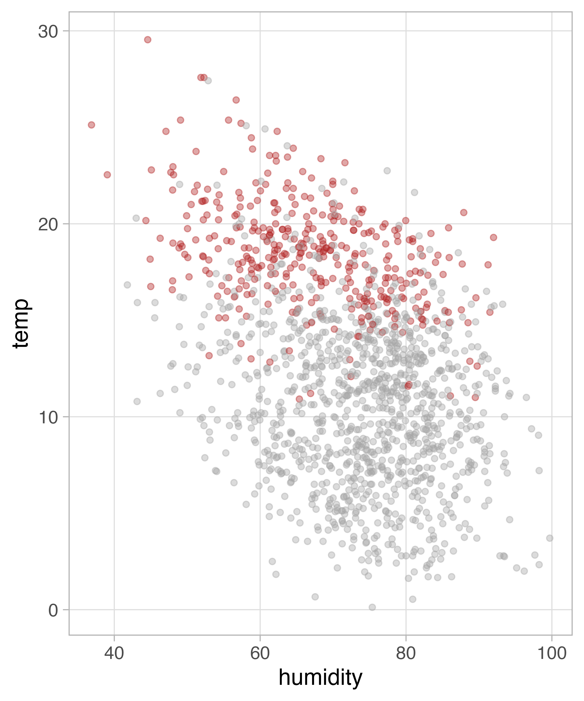{width=1500}
:::
:::


# Adding Images

## Load and Modify Image


::: {.cell hash='05_annotations_cache/revealjs/read-img_5525109531499db31e13dfe918cec750'}

```{.r .cell-code  code-line-numbers="1,2,3,4,5|1|2|3"}
url <- "https://d33wubrfki0l68.cloudfront.net/dbb07b06a7b3fe056db386fef0b158cc2fd33cb9/8b491/assets/img/2022conf/logo-rstudio-conf.png"
img <- magick::image_read(url)
img <- magick::image_negate(img)

img
```

::: {.cell-output-display}
{width=94}
:::
:::


## Add Background Image


::: {.cell output-location='column' hash='05_annotations_cache/revealjs/annotate-custom_e8d0bc15b0e05b9b11e5b6c7df52db82'}

```{.r .cell-code  code-line-numbers="3,4,5,6|3|4"}
ggplot(bikes, aes(date, temp_feel)) +
  annotation_custom(
    grid::rasterGrob(
      image = img
    )
  ) +
  geom_point(color = "#71a5d4")
```

::: {.cell-output-display}
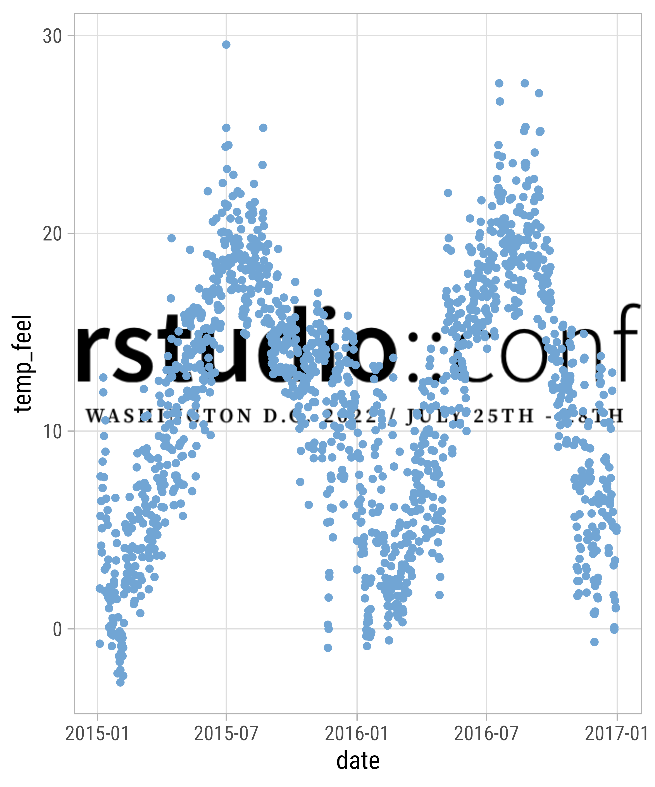{width=1500}
:::
:::


## Adjust Position


::: {.cell output-location='column' hash='05_annotations_cache/revealjs/annotate-custom-position_a29fb7aa1cac4f1add8cfe2e6f19e98a'}

```{.r .cell-code  code-line-numbers="5,6,7,11"}
ggplot(bikes, aes(date, temp_feel)) +
  annotation_custom(
    grid::rasterGrob(
      image = img,
      x = .5,
      y = .9,
      width = .9
    )
  ) +
  geom_point(color = "#71a5d4") +
  ylim(NA, 37)
```

::: {.cell-output-display}
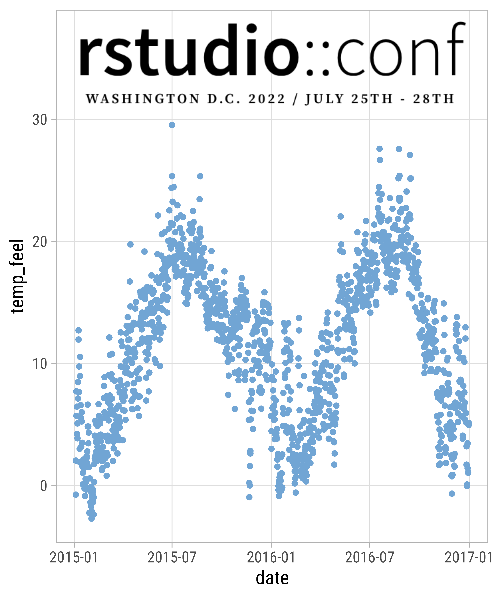{width=1500}
:::
:::


## Place Image Outside


::: {.cell output-location='column' hash='05_annotations_cache/revealjs/annotate-custom-position-outside_d4466ca23636c7b33143f536acf182a5'}

```{.r .cell-code  code-line-numbers="5,6,11,12,13,14|6,11,13"}
ggplot(bikes, aes(date, temp_feel)) +
  annotation_custom(
    grid::rasterGrob(
      image = img,
      x = .47,
      y = 1.15,
      width = .9
    )
  ) +
  geom_point(color = "#71a5d4") +
  coord_cartesian(clip = "off") +
  theme(
    plot.margin = margin(90, 10, 10, 10)
  )
```

::: {.cell-output-display}
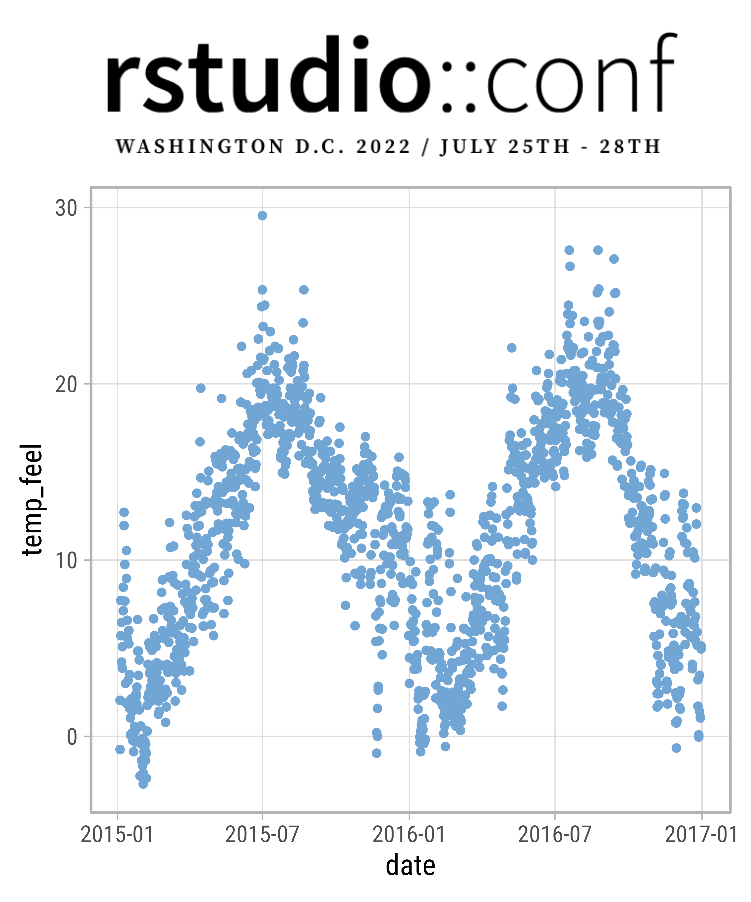{width=1500}
:::
:::


## <b style='color:#663399;'>Recap</b>

::: recap
::: incremental
-   style labels such as title, axis and legend texts with **`theme()`**
-   format data-related labels with the **`labels`** argument of `scale_*()`
-   adjust strip text with the **`facet_*(labeller)`** functionality
-   add data-related annotations with **`geom_text|label()`**
-   ... and data-unrelated annotations with **`annotate()`**
-   **`annotation_custom(rasterGrob())`** is a basic way to add images
-   **`{ggtext}`** allows to render labels with markdown and basic html
-   `{ggtext}` also allows to add **dynamic linebreaks** and images
-   **`{ggrepel}`** ensures clever placement of annotations
-   **`ggforce::geom_mark_*()`** provide a set of advanced annotations
:::
:::

# Exercises

## Exercise 1

::: question
-   {ggtext} also comes with some new geom's. Explore those and other options on the package webpage: [wilkelab.rg/ggtext](https://wilkelab.org/ggtext/).
-   **Create the following visualization, as close as possible**, with the `penguins` dataset which is provided by the [{palmerpenguins} package](https://allisonhorst.github.io/palmerpenguins/).
    -   For the species labels, you likely have to create a summary data set.
    -   Use the {ggtext} geometries and theme elements to format the labels.
    -   Also, make use of the other components such as scales, complete themes, and theme customization.
:::

------------------------------------------------------------------------


::: {.cell hash='05_annotations_cache/revealjs/exercise-text-styling_bf378dccce9bee775b2b4f8fd833ae53'}
::: {.cell-output-display}
{fig-pos='center' width=1800}
:::
:::

::: {.cell hash='05_annotations_cache/revealjs/countdown-ex-1_2e03a2195c87036757a54c35413c394c'}
::: {.cell-output-display}
```{=html}
<div class="countdown" id="timer_62f3ae31" style="right:0;bottom:0;font-size:.5em;" data-warnwhen="0">
<code class="countdown-time"><span class="countdown-digits minutes">20</span><span class="countdown-digits colon">:</span><span class="countdown-digits seconds">00</span></code>
</div>
```
:::
:::


## Exercise 2

::: question
-   **Create this logo with the image file `exercises/rstudioconf-washington-bg.png`:**
:::


::: {.cell layout-align="center" hash='05_annotations_cache/revealjs/annotate-custom-rstudioconf_a507b11e30e818e4a6307f17042fc891'}
::: {.cell-output-display}
{fig-align='center' width=1500}
:::
:::

::: {.cell hash='05_annotations_cache/revealjs/countdown-ex-2_a963ea40685f4b4a4724df583f4ac750'}
::: {.cell-output-display}
```{=html}
<div class="countdown" id="timer_62f3ae66" style="right:0;bottom:0;font-size:.5em;" data-warnwhen="0">
<code class="countdown-time"><span class="countdown-digits minutes">10</span><span class="countdown-digits colon">:</span><span class="countdown-digits seconds">00</span></code>
</div>
```
:::
:::

