## Setup


::: {.cell hash='06_colors_cache/revealjs/prep_27ad548c644c27942a434ffdb2d16e68'}

```{.r .cell-code}
library(tidyverse)

library(tidyverse)

bikes <- readr::read_csv(
  here::here("data", "london-bikes-custom.csv"), 
  col_types = "Dcfffilllddddc"
)

bikes$season <- forcats::fct_inorder(bikes$season)

theme_set(theme_light(base_size = 14, base_family = "Roboto Condensed"))

theme_update(
  panel.grid.minor = element_blank(),
  plot.title = element_text(face = "bold"),
  legend.position = "top",
  plot.title.position = "plot"
)
```
:::


# Color Palettes

## Pre-Defined Color Palettes: Viridis


::: {.cell output-location='column' hash='06_colors_cache/revealjs/color-palettes-viridis_dfe25181603c49799ccf8f44407c4b5a'}

```{.r .cell-code  code-line-numbers="1,2,3,4,5,6|7,8,9,10"}
ggplot(
    bikes, 
    aes(x = day_night, y = count, 
        fill = season)
  ) +
  geom_boxplot() +
  scale_fill_viridis_d(
    option = "plasma",
    begin = .3
  )
```

::: {.cell-output-display}
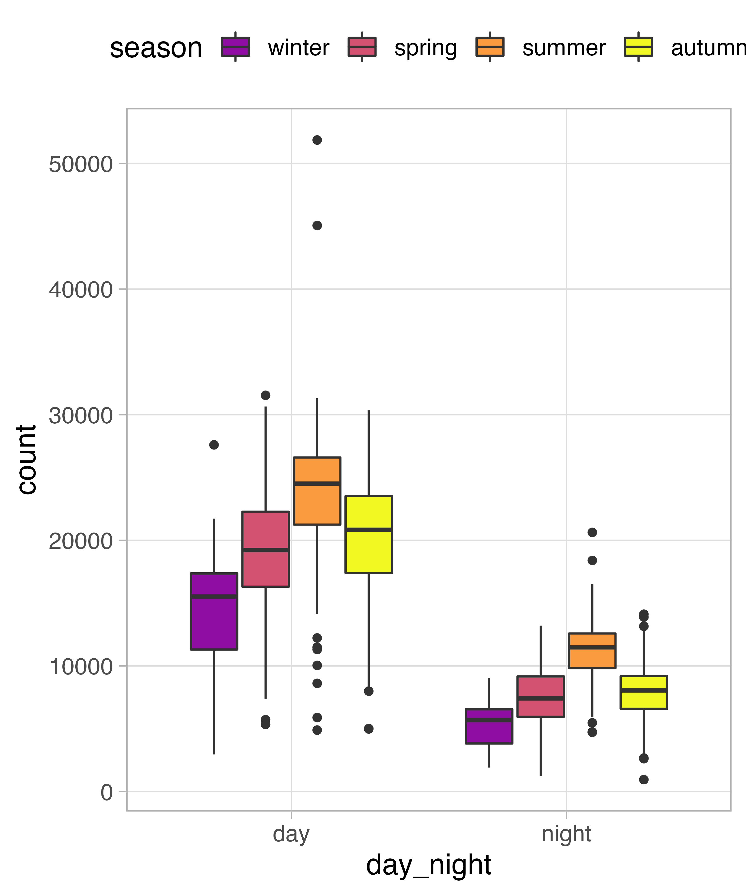{width=1500}
:::
:::


## Pre-Defined Color Palettes: Viridis


::: {.cell output-location='column' hash='06_colors_cache/revealjs/color-palettes-viridis-month_5781788641fc40153249240c2d6fd6f5'}

```{.r .cell-code  code-line-numbers="4"}
ggplot(
    bikes, 
    aes(x = day_night, y = count, 
        fill = month)
  ) +
  geom_boxplot() +
  scale_fill_viridis_d(
    option = "plasma",
    begin = .3
  )
```

::: {.cell-output-display}
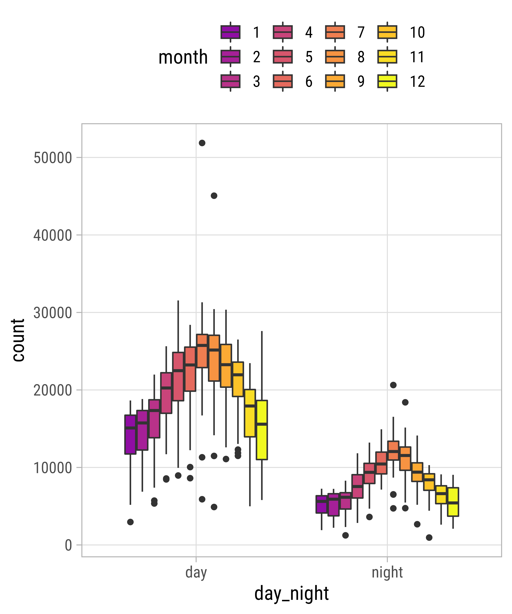{width=1500}
:::
:::


## Pre-Defined Color Palettes: Viridis


::: {.cell output-location='column' hash='06_colors_cache/revealjs/color-palettes-viridis-cont_350ae4a6935a8122a4c43740fad1a994'}

```{.r .cell-code  code-line-numbers="3,4,7|7,9"}
ggplot(
    bikes, 
    aes(x = temp_feel, y = count, 
        color = temp_feel)
  ) +
  geom_point() +
  scale_color_viridis_c(
    option = "plasma",
    end = .9
  )
```

::: {.cell-output-display}
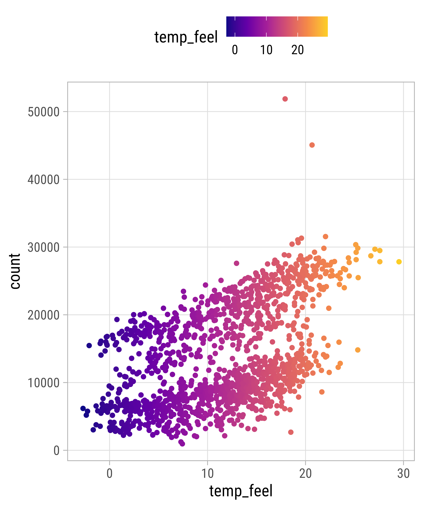{width=1500}
:::
:::


## Pre-Defined Color Palettes: Viridis


::: {.cell output-location='column' hash='06_colors_cache/revealjs/color-palettes-viridis-cont-rev_bb8206d48d6a311e1e2f6bc1a5e64d15'}

```{.r .cell-code  code-line-numbers="10"}
ggplot(
    bikes, 
    aes(x = temp_feel, y = count, 
        color = temp_feel)
  ) +
  geom_point() +
  scale_color_viridis_c(
    option = "plasma",
    end = .9,
    direction = -1
  )
```

::: {.cell-output-display}
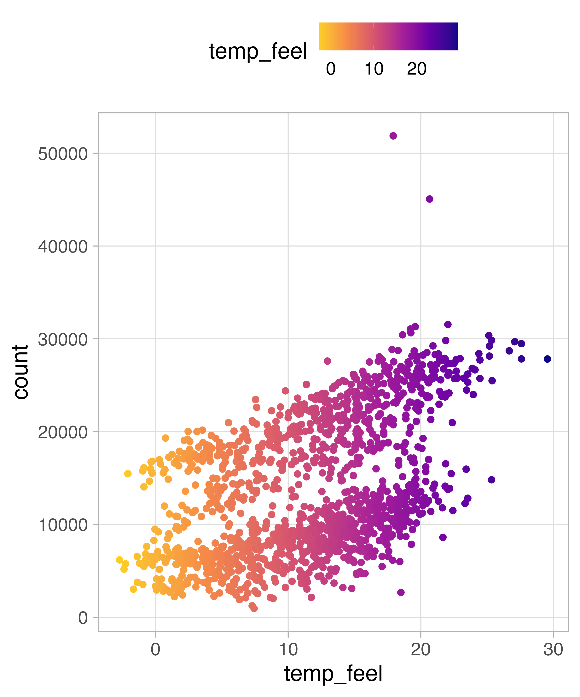{width=1500}
:::
:::


## Pre-Defined Color Palettes: Brewer


::: {.cell output-location='column' hash='06_colors_cache/revealjs/color-palettes-brewer_ddffe52b0bcf663522f4248a876f5cda'}

```{.r .cell-code  code-line-numbers="7,8,9"}
ggplot(
    bikes, 
    aes(x = day_night, y = count, 
        fill = season)
  ) +
  geom_boxplot() +
  scale_fill_brewer(
    palette = "Set1"
  )
```

::: {.cell-output-display}
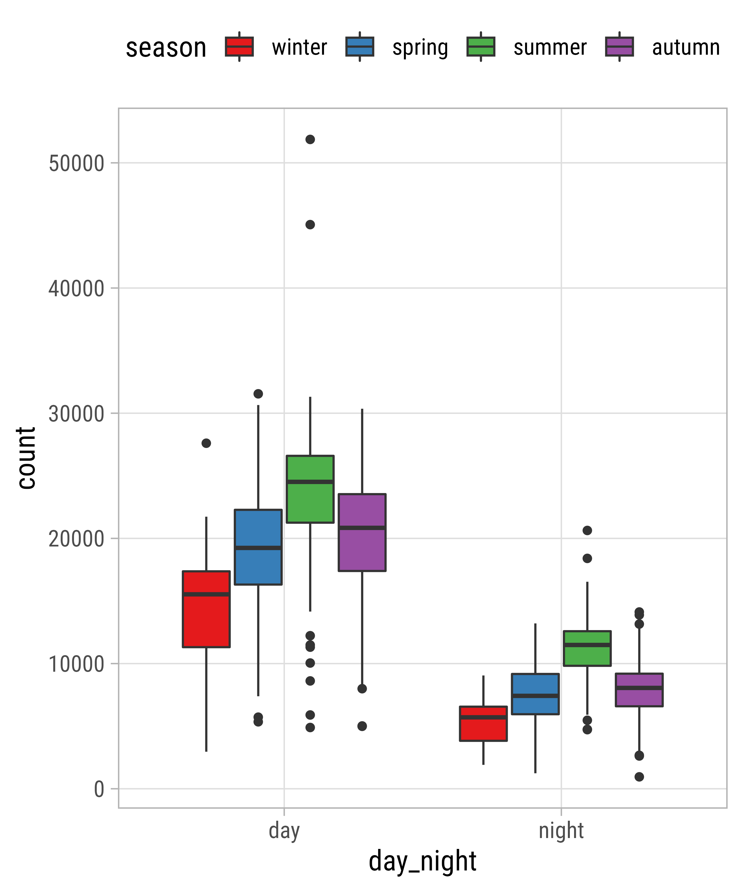{width=1500}
:::
:::


## Pre-Defined Color Palettes: Brewer


::: {.cell hash='06_colors_cache/revealjs/color-palettes-brewer-show-all_fe12855122fe75b1c2ba7792748e84b6'}

```{.r .cell-code}
RColorBrewer::display.brewer.all()
```

::: {.cell-output-display}
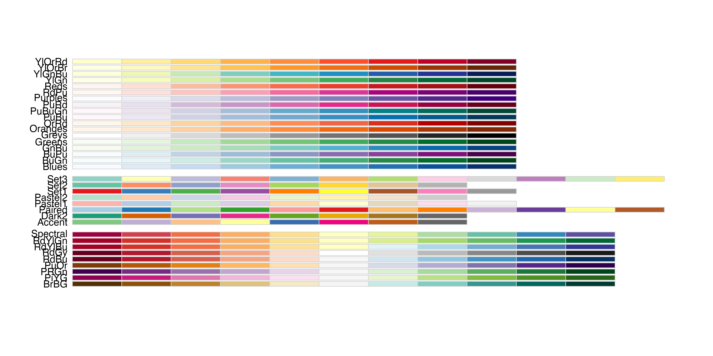{width=3600}
:::
:::


## Pre-Defined Color Palettes: Brewer


::: {.cell hash='06_colors_cache/revealjs/color-palettes-brewer-show-cvd_a1160b82849be29095243abf99001e61'}

```{.r .cell-code}
RColorBrewer::display.brewer.all(colorblindFriendly = TRUE)
```

::: {.cell-output-display}
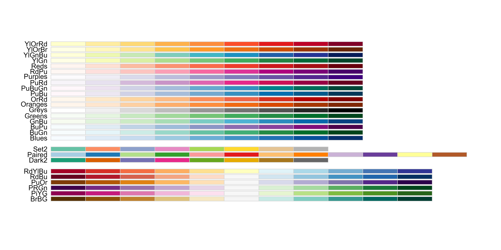{width=3600}
:::
:::


## {rcartocolor}


::: {.cell output-location='column' hash='06_colors_cache/revealjs/color-palettes-carto_0ef32c912904e2345a82d839204aa81e'}

```{.r .cell-code  code-line-numbers="9,10,11"}
# install.packages("rcartocolor")

ggplot(
    bikes, 
    aes(x = day_night, y = count, 
        fill = season)
  ) +
  geom_boxplot() +
  rcartocolor::scale_fill_carto_d(
    palette = "Vivid" 
  )
```

::: {.cell-output-display}
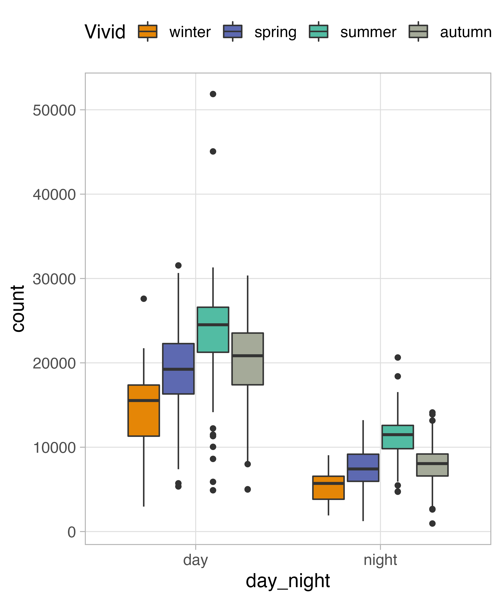{width=1500}
:::
:::


## {rcartocolor}


::: {.cell hash='06_colors_cache/revealjs/color-palettes-carto-show-all_47d3f78e5c5384528daf266659b9fea9'}

```{.r .cell-code}
rcartocolor::display_carto_all()
```

::: {.cell-output-display}
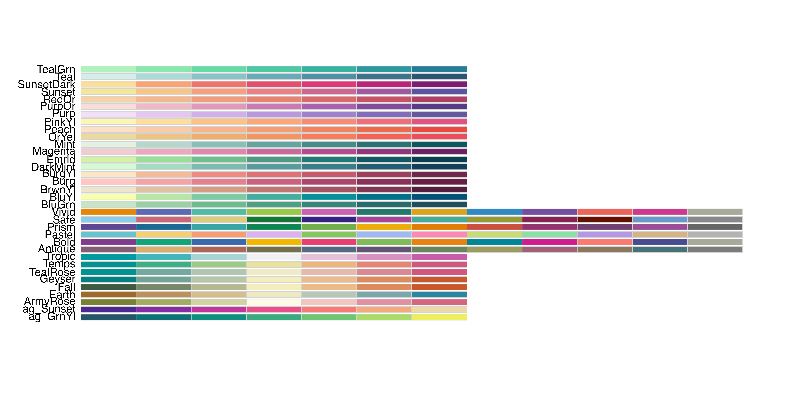{width=3600}
:::
:::


## {rcartocolor}


::: {.cell hash='06_colors_cache/revealjs/color-palettes-carto-show-cvd_a676fc51c10c3ea1f078c18ccd9066d3'}

```{.r .cell-code}
rcartocolor::display_carto_all(colorblind_friendly = TRUE)
```

::: {.cell-output-display}
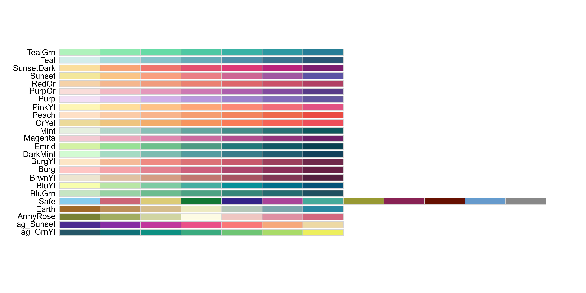{width=3600}
:::
:::


## {scico}


::: {.cell output-location='column' hash='06_colors_cache/revealjs/color-palettes-scico_22ddaebbbeebe5c069fdf069413328b3'}

```{.r .cell-code  code-line-numbers="9,10,11"}
# install.packages("scico")

ggplot(
    bikes, 
    aes(x = day_night, y = count, 
        fill = season)
  ) +
  geom_boxplot() +
  scico::scale_fill_scico_d(
    palette = "hawaii"
  )
```

::: {.cell-output-display}
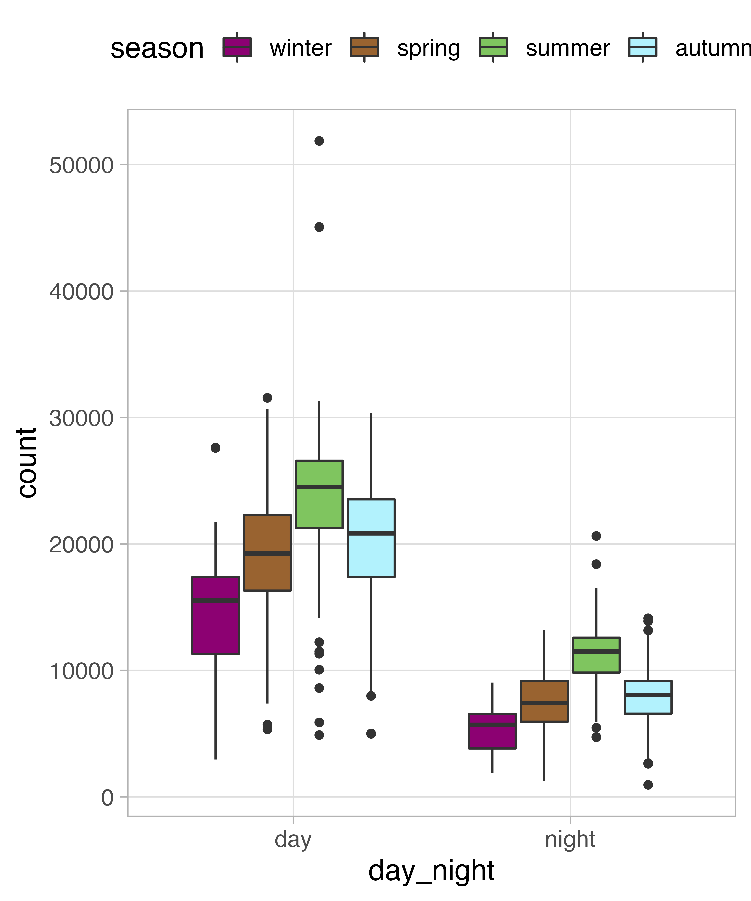{width=1500}
:::
:::


## {scico}


::: {.cell hash='06_colors_cache/revealjs/color-palettes-scico-show-all_018d3fc8c4d7bda0bb48eb805c069703'}

```{.r .cell-code}
scico::scico_palette_show()
```

::: {.cell-output-display}
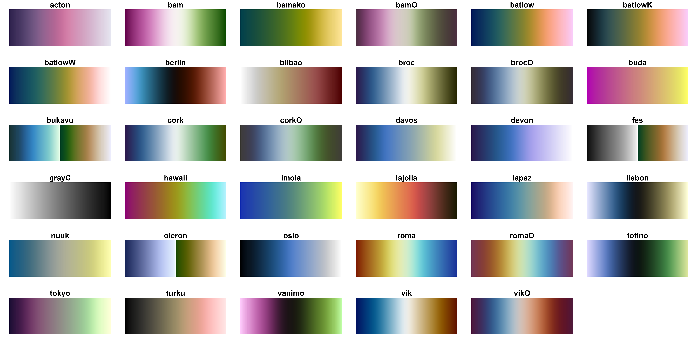{width=3600}
:::
:::


## {ggsci} and {ggthemes}

::: {layout-ncol="2"}

::: {.cell hash='06_colors_cache/revealjs/color-palettes-ggsci_657ef634bdf17b6862437a9398c245ca'}

```{.r .cell-code  code-line-numbers="8"}
# install.packages("ggsci")
ggplot(
    bikes, 
    aes(x = day_night, y = count, 
        fill = season)
  ) +
  geom_boxplot() +
  ggsci::scale_fill_npg()
```

::: {.cell-output-display}
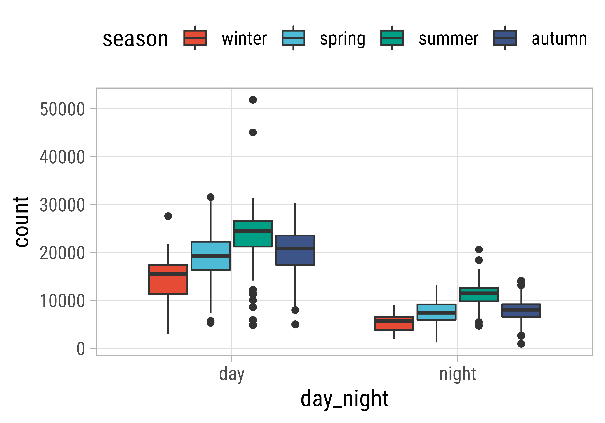{width=1500}
:::
:::

::: {.cell hash='06_colors_cache/revealjs/color-palettes-ggthemes_c9d8aee8586901356a91ae9c6deeebbb'}

```{.r .cell-code  code-line-numbers="8"}
# install.packages("ggthemes")
ggplot(
    bikes, 
    aes(x = day_night, y = count, 
        fill = season)
  ) +
  geom_boxplot() +
  ggthemes::scale_fill_gdocs()
```

::: {.cell-output-display}
{width=1500}
:::
:::

:::

## {nord}


::: {.cell output-location='column' hash='06_colors_cache/revealjs/color-palettes-nord_4875c4389611893dd69bdc87c5297cbd'}

```{.r .cell-code  code-line-numbers="9,10,11"}
# install.packages("nord")

ggplot(
    bikes, 
    aes(x = day_night, y = count, 
        fill = season)
  ) +
  geom_boxplot() +
  nord::scale_fill_nord(
    palette = "aurora"
  )
```

::: {.cell-output-display}
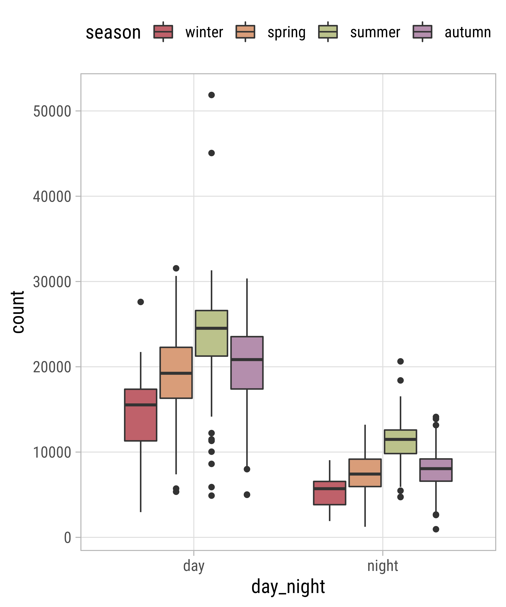{width=1500}
:::
:::


## {nord}


::: {.cell output-location='column' hash='06_colors_cache/revealjs/color-palettes-nord-cont_b173aba3c1b75030b485c4475c5027d9'}

```{.r .cell-code  code-line-numbers="9,10,11,12"}
# install.packages("nord")

ggplot(
    bikes, 
    aes(x = temp_feel, y = count, 
        color = temp_feel)
  ) +
  geom_point() +
  nord::scale_color_nord(
    palette = "silver_mine",
    discrete = FALSE
  )
```

::: {.cell-output-display}
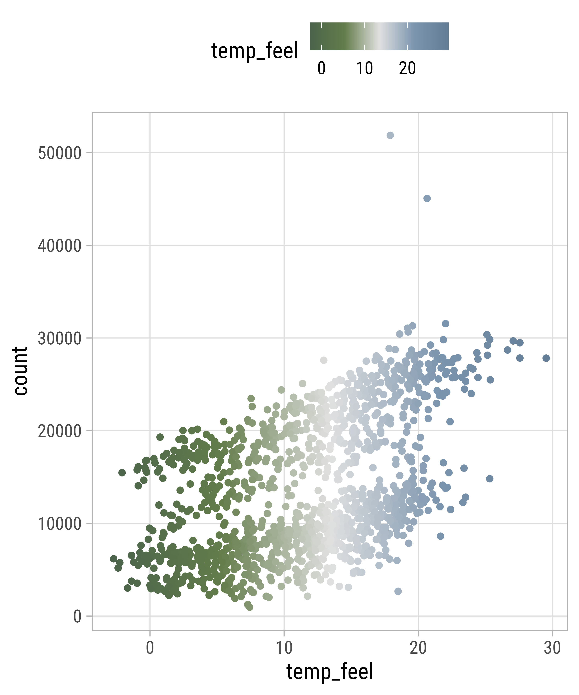{width=1500}
:::
:::


## {MetBrewer}


::: {.cell output-location='column' hash='06_colors_cache/revealjs/color-palettes-metbrewer_acbbb616450f8342f7f1b34c8f2e434a'}

```{.r .cell-code  code-line-numbers="9,10,11"}
# install.packages("MetBrewer")

ggplot(
    bikes, 
    aes(x = day_night, y = count, 
        fill = season)
  ) +
  geom_boxplot() +
  MetBrewer::scale_fill_met_d(
    name = "Klimt"
  )
```

::: {.cell-output-display}
{width=1500}
:::
:::


## {MetBrewer}


::: {.cell hash='06_colors_cache/revealjs/color-palettes-metbrewer-show-all_3a075be56b2978aaa204794a7a78d0f9'}

```{.r .cell-code}
MetBrewer::display_all()
```

::: {.cell-output-display}
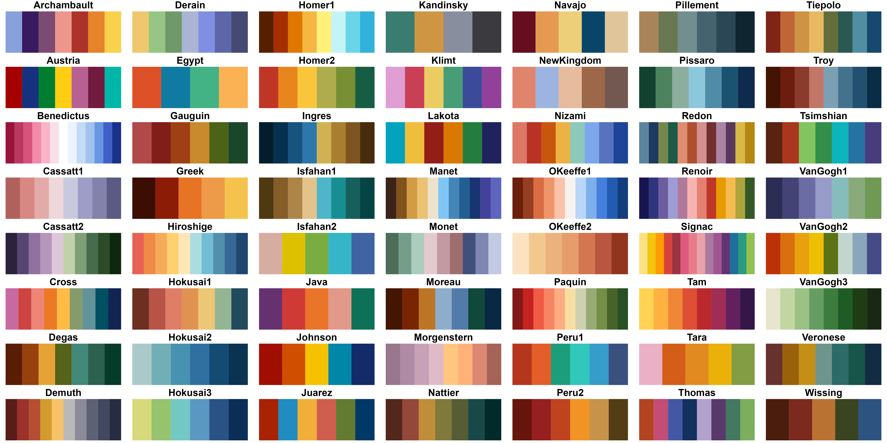{width=3600}
:::
:::


## {MetBrewer}


::: {.cell hash='06_colors_cache/revealjs/color-palettes-metbrewer-show-cvd_935bf611baadfcdc37c7e9301f9d1466'}

```{.r .cell-code}
MetBrewer::display_all(colorblind_only = TRUE)
```

::: {.cell-output-display}
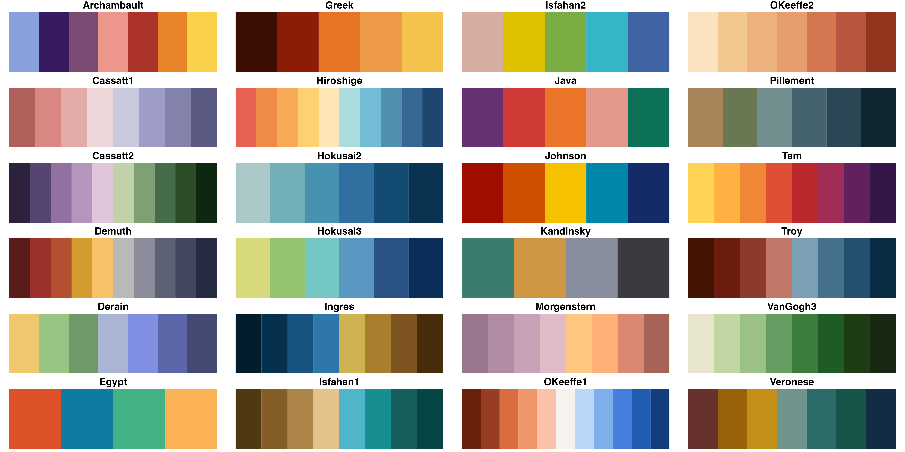{width=3600}
:::
:::


## {MetBrewer}


::: {.cell output-location='column' hash='06_colors_cache/revealjs/color-palettes-metbrewer-cont_6c46993009d12877d8183c11592b9241'}

```{.r .cell-code  code-line-numbers="9,10,11"}
# install.packages("MetBrewer")

ggplot(
    bikes, 
    aes(x = temp_feel, y = count, 
        color = temp_feel)
  ) +
  geom_point() +
  MetBrewer::scale_color_met_c(
    name = "Hiroshige" 
  )
```

::: {.cell-output-display}
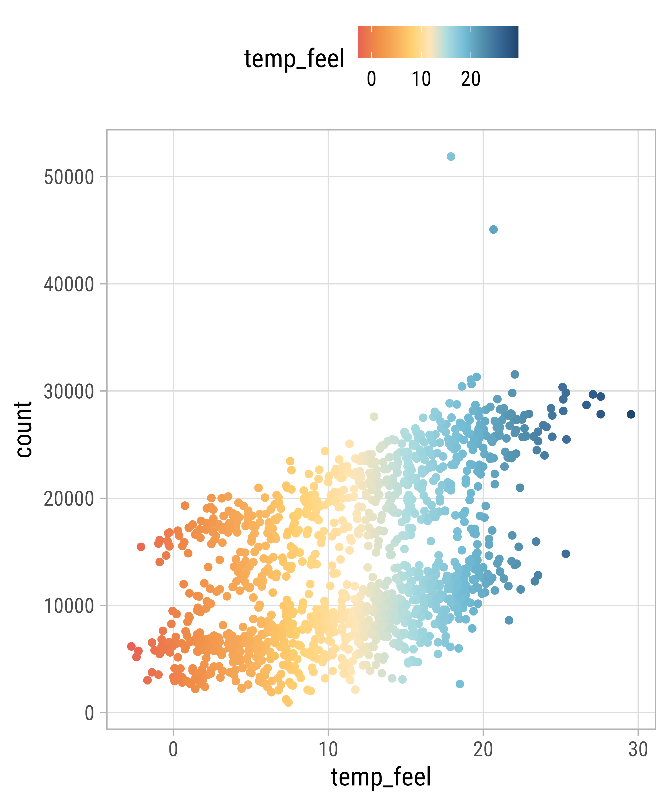{width=1500}
:::
:::


# Customize Palettes

## Customize Existing Palettes


::: {.cell output-location='column' hash='06_colors_cache/revealjs/color-palettes-carto-default_a5b4a44e89804f4cbeba5053669a31a3'}

```{.r .cell-code  code-line-numbers="9,10,11"}
library("rcartocolor")

ggplot(
    bikes, 
    aes(x = day_night, y = count, 
        fill = season)
  ) +
  geom_boxplot() +
  rcartocolor::scale_fill_carto_d(
    name = "Vivid" 
  )
```

::: {.cell-output-display}
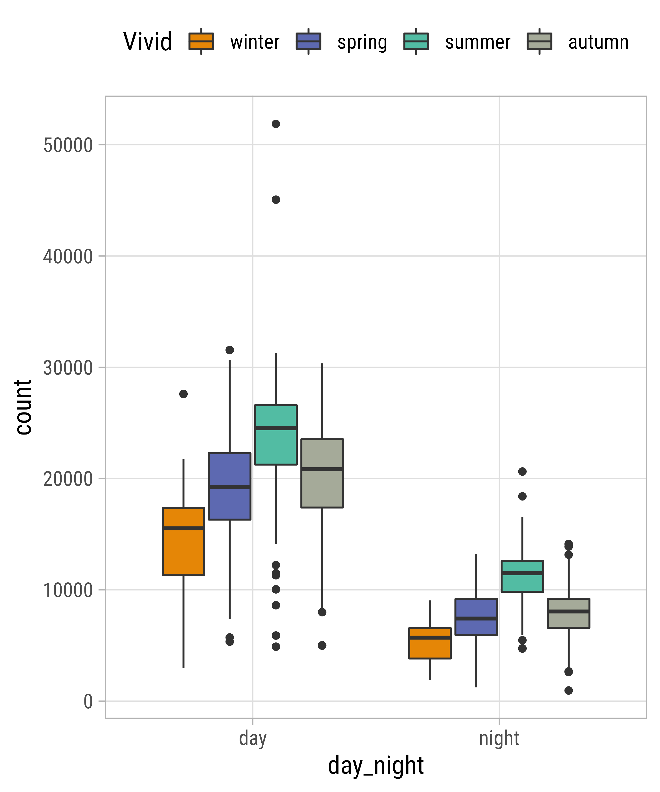{width=1500}
:::
:::


## Customize Existing Palettes


::: {.cell output-location='column' hash='06_colors_cache/revealjs/color-palettes-carto-manual_49c139e1f5bfb964f29139c3309f5d7b'}

```{.r .cell-code  code-line-numbers="9,10,11,12,13"}
library("rcartocolor")

ggplot(
    bikes, 
    aes(x = day_night, y = count, 
        fill = season)
  ) +
  geom_boxplot() +
  scale_fill_manual(
    values = carto_pal(
      name = "Vivid", n = 4
    )
  )
```

::: {.cell-output-display}
{width=1500}
:::
:::


## Customize Existing Palettes


::: {.cell output-location='column' hash='06_colors_cache/revealjs/color-palettes-carto-custom_a01cd80659498892fbea726f46083d93'}

```{.r .cell-code  code-line-numbers="11,12"}
library("rcartocolor")

ggplot(
    bikes, 
    aes(x = day_night, y = count, 
        fill = season)
  ) +
  geom_boxplot() +
  scale_fill_manual(
    values = carto_pal(
      name = "Vivid", n = 5
    )[1:4]
  )
```

::: {.cell-output-display}
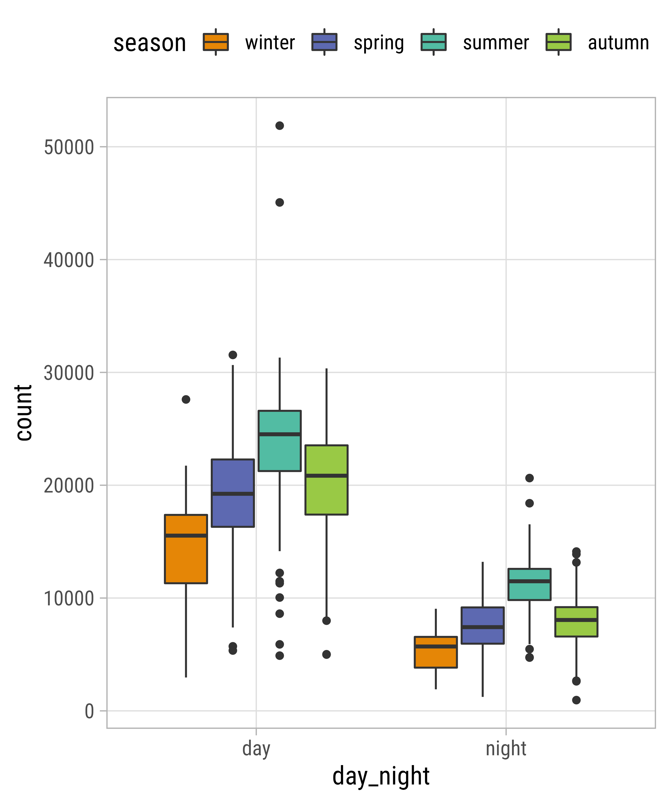{width=1500}
:::
:::


## Customize Existing Palettes


::: {.cell output-location='column' hash='06_colors_cache/revealjs/color-palettes-carto-custom-2_02f9a626b3e3362e65810e45c0453cdb'}

```{.r .cell-code  code-line-numbers="11,12"}
library("rcartocolor")

ggplot(
    bikes, 
    aes(x = day_night, y = count, 
        fill = season)
  ) +
  geom_boxplot() +
  scale_fill_manual(
    values = carto_pal(
      name = "Vivid", n = 6
    )[c(1, 3:5)]
  )
```

::: {.cell-output-display}
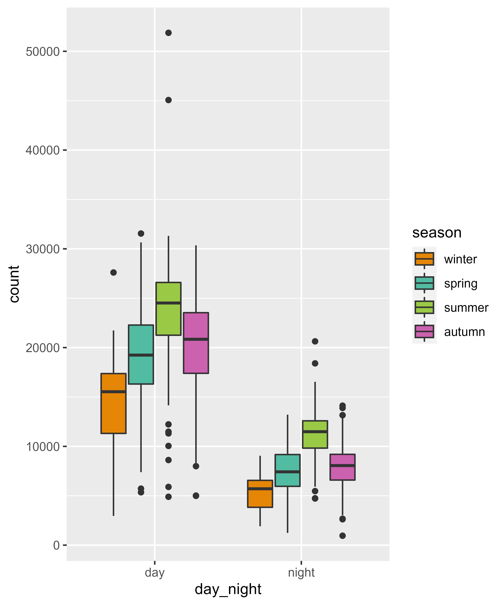{width=1500}
:::
:::


## Customize Existing Palettes


::: {.cell output-location='column' hash='06_colors_cache/revealjs/color-palettes-carto-custom-assign_312b772e8481af5be5c99143b10a22ec'}

```{.r .cell-code  code-line-numbers="1,2,3,4|13"}
carto_custom <- 
  carto_pal(
    name = "Vivid", n = 6
  )[c(1, 3:5)]

ggplot(
    bikes, 
    aes(x = day_night, y = count, 
        fill = season)
  ) +
  geom_boxplot() +
  scale_fill_manual(
    values = carto_custom
  )
```

::: {.cell-output-display}
{width=1500}
:::
:::


## Customize Existing Palettes


::: {.cell output-location='column' hash='06_colors_cache/revealjs/color-palettes-carto-light_72e8bb2b31d7a1c7f178224926d13b3c'}

```{.r .cell-code  code-line-numbers="2,4|13"}
# install.packages("colorspace")
library(colorspace)

carto_light <- lighten(carto_custom, .8)

ggplot(
    bikes, 
    aes(x = day_night, y = count, 
        fill = season)
  ) +
  geom_boxplot() +
  scale_fill_manual(
    values = carto_light
  )
```

::: {.cell-output-display}
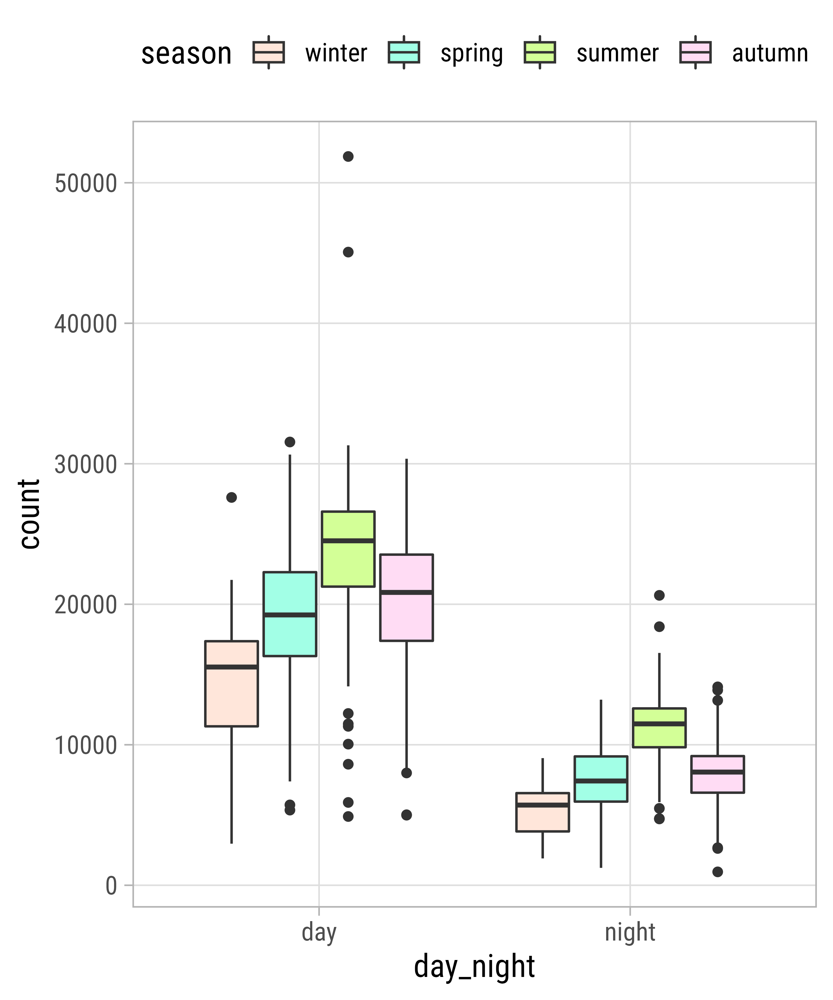{width=1500}
:::
:::


## Customize Existing Palettes


::: {.cell output-location='column' hash='06_colors_cache/revealjs/color-palettes-carto-afterscale_d76f39e4e74355a3e97ef28a6fa5c9fc'}

```{.r .cell-code  code-line-numbers="12|6,7,8,9|6|7,9|8|"}
ggplot(
    bikes, 
    aes(x = day_night, y = count)
  ) +
  geom_boxplot(
    aes(fill = season,
        fill = after_scale(
          lighten(fill, .8)
    ))
  ) +
  scale_fill_manual(
    values = carto_custom
  )
```

::: {.cell-output-display}
{width=1500}
:::
:::


## Customize Existing Palettes


::: {.cell output-location='column' hash='06_colors_cache/revealjs/color-palettes-carto-afterscale-stage_e9ec19dac8fe3615957e03663e6d9b0d'}

```{.r .cell-code  code-line-numbers="7,8,9,10,11|7|9|10"}
ggplot(
    bikes, 
    aes(x = day_night, y = count)
  ) +
  geom_boxplot(
    aes(
      fill = stage(
        season,
        after_scale =
          lighten(fill, .8)
      )
    )
  ) +
  scale_fill_manual(
    values = carto_custom
  )
```

::: {.cell-output-display}
{width=1500}
:::
:::


## Customize Existing Palettes


::: {.cell output-location='column' hash='06_colors_cache/revealjs/color-palettes-carto-afterscale-2_c6181a1b372c663b91f3dd4777e29a49'}

```{.r .cell-code  code-line-numbers="6,11|7,8,9"}
ggplot(
    bikes, 
    aes(x = day_night, y = count)
  ) +
  geom_boxplot(
    aes(color = season,
        fill = after_scale(
          lighten(color, .8)
    ))
  ) +
  scale_color_manual(
    values = carto_custom
  )
```

::: {.cell-output-display}
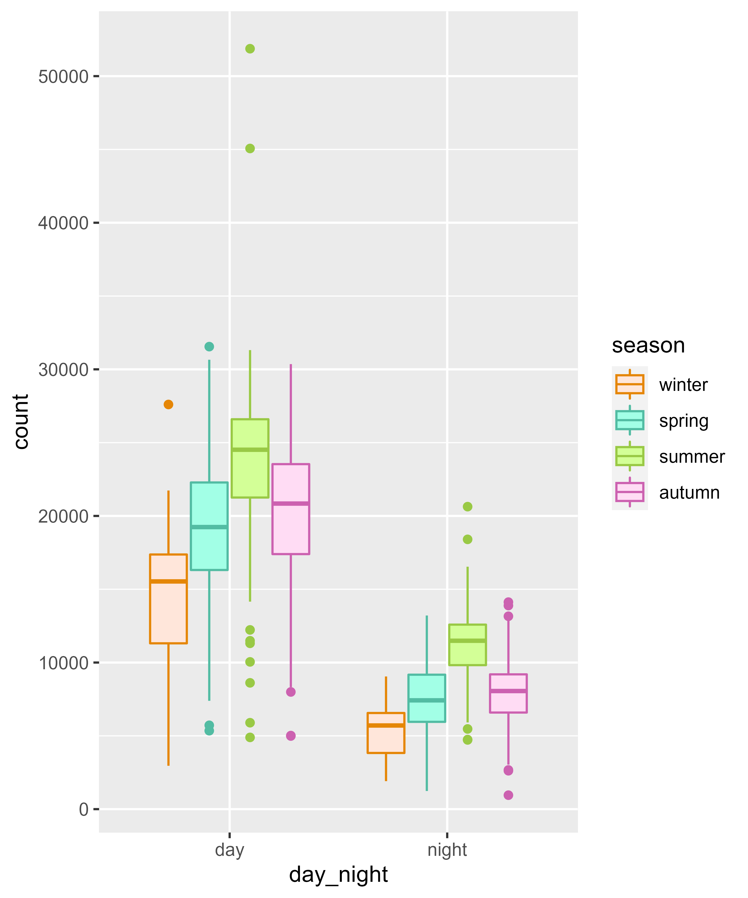{width=1500}
:::
:::


## Customize Existing Palettes


::: {.cell output-location='column' hash='06_colors_cache/revealjs/color-palettes-carto-afterscale-combined_129f15e66bc17bd36c537ea274426103'}

```{.r .cell-code  code-line-numbers="11,12,13,14,15,16,17,18|13,14,15,16"}
ggplot(
    bikes, 
    aes(x = day_night, y = count)
  ) +
  geom_boxplot(
    aes(color = season,
        fill = after_scale(
          lighten(color, .8)
    ))
  ) +
  geom_jitter(
    aes(color = season), 
    position = position_jitterdodge(
      dodge.width = .75, 
      jitter.width = .2
    ),
    alpha = .4
  ) +
  scale_color_manual(
    values = carto_custom
  )
```

::: {.cell-output-display}
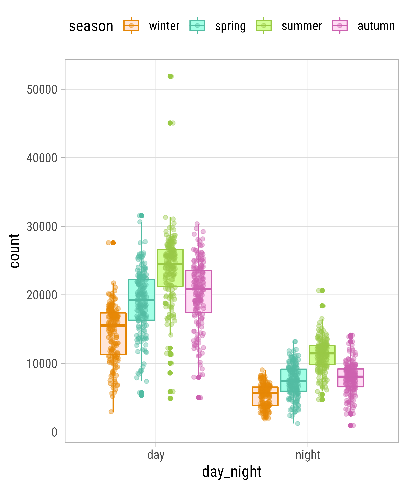{width=1500}
:::
:::


## Customize Existing Palettes


::: {.cell output-location='column' hash='06_colors_cache/revealjs/color-palettes-carto-afterscale-combined-2_e33e95f36bc913e6b5115d9b7af6d3e3'}

```{.r .cell-code  code-line-numbers="12,13,14,15|14"}
ggplot(
    bikes, 
    aes(x = day_night, y = count)
  ) +
  geom_boxplot(
    aes(color = season,
        fill = after_scale(
          lighten(color, .8)
        ))
  ) +
  geom_jitter(
    aes(color = season,
        color = after_scale(
          darken(color, .3)
    )), 
    position = position_jitterdodge(
      dodge.width = .75, 
      jitter.width = .2
    ),
    alpha = .4
  ) +
  scale_color_manual(
    values = carto_custom
  )
```

::: {.cell-output-display}
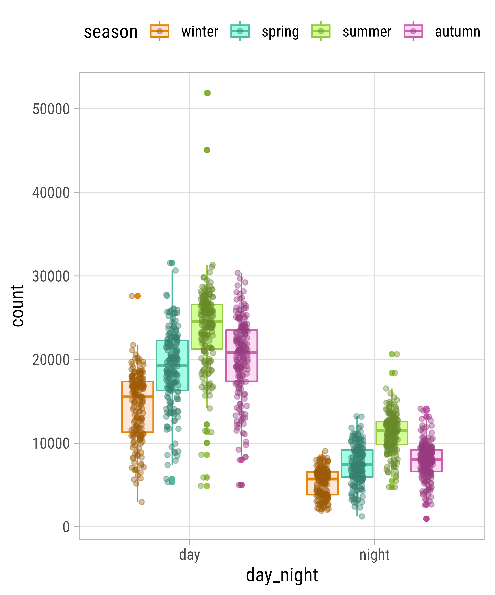{width=1500}
:::
:::


## Customize Existing Palettes


::: {.cell output-location='column' hash='06_colors_cache/revealjs/color-palettes-carto-afterscale-combined-3_7a594124ed69b0dd782a6544d5ea032e'}

```{.r .cell-code  code-line-numbers="13,14,15"}
ggplot(
    bikes, 
    aes(x = day_night, y = count)
  ) +
  geom_boxplot(
    aes(color = season,
        fill = after_scale(
          lighten(color, .8)
        ))
  ) +
  geom_jitter(
    aes(color = season,
        color = after_scale(
          darken(color, .3)
        )), 
    position = position_jitterdodge(
      dodge.width = .75, 
      jitter.width = .2
    ),
    alpha = .4
  ) +
  scale_color_manual(
    values = carto_custom
  )
```

::: {.cell-output-display}
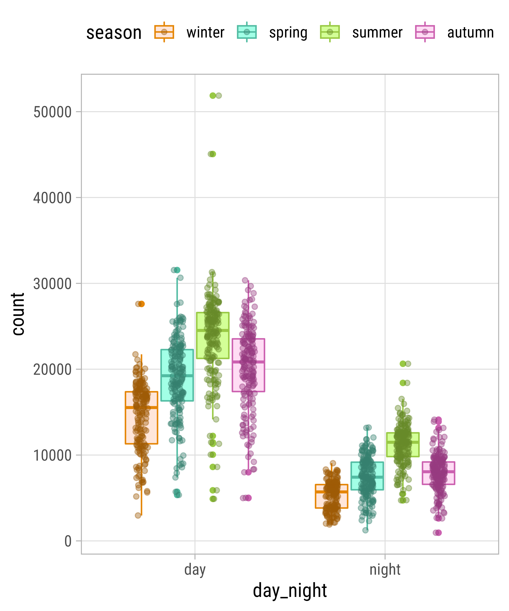{width=1500}
:::
:::


# Create New Palettes

## Create Sequential Palettes


::: {.cell output-location='column' hash='06_colors_cache/revealjs/color-palettes-gradient_2c9ff69520b0acc1c972ba842efb6f4a'}

```{.r .cell-code  code-line-numbers="7,10|8,9"}
ggplot(
    bikes, 
    aes(x = temp_feel, y = count, 
        color = temp_feel)
  ) +
  geom_point() +
  scale_color_gradient(
    low = "#28A87D",
    high = "#FFD166"
  )
```

::: {.cell-output-display}
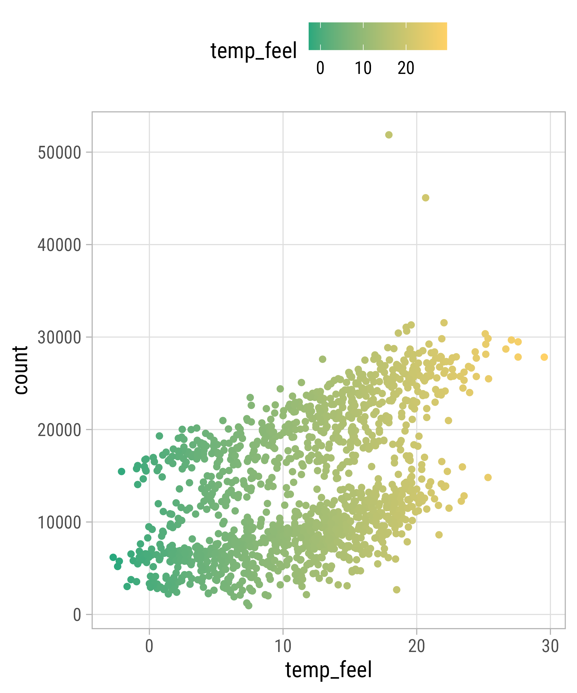{width=1500}
:::
:::


## Create Diverging Palettes


::: {.cell output-location='column' hash='06_colors_cache/revealjs/color-palettes-gradient2_8463e452ee90e1f54259f5fd62b7c821'}

```{.r .cell-code  code-line-numbers="7,11|8,9,10|10"}
ggplot(
    bikes, 
    aes(x = temp_feel, y = count, 
        color = temp_feel)
  ) +
  geom_point() +
  scale_color_gradient2(
    low = "#663399",
    high = "#993334",
    mid = "grey95"
  )
```

::: {.cell-output-display}
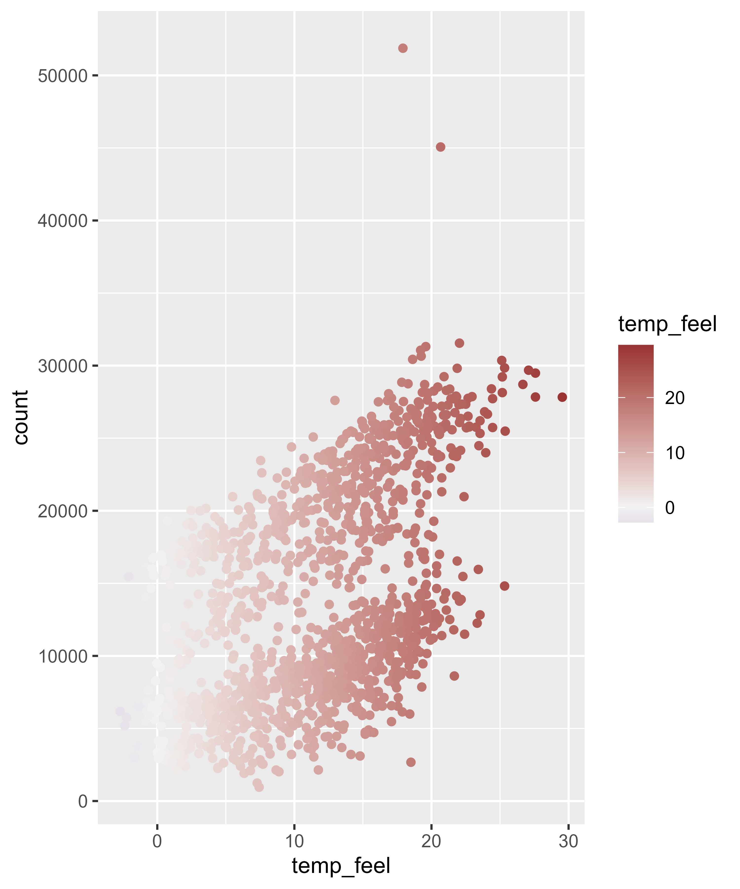{width=1500}
:::
:::


## Create Diverging Palettes


::: {.cell output-location='column' hash='06_colors_cache/revealjs/color-palettes-gradient2-midpoint_2f4847732a208cda41bfaaf4d0b00899'}

```{.r .cell-code  code-line-numbers="11"}
ggplot(
    bikes, 
    aes(x = temp_feel, y = count, 
        color = temp_feel)
  ) +
  geom_point() +
  scale_color_gradient2(
    low = "#663399",
    high = "#993334",
    mid = "grey92",
    midpoint = 10    
  )
```

::: {.cell-output-display}
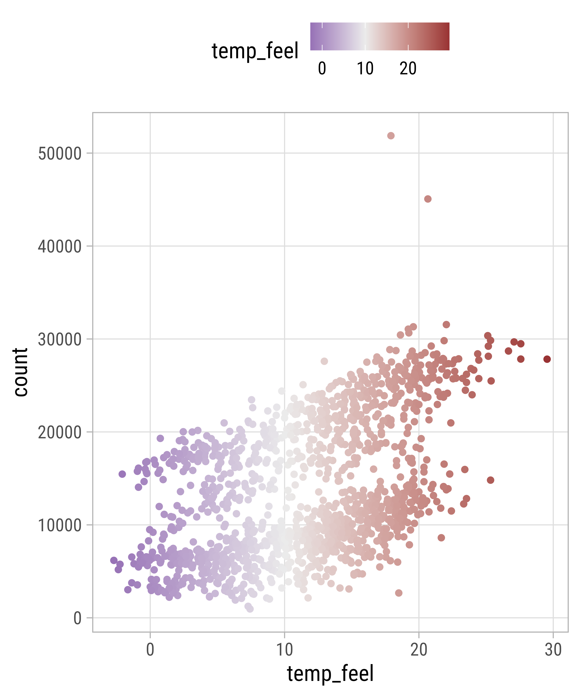{width=1500}
:::
:::


## Create Diverging Palettes


::: {.cell output-location='column' hash='06_colors_cache/revealjs/color-palettes-gradient2-midpoint-limits_3636940147efd8b4bf4d5d32470a1e79'}

```{.r .cell-code  code-line-numbers="12"}
ggplot(
    bikes, 
    aes(x = temp_feel, y = count, 
        color = temp_feel)
  ) +
  geom_point() +
  scale_color_gradient2(
    low = "#663399",
    high = "#993334",
    mid = "grey92",
    midpoint = 10,
    limits = c(-10, 30)   
  )
```

::: {.cell-output-display}
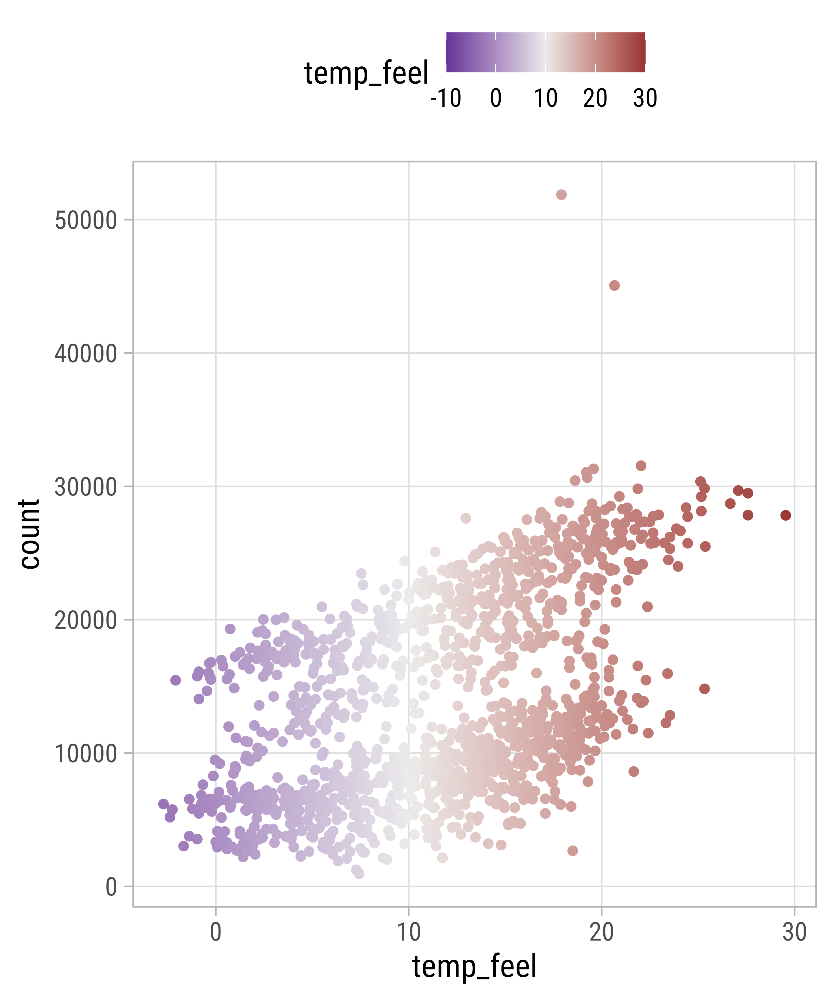{width=1500}
:::
:::


## Create Any Palette


::: {.cell output-location='column' hash='06_colors_cache/revealjs/color-palettes-gradientn_16bfc1953a6ad01405e6baa467df77fd'}

```{.r .cell-code  code-line-numbers="7,8,9"}
ggplot(
    bikes, 
    aes(x = temp_feel, y = count, 
        color = temp_feel)
  ) +
  geom_point() +
  scale_color_gradientn(
    colors = carto_custom  
  )
```

::: {.cell-output-display}
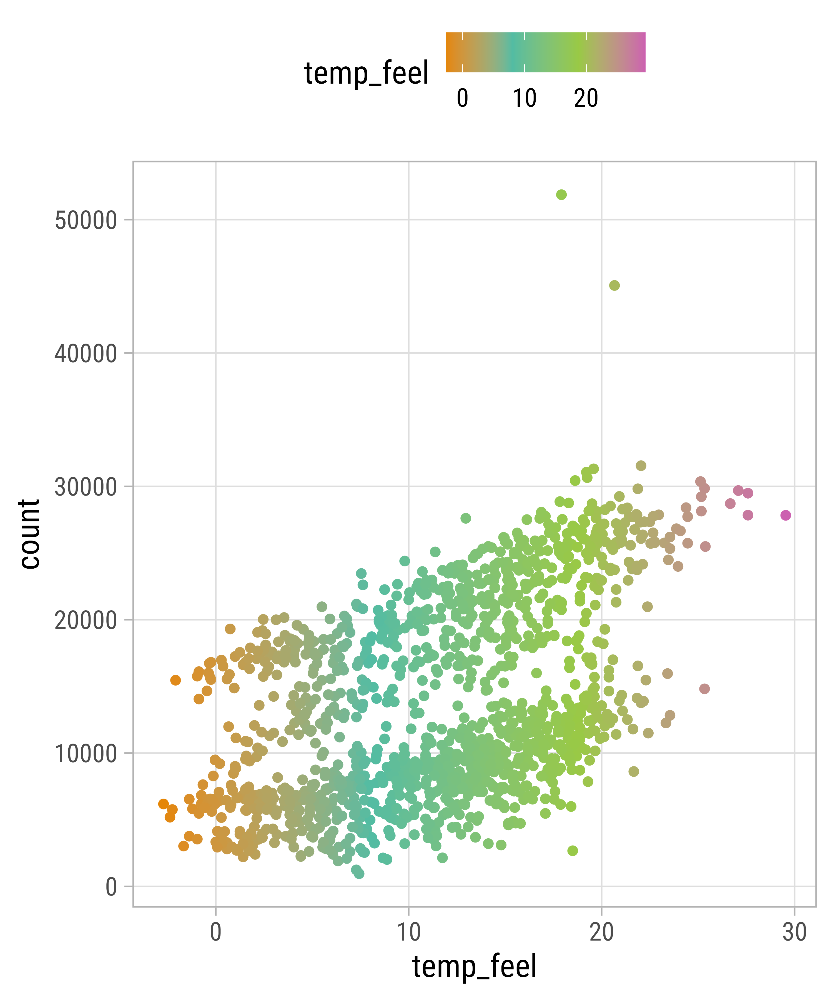{width=1500}
:::
:::


## Create Any Palette


::: {.cell output-location='column' hash='06_colors_cache/revealjs/color-palettes-gradientn-weight_701e2657be35a852e4e262ab3fd4e0ba'}

```{.r .cell-code  code-line-numbers="9"}
ggplot(
    bikes, 
    aes(x = temp_feel, y = count, 
        color = temp_feel)
  ) +
  geom_point() +
  scale_color_gradientn(
    colors = carto_custom,
    values = c(0, .2, .8, 1)
  )
```

::: {.cell-output-display}
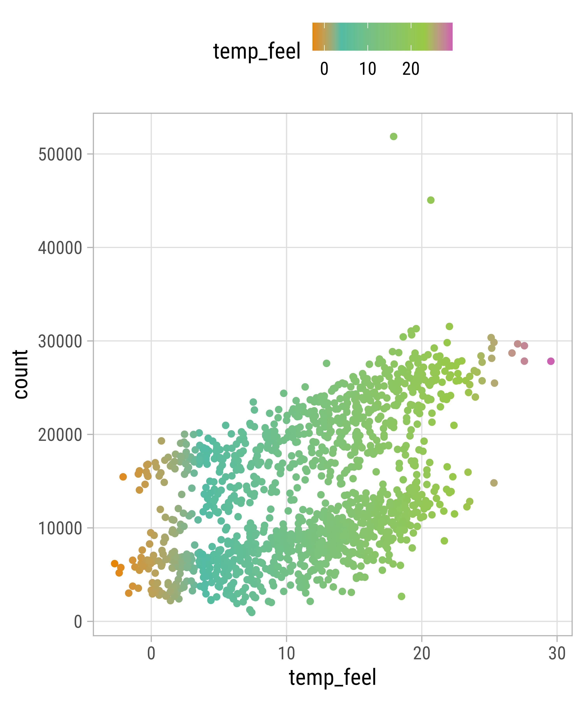{width=1500}
:::
:::


# Build Your Own<br>`scale_color|fill_*()`


---

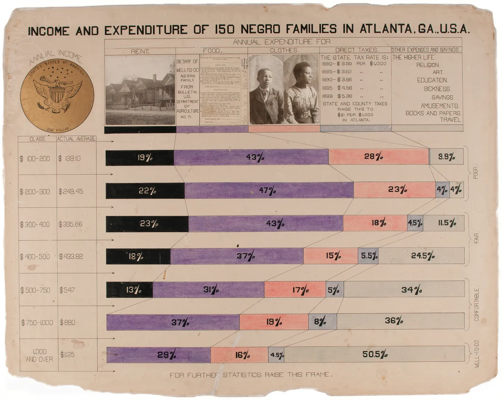{fig-alt="“Black Lives 1900: W. E. B. Du Bois at the Paris Exposition” reprints some of the striking photographs and graphics that Du Bois and his curators commissioned for the World’s Fair, here the colorful stacked bar chart on income and expenditure of 150 negro families in Atlanta." fig-width="60%"}

##  {background-image="img/colors/dubois-colors.png" background-position="center" background-size="92%" background-alt="Seven colors based on and inspired by the graphic from W. E. B. Du Bois."}

## Build Your Own `scale_color|fill_*()`

::: {.cell hash='06_colors_cache/revealjs/dubois-colors-function_8e52ca076dcfc66368ccbab75ad4be4e'}

```{.r .cell-code  code-line-numbers="1,18|2,3,4,5,6,7,8,9,10,11|13,14,15,16,17|20"}
dubois_colors <- function(...) {
  dubois_cols <- c(
    `black`    = "#000000",
    `purple`   = "#582f6c",
    `violet`   = "#94679C",
    `pink`     = "#ef849f",
    `softred`  = "#f4b7a7",
    `iceblue`  = "#bccbf3",
    `palegrey` = "#e4e4e4"
  )

  cols <- c(...)

  if (is.null(cols))
    return (dubois_cols)

  dubois_cols[cols]
}

dubois_colors("black", "pink", "softred", "iceblue")
```

::: {.cell-output .cell-output-stdout}
```
    black      pink   softred   iceblue 
"#000000" "#ef849f" "#f4b7a7" "#bccbf3" 
```
:::
:::

## Build Your Own `scale_color|fill_*_d()`

::: {.cell hash='06_colors_cache/revealjs/dubois-colors-pal-d-function_161135bb87d43b48c40c11ec262c8d98'}

```{.r .cell-code  code-line-numbers="1,2,12,13|3|5,6,7,8|9|11|13|15"}
dubois_pal_d <- function(palette = "default", reverse = FALSE) {
  function(n) {
    if(n > 5) stop('Palettes only contains 5 colors')

    if (palette == "default") { pal <- dubois_colors("black", "violet", "softred", "iceblue", "palegrey")[1:n] }
    if (palette == "dark") { pal <- dubois_colors(1:5)[1:n] }
    if (palette == "light") { pal <- dubois_colors(3:7)[1:n] }
    
    pal <- unname(pal)

    if (reverse) rev(pal) else pal
  }
}

dubois_pal_d()(3)
```

::: {.cell-output .cell-output-stdout}
```
[1] "#000000" "#94679C" "#f4b7a7"
```
:::
:::

## Build Your Own `scale_fill|color_*_d()`

::: {.cell hash='06_colors_cache/revealjs/dubois-scale-discrete-functions_74476768f73768b521177a5fadfa1af4'}

```{.r .cell-code  code-line-numbers="1,2,3,4,5,6,7|9,10,11,12,13,14,15|2,10|4,12|6,14"}
scale_color_dubois_d <- function(palette = "default", reverse = FALSE, ...) {
  if (!palette %in% c("default", "dark", "light")) stop('Palette should be "default", "dark" or "light".')

  pal <- dubois_pal_d(palette = palette, reverse = reverse)

  ggplot2::discrete_scale("colour", paste0("dubois_", palette), palette = pal, ...)
}

scale_fill_dubois_d <- function(palette = "default", reverse = FALSE, ...) {
  if (!palette %in% c("default", "dark", "light")) stop('Palette should be "default", "dark" or "light".')

  pal <- dubois_pal_d(palette = palette, reverse = reverse)

  ggplot2::discrete_scale("fill", paste0("dubois_", palette), palette = pal, ...)
}
```
:::

## Use Your Own `scale_fill_*_d()`

::: {.cell output-location='column' hash='06_colors_cache/revealjs/dubois-scales-fill-d-use_c29c2bf5921234aa5274fd4678395d7a'}

```{.r .cell-code  code-line-numbers="4,7"}
ggplot(
    bikes, 
    aes(x = day_night, y = count, 
        fill = season)
  ) +
  geom_boxplot() +
  scale_fill_dubois_d()
```

::: {.cell-output-display}
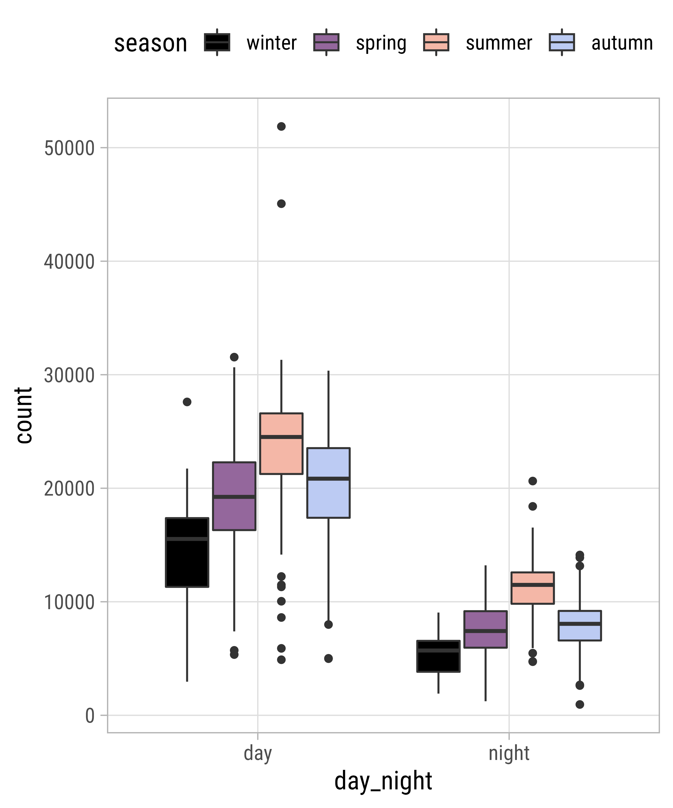{width=1500}
:::
:::

## Use Your Own `scale_color_*_d()`

::: {.cell output-location='column' hash='06_colors_cache/revealjs/dubois-scales-color-d-use_80bcd927b143f94525f7b1ed10d9305d'}

```{.r .cell-code  code-line-numbers="4,7,8,9,10"}
ggplot(
    bikes, 
    aes(x = day_night, y = count, 
        color = season)
  ) +
  geom_boxplot() +
  scale_color_dubois_d(
    palette = "dark",
    reverse = TRUE
  )
```

::: {.cell-output-display}
{width=1500}
:::
:::


# Test Your Palettes


## Emulate CVD

::: {.cell output-location='column' hash='06_colors_cache/revealjs/cvd-emulation-deutan_80ef7905810c98c30ea5817fcecd6de5'}

```{.r .cell-code  code-line-numbers="1,2,3,4,5,6|14,15,16"}
deut <- 
  colorspace::deutan(
    viridis::turbo(
      n = 100, direction = -1
    )
  )

ggplot(
    bikes, 
    aes(x = temp_feel, y = count,
        color = temp_feel)
  ) +
  geom_point() +
  scale_color_gradientn(
    colors = deut
  )
```

::: {.cell-output-display}
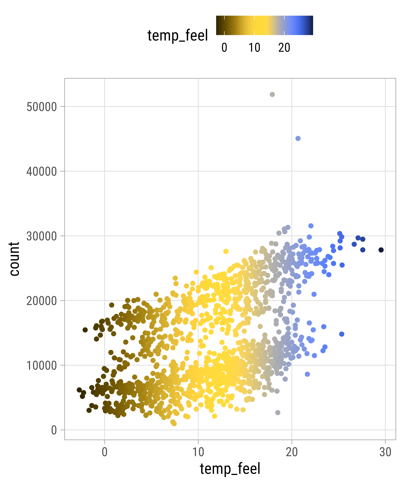{width=1500}
:::
:::

## Emulate CVD

::: {.cell output-location='column' hash='06_colors_cache/revealjs/cvd-emulation-all-prep_fc2fb699966ad49d7cf812f37fcca97a'}

```{.r .cell-code}
g <- 
  ggplot(
    bikes, 
    aes(x = day_night, y = count, 
        fill = season)
  ) +
  geom_boxplot() +
  scale_fill_manual(
    values = carto_custom
  )

g
```

::: {.cell-output-display}
{width=1500}
:::
:::

## Emulate CVD

::: {.cell output-location='column' hash='06_colors_cache/revealjs/cvd-emulation-all_248e56d7e5e4eeb6e383fae861a392b5'}

```{.r .cell-code}
# devtools::install_github(
#   "clauswilke/colorblindr"
# )

colorblindr::cvd_grid(g)
```

::: {.cell-output-display}
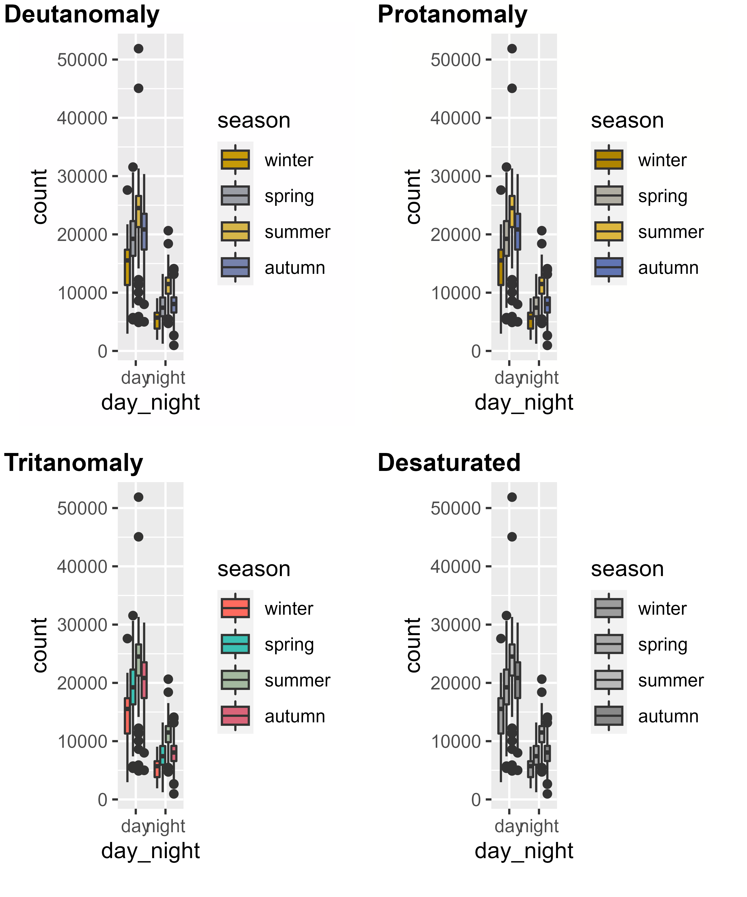{width=1500}
:::
:::

## Emulate CVD

::: {.cell hash='06_colors_cache/revealjs/cvd-emulation-all-2-prep_7aab750c718124f842c38502807ef1df'}

:::

## Emulate CVD

::: {.cell hash='06_colors_cache/revealjs/cvd-emulation-all-2_2253dabd250643052adb14ce819b75b8'}

```{.r .cell-code}
# devtools::install_github("clauswilke/colorblindr")

colorblindr::cvd_grid(g2)
```

::: {.cell-output-display}
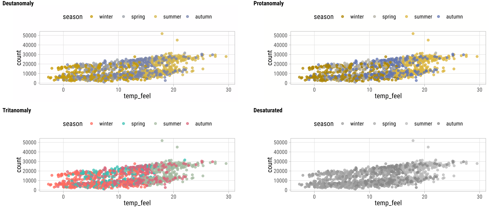{width=4200}
:::
:::

## Emulate CVD

::: {.cell hash='06_colors_cache/revealjs/cvd-emulation-all-3-prep_2f5b5b887834bb333a37065c83a1a641'}

:::

## Emulate CVD

::: {.cell hash='06_colors_cache/revealjs/cvd-emulation-all-3_5d4e237ff334b2d8f4ba27e30971629a'}

```{.r .cell-code}
# devtools::install_github("clauswilke/colorblindr")

colorblindr::cvd_grid(g3)
```

::: {.cell-output-display}
{width=4200}
:::
:::

## <b style='color:#663399;'>Recap</b>

::: recap
::: incremental
-   use **categorical** palettes for **qualitative** data
    -  e.g. `scale_*_discrete()` and `scale_*_manual()` for custom options
    -  e.g. `scale_*_viridis_d` and `scale_*_brewer()` for pre-defined options
-   use **sequential or diverging** palettes for **quantitative** data
    -  e.g. `scale_*_gradient()` or `scale_*_gradient2()` for custom options
    -  e.g. `scale_*_viridis_c` and `scale_*_distiller()` for pre-defined options
-   various packages provide palettes incl. `scale_*` components
    - e.g. `{rcartocolors}`, `{scico}`, `{ggsci}`, `{ggthemes}`, `{nord}`
-   those and even more packages return palettes as vectors
    - modify and supply thehm to `scale_*_manual()` and `scale_*_gradientn()`
-   use **`after_scale`** to modify and recycle color scales 
:::
:::

# Exercise

## Exercise

::: question
-   **Create a similar visualization as close as possible:**
:::

::: {.cell layout-align="center" hash='06_colors_cache/revealjs/exercise-jittered-errorbars_f0c97c60a4b5bc7be41eb9ee0634e351'}
::: {.cell-output-display}
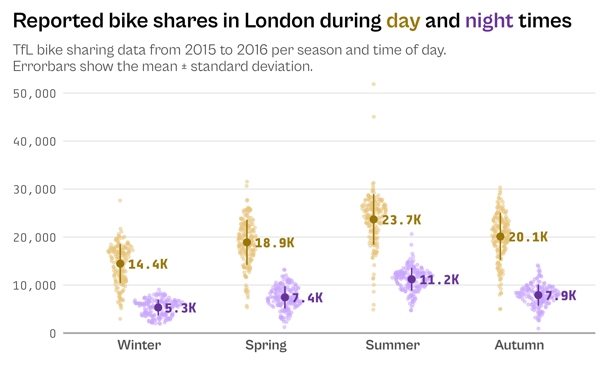{fig-align='center' width=3000}
:::
:::

::: {.cell hash='06_colors_cache/revealjs/countdown-ex1_f20122a8b337fad905187dc0e566a4dd'}
::: {.cell-output-display}
```{=html}
<div class="countdown" id="timer_62f3af82" style="right:0;bottom:0;font-size:.5em;" data-warnwhen="0">
<code class="countdown-time"><span class="countdown-digits minutes">20</span><span class="countdown-digits colon">:</span><span class="countdown-digits seconds">00</span></code>
</div>
```
:::
:::

# Appendix

# HCL Spectrum

## Evaluate HCL Spectrum

::: {.cell output-location='column' hash='06_colors_cache/revealjs/color-palettes-colorspace-spec-explain_424808778e5c892541586f082f9f5a14'}

```{.r .cell-code}
colorspace::specplot(
  colorspace::diverging_hcl(
    n = 100, palette = "Blue-Red"
  )
)
```

::: {.cell-output-display}
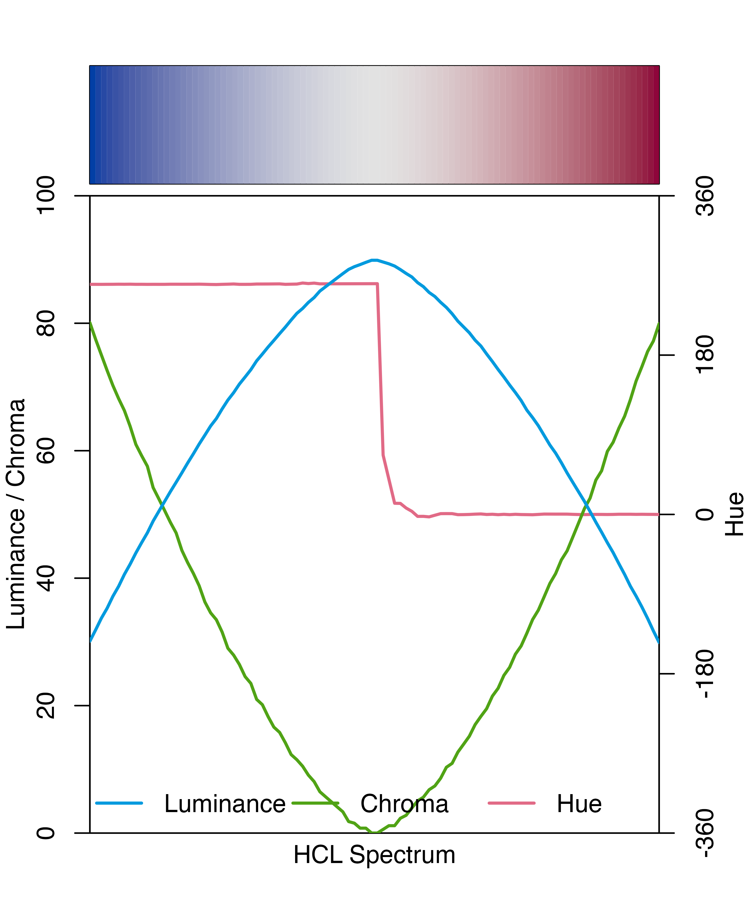{width=1500}
:::
:::

## Evaluate HCL Spectrum

::: {layout-ncol="2"}
::: {.cell hash='06_colors_cache/revealjs/color-palettes-scico-spec_7e42031c8641fa0f813517ae7c46782c'}

```{.r .cell-code}
colorspace::specplot(
  scico::scico(
    n = 100, palette = "hawaii"
  )
)
```

::: {.cell-output-display}
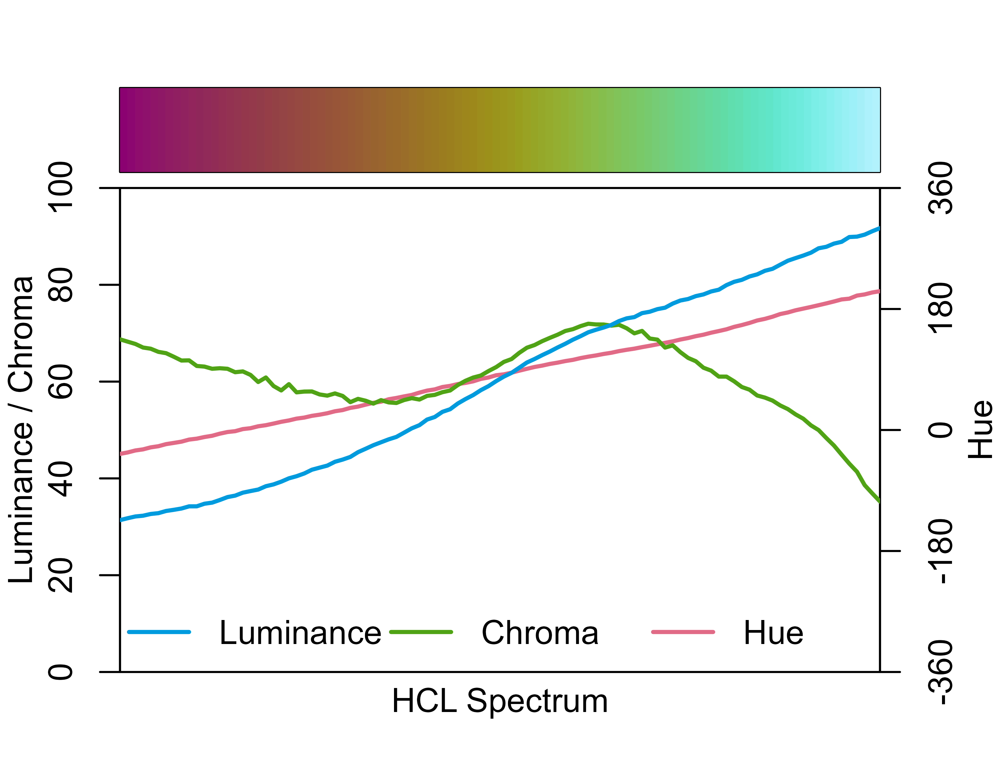{width=1500}
:::
:::

::: {.cell hash='06_colors_cache/revealjs/color-palettes-metbrewer-spec_eb24e5d2d89422525fe8eadbdb66cd66'}

```{.r .cell-code}
colorspace::specplot(
  MetBrewer::met.brewer(
     n = 100, name = "Hiroshige"
  )
)
```

::: {.cell-output-display}
{width=1500}
:::
:::
:::

## Evaluate HCL Spectrum

::: {layout-ncol="2"}
::: {.cell hash='06_colors_cache/revealjs/color-palettes-carto-spec_b7793123a81d65930ac9042238933d81'}

```{.r .cell-code}
colorspace::specplot(
  rcartocolor::carto_pal(
    n = 7, name = "TealRose"
  )
)
```

::: {.cell-output-display}
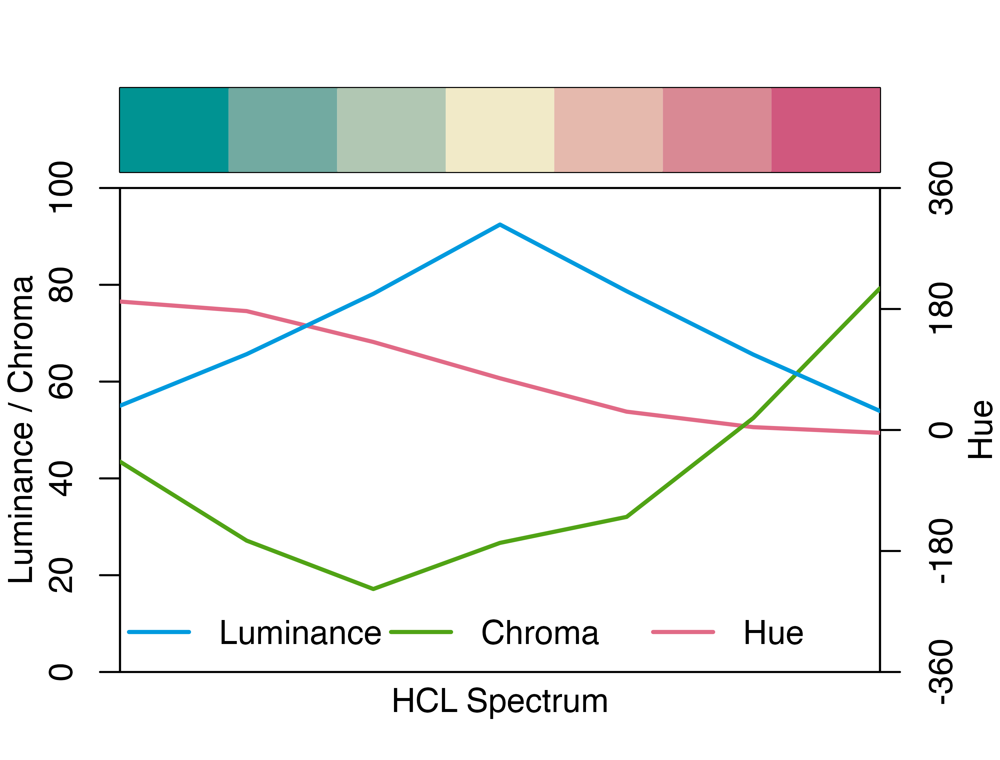{width=1500}
:::
:::

::: {.cell hash='06_colors_cache/revealjs/color-palettes-metbrewer-spec-2_1fcc9a8a85ad0482046ab7fdb404188a'}

```{.r .cell-code}
colorspace::specplot(
  MetBrewer::met.brewer(
     n = 100, name = "Cassatt2"
  )
)
```

::: {.cell-output-display}
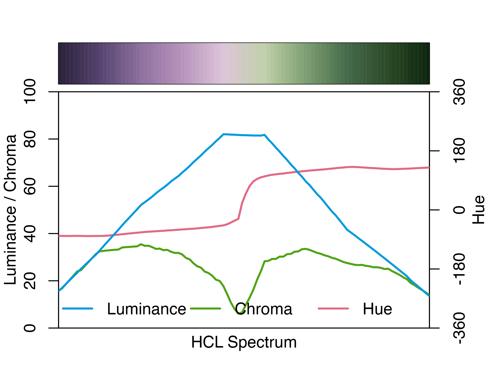{width=1500}
:::
:::
:::

## Evaluate HCL Spectrum

::: {layout-ncol="2"}
::: {.cell hash='06_colors_cache/revealjs/color-palettes-rainbow-spec_a580d36507774743d0796b868a087b68'}

```{.r .cell-code}
colorspace::specplot(
  rainbow(
    n = 100
  )
)
```

::: {.cell-output-display}
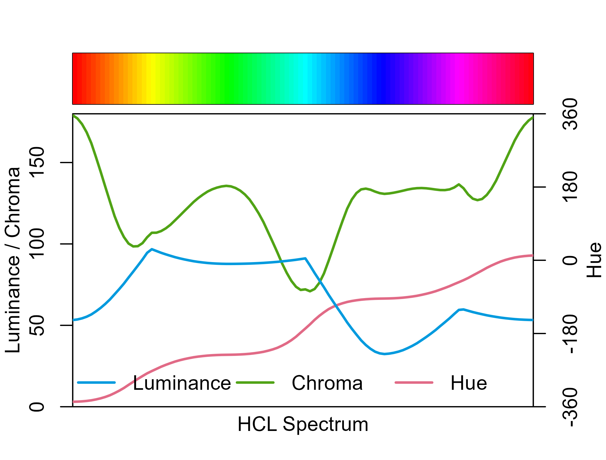{width=1500}
:::
:::

::: {.cell hash='06_colors_cache/revealjs/color-palette-viridis-spec_0b358b032617339894dcf173e8ba5743'}

```{.r .cell-code}
colorspace::specplot(
  viridis::turbo(
     n = 100, direction = -1
  )
)
```

::: {.cell-output-display}
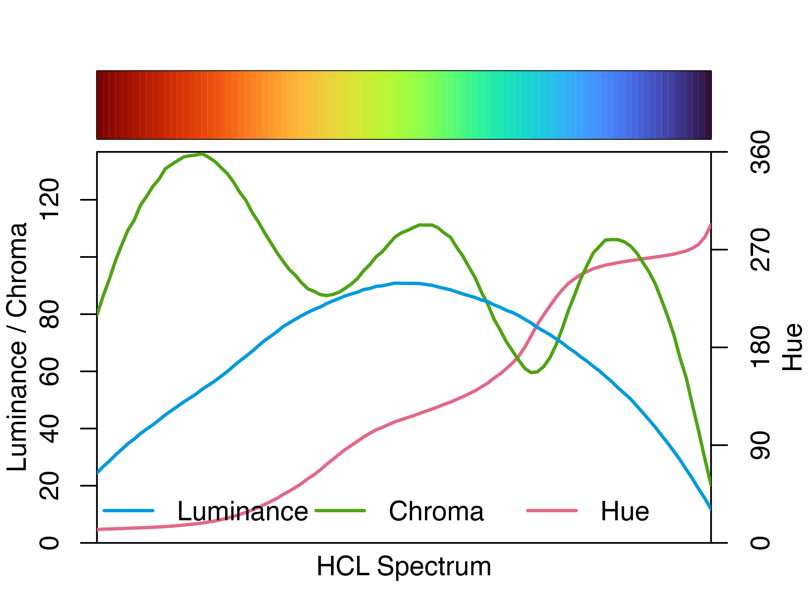{width=1500}
:::
:::
:::

## Build Your Own `scale_color|fill_*_c()`

::: {.cell hash='06_colors_cache/revealjs/dubois-colors-pal-c-function_957af792d744b75f6dd0e59412a9bf4a'}

```{.r .cell-code  code-line-numbers="1,13|2,3,4,5|7,8|10|12|15"}
dubois_pal_c <- function(palette = "dark", reverse = FALSE, ...) {
  dubois_palettes <- list(
    `dark`    = dubois_colors("black", "purple", "violet", "pink"),
    `light`   = dubois_colors("purple", "violet", "pink", "palered")
  )

  pal <- dubois_palettes[[palette]]
  pal <- unname(pal)

  if (reverse) pal <- rev(pal)

  grDevices::colorRampPalette(pal, ...)
}

dubois_pal_c(palette = "light", reverse = TRUE)(3)
```

::: {.cell-output .cell-output-stdout}
```
[1] "#FFFFFF" "#C1759D" "#582F6C"
```
:::
:::

## Build Your Own `scale_color|fill_*_c()`

::: {.cell hash='06_colors_cache/revealjs/dubois-scale-continuous-functions_69d0f1bca9b5d985bb8cca5ca3add69a'}

```{.r .cell-code  code-line-numbers="1,2,3,4,5,6,7|9,10,11,12,13,14,15|2,10|4,12|6,14|"}
scale_fill_dubois_c <- function(palette = "dark", reverse = FALSE, ...) {
  if (!palette %in% c("dark", "light")) stop('Palette should be "dark" or "light".')

  pal <- dubois_pal_c(palette = palette, reverse = reverse)

  ggplot2::scale_fill_gradientn(colours = pal(256), ...)
}

scale_color_dubois_c <- function(palette = "dark", reverse = FALSE, ...) {
  if (!palette %in% c("dark", "light")) stop('Palette should be "dark" or "light".')

  pal <- dubois_pal_c(palette = palette, reverse = reverse)

  ggplot2::scale_color_gradientn(colours = pal(256), ...)
}
```
:::

## Use Your Own `scale_color|fill_*_c()`

::: {.cell output-location='column' hash='06_colors_cache/revealjs/dubois-scales-color-c-use-1_6bd557da414e8bb234de5ecd784fb721'}

```{.r .cell-code  code-line-numbers="3,4,7|7,9"}
ggplot(
    bikes, 
    aes(x = temp_feel, y = count, 
        color = temp_feel)
  ) +
  geom_point() +
  scale_color_dubois_c()
```

::: {.cell-output-display}
{width=1500}
:::
:::

## Use Your Own `scale_color|fill_*_c()`

::: {.cell output-location='column' hash='06_colors_cache/revealjs/dubois-scales-color-c-use-2_a8ab12feb6b2a7078a12c2fd7c4ada1e'}

```{.r .cell-code  code-line-numbers="3,4,7|7,9"}
ggplot(
    bikes, 
    aes(x = temp_feel, y = count, 
        color = temp_feel)
  ) +
  geom_point() +
  scale_color_dubois_c(
    palette = "light",
    reverse = TRUE
  )
```

::: {.cell-output-display}
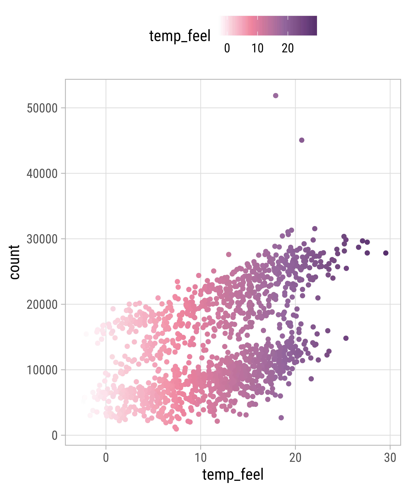{width=1500}
:::
:::

