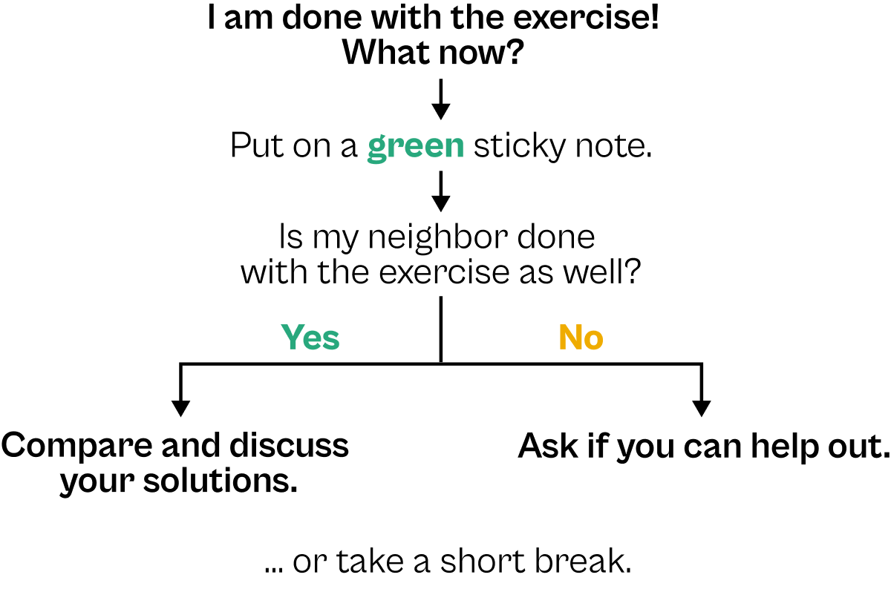

# Exercise 2

- Explore the TfL bike sharing data visually:  
  **create a boxplot of counts per weather type**
    * Turn the plot into a jitter strips plot (random noise across the x axis)
    * Combine both chart types (jittered points on top of the boxplots)
    * [Bonus: sort the boxplot-jitter hybrid by median counts]{style="color:#5DB699;"}
    * Apply your favorite theme to the plot.
    * Add meaningful labels.
    * [Bonus: Explore other chart types to visualize the distributions.]{style="color:#5DB699;"}
- Save the plot as a vector graphic with a decent plot size.

## Data import

```{r preparation, warning=FALSE, message=FALSE}
library(tidyverse)

bikes <- read_csv(
  "https://raw.githubusercontent.com/z3tt/graphic-design-ggplot2/main/data/london-bikes-custom.csv", 
  col_types = "Dcfffilllddddc"
)

bikes$season <- fct_inorder(bikes$season)

bikes
```

## Boxplot of counts per weather type

```{r plot}

```

Add your comments and more code here.


<br><br><br>
```{r}
#| label: i-am-done-what-now
#| echo: false

```::
```
